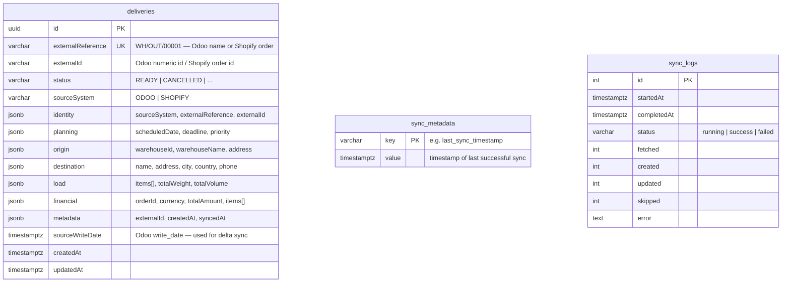

# Database Schema — mapper_clienta

## Table Descriptions

### `deliveries`
Core table — one row per canonical delivery from any source system.
- `externalReference` — unique business key used for upsert conflict detection (e.g. `WH/OUT/00017`, `#1001`)
- `sourceSystem` — isolates Odoo rows from Shopify rows (`ODOO` | `SHOPIFY`)
- `sourceWriteDate` — Odoo `write_date` / Shopify `updated_at` — if unchanged the row is skipped (no redundant publish)
- JSONB columns store the full canonical delivery model — flexible, no joins needed

### `sync_metadata`
Key/value store with a single row: `key='last_sync_timestamp'`.  
Read at the start of each sync cycle as the `?since=` param, updated after success.

### `sync_logs`
Audit trail — one row per sync run (every 30s).  
Tracks `fetched / created / updated / skipped` counts, duration, and any error message.
