# ASM Track — Plateforme SaaS de Gestion des Livraisons

> Projet de Fin d'Études — ISIMS 2026
> Mohamed Aziz Hadjkacem — ASM (All Soft Multimédia), Sfax

> **L'intégration continue tourne sur le GitLab auto-hébergé d'ASM.** GitHub n'exécute pas
> `.gitlab-ci.yml` : aucun workflow ne s'exécute ici. La définition du pipeline est dans
> [`.gitlab-ci.yml`](.gitlab-ci.yml) et des exécutions réussies sont montrées plus bas.

---

## Aperçu

ASM Track est une plateforme **multi-tenant** de gestion et de suivi des livraisons en temps réel, conçue pour les opérateurs logistiques. Elle couvre l'intégralité du cycle de vie d'une livraison — de l'import depuis l'ERP du client jusqu'à la preuve de livraison signée, en passant par la planification des tournées et l'encaissement contre remboursement.

Le parti pris central : **l'ERP du client reste maître de ses documents et de sa facturation.** ASM Track pilote le terrain — qui livre quoi, quand, avec quelle preuve — et renvoie le résultat dans l'ERP. La plateforme n'émet ni bon de livraison ni facture ; elle enregistre des faits opérationnels.

---

## Architecture

**6 microservices Spring Boot**, chacun propriétaire de sa base de données, plus une bibliothèque
partagée `asm-tenant-core` (résolution du tenant, filtres, SPI Hibernate) :

| Service | Port | Responsabilité |
|---|---|---|
| `ApiGateway` | 80 | Routage, agrégation OpenAPI, première évaluation RBAC |
| `AppBackend` | 8080 | Comptes back-office, paramètres entreprise, intégration Keycloak |
| `DeliveryMicroservice` | 8082 | Cœur métier : livraisons, tournées, retours, encaissements, SLA |
| `DriverService` | 8086 | Livreurs, véhicules, disponibilité |
| `ErpAdapterService` | 8088 | Traduction vers l'ERP du client (Odoo, ERPNext) |
| `AssistantService` | 8087 | Assistant RAG — réponses sur les données métier, dans le périmètre de permissions de l'utilisateur |

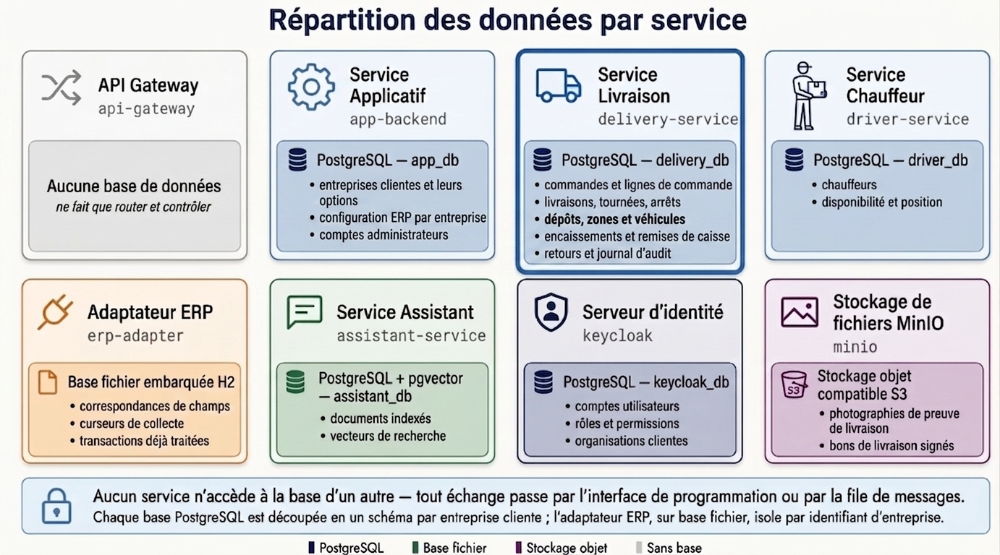

**L'authentification n'est pas un service maison** : elle est déléguée à **Keycloak** (OIDC, JWT RS256, JWKS). Écrire un serveur d'authentification aurait été le plus sûr moyen de mal le faire.

> 📖 **Documentation technique complète** dans [`docs/`](docs/index.md) — architecture, métier,
> exploitation et décisions, avec 84 diagrammes.

<details>
<summary><b>Comment la consulter</b></summary>

**Depuis un artefact de CI** — aucune installation. Dans GitLab, ouvrir la pipeline de `main`, job
`pages` → **Download artifacts**, décompresser, puis ouvrir `public/index.html`. La navigation et
les diagrammes fonctionnent hors ligne ; seule la barre de recherche demande un serveur (elle charge
son index par XHR, ce que le navigateur bloque sur `file://`).

**En local, avec la recherche** — depuis la racine du dépôt :

```bash
docker run --rm -p 8000:8000 -v "$PWD:/docs" squidfunk/mkdocs-material serve -a 0.0.0.0:8000
```

→ <http://localhost:8000>

</details>

### Décisions structurantes

Chacune est détaillée dans un ADR — contexte, alternatives écartées et **ce qu'elle coûte** :
[001 multi-tenant](docs/adr/001-multi-tenant-par-schema.md) ·
[002 autorisation](docs/adr/002-politique-rbac-unique.md) ·
[003 intégration ERP](docs/adr/003-ports-adapters-erp.md) ·
[004 outbox](docs/adr/004-outbox-transactionnel.md)

**Multi-tenant par schéma PostgreSQL** — un schéma `company_<uuid>` par client, résolu à l'exécution via le SPI de multi-tenance d'Hibernate. Un seul pool de connexions, un `SET search_path` au retrait. Le nom de schéma dérive d'un `UUID` déjà parsé, donc il est sûr par construction vis-à-vis de l'injection SQL.

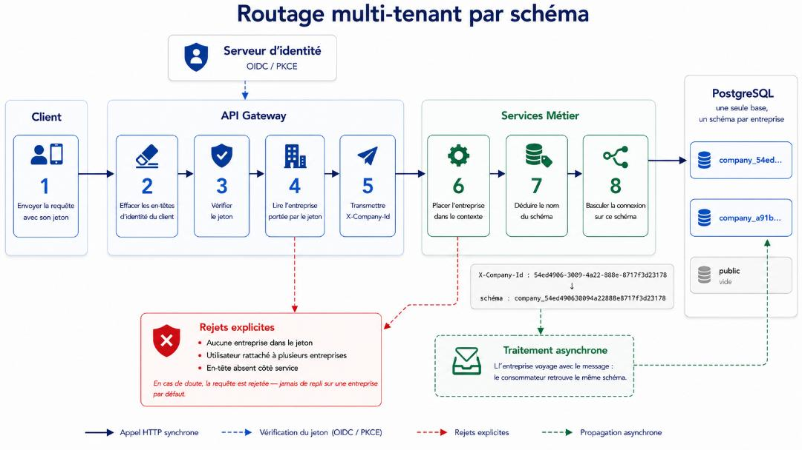

**Politique d'autorisation unique et déclarative** — un fichier `rbac-policy.json` décrit les règles `chemin → permission`. Il est répliqué à l'identique dans chaque service et évalué par la gateway *et* par le service. Les règles sont ordonnées, premier match gagnant, et **l'absence de règle vaut refus** (fail-closed). L'alternative — une annotation sur chacun des 271 endpoints — rendait impossible de répondre à « qui a le droit de faire quoi ? ».

**Patron Outbox transactionnel** — un changement métier et son événement sont écrits dans la même transaction, puis relayés vers RabbitMQ par un processus séparé. 15 tentatives à backoff exponentiel (`2^n × 5 s`, plafonné à 4 h), ce qui couvre une indisponibilité de week-end avant la mise en file morte. Sans cela, un ERP injoignable au mauvais moment perdait silencieusement la synchronisation.

**Ports & Adapters pour l'ERP** — quatre interfaces (`ErpSyncPort`, `ErpLookupPort`, `ErpOrderPort`, `ErpChangePort`) et **deux implémentations réelles** : Odoo (16 → 19, via JSON-RPC) et ERPNext (via l'API REST Frappe). Un client sans ERP est servi par un adaptateur nul explicite plutôt que par des `if` dispersés.

**Temps réel** — WebSocket STOMP relayé par RabbitMQ vers le poste de dispatch.

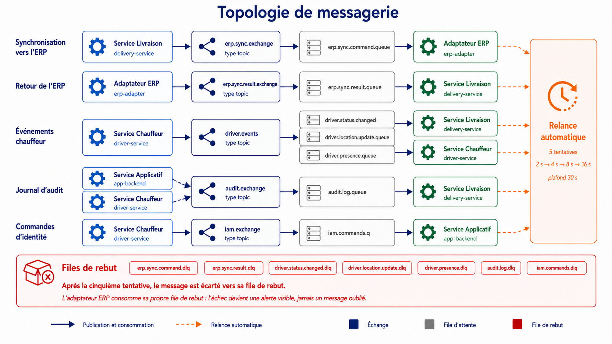

**Assistant RAG** — les réponses sont construites sur les données métier vivantes, filtrées par le
périmètre de permissions de l'utilisateur qui pose la question : deux utilisateurs d'un même client
n'obtiennent pas la même réponse si leurs rôles diffèrent.

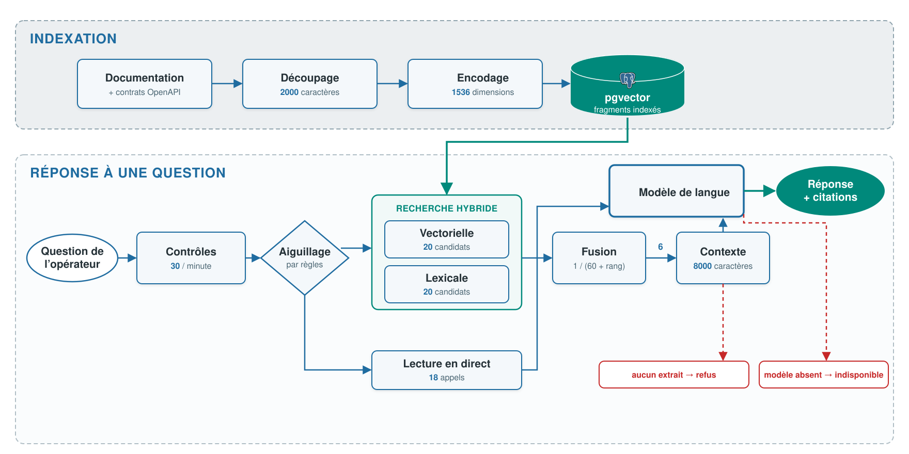

---

## Interfaces

**Poste de dispatch et back-office** — React 19

| Dispatch | Construction de tournée |
|---|---|
| 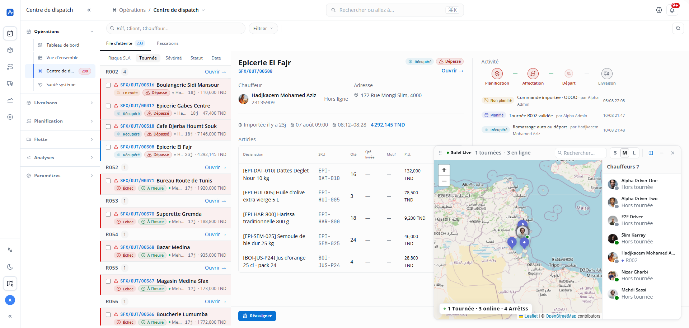 | 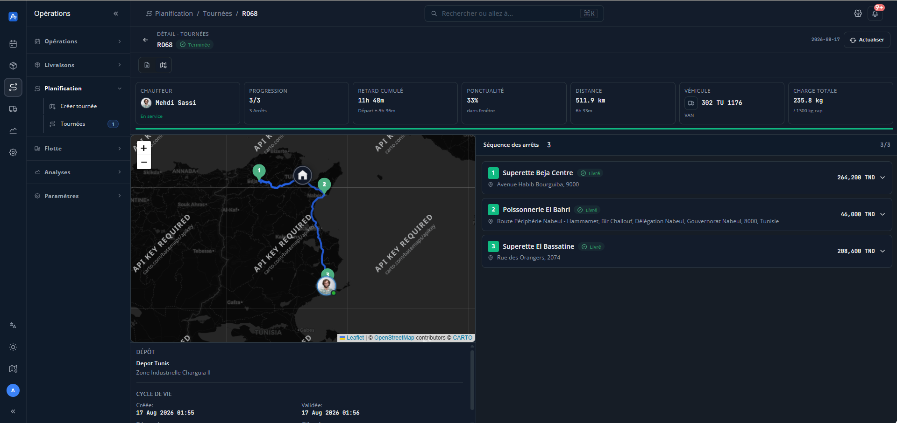 |

| Assistant | Indicateurs |
|---|---|
| 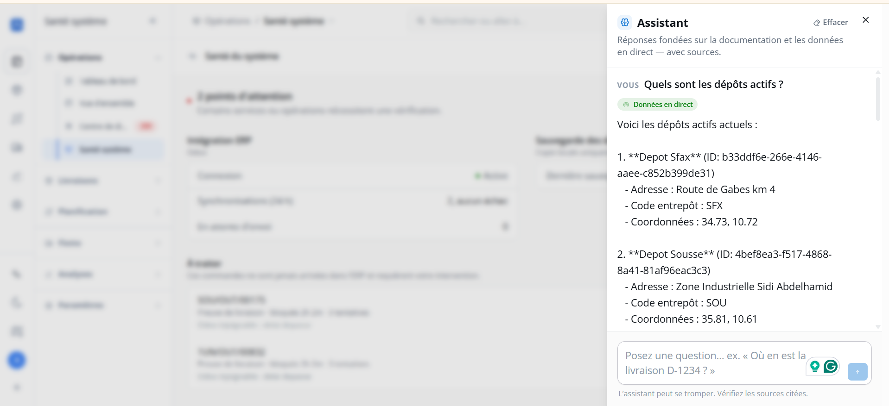 | 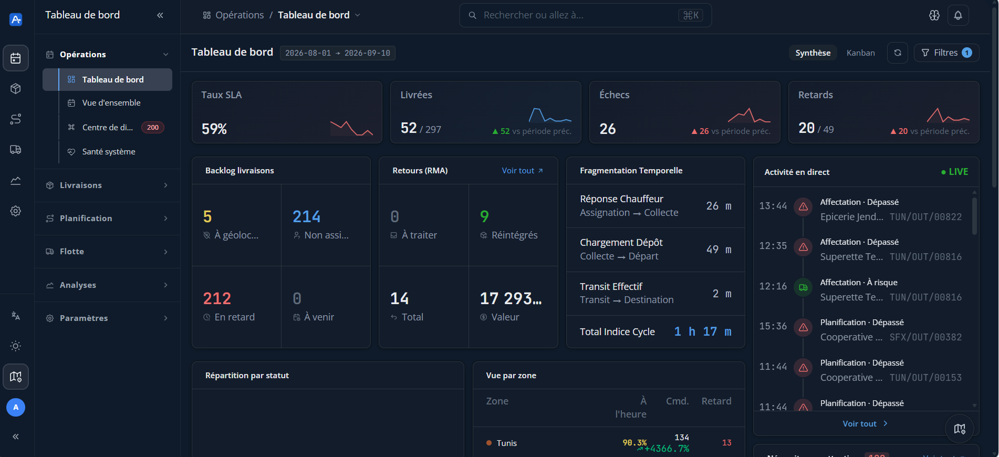 |

**Application livreur** — Flutter, hors-ligne d'abord

| Tournée du jour | Preuve de livraison | File de synchronisation |
|---|---|---|
| 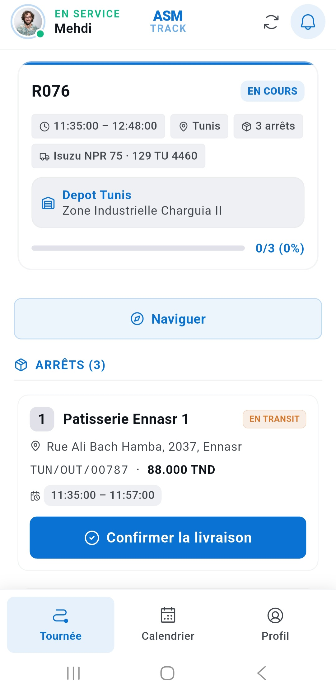 |  | 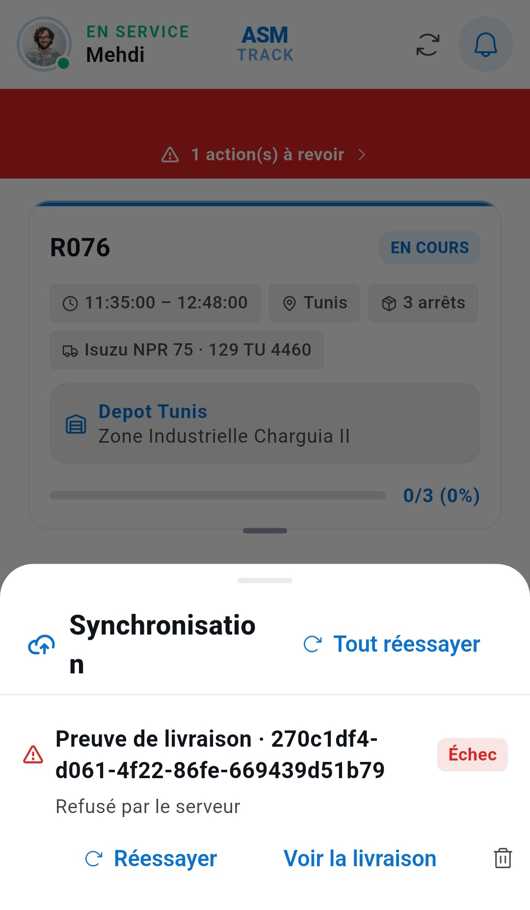 |

---

## Stack technique

| Couche | Technologies |
|---|---|
| Backend | Java 17, Spring Boot 3.3.5, Spring Security OAuth2 Resource Server, Flyway |
| Bases de données | PostgreSQL 16 (un par service) · H2 fichier pour l'adaptateur ERP |
| Frontend | React 19, Vite 8, TypeScript, Tailwind CSS 4, TanStack Query 5, @dnd-kit, Leaflet |
| Mobile | Flutter (Dart 3.8), Riverpod, Dio, Hive (file locale), geolocator, mobile_scanner, signature |
| Messagerie | RabbitMQ (AMQP + relais STOMP) |
| Authentification | Keycloak 26 — OIDC, JWT RS256, JWKS, rôles composites `perm:*` |
| Stockage | MinIO (photos de preuve de livraison) |
| Routage | OSRM sur données OpenStreetMap Tunisie |
| Documentation | springdoc-openapi — contrats exportés dans `docs/openapi/` |

---

## Le projet en chiffres

| | |
|---|---|
| Endpoints REST | 271 |
| Classes Java (production) | 590 · ~59 000 lignes |
| Frontend | 281 fichiers TypeScript · ~62 000 lignes |
| Tests automatisés | 587 (459 backend, 128 frontend) |
| Migrations Flyway | 43 · 34 tables |
| Connecteurs ERP | 2 (Odoo, ERPNext) |
| Langues de l'interface | 3 (français, anglais, arabe — avec RTL) |

---

## Démarrage

```bash
cd Microservices
cp .env.example .env           # 20 variables : mots de passe, secrets Keycloak, clé Resend

# Une seule fois par serveur — télécharge la carte OSM Tunisie et la prépare pour OSRM.
# Plusieurs centaines de Mo et de longues minutes ; sans cette étape le service de
# routage redémarre en boucle sur des fichiers absents.
docker compose --profile init up osrm-download osrm-prepare

# Toute la pile (bases, RabbitMQ, Keycloak, MinIO, OSRM, les 5 services)
docker compose up -d

# Interface d'administration
cd ../Apps/admin-app-react
npm ci && npm run dev          # http://localhost:5173
```

La gateway répond sur `http://localhost`, Keycloak sur `http://localhost:8089`.

**Aucun script SQL à lancer.** Les bases sont créées par leurs conteneurs, puis chaque service
applique ses propres migrations Flyway au démarrage. Les schémas par client sont créés à
l'onboarding, et `TenantMigrationRunner` rejoue les migrations en attente sur les schémas existants
à chaque démarrage — voir [ADR-001](docs/adr/001-multi-tenant-par-schema.md).

> Vérifié sur des volumes vides : les 4 bases se créent seules, Flyway applique 44 migrations sur
> `delivery_db` et 1 sur chacune des autres, Keycloak importe le realm `asm`, et la gateway répond.
> Seul OSRM exige l'étape `init` ci-dessus.

---

## Documentation de l'API

Chaque service expose son contrat OpenAPI et son interface Swagger. La gateway les agrège.

Les contrats des trois services exposés publiquement sont versionnés dans [`docs/openapi/`](docs/openapi/) — un contrat qui n'existe que sur une machine allumée n'est pas un livrable.

```bash
./ops/openapi/export.sh        # régénère les contrats depuis une pile démarrée
```

L'`ErpAdapterService` en est délibérément absent : c'est un service interne, injoignable depuis l'extérieur.

---

## Tests

```bash
cd Microservices/<Service> && gradle test              # unitaires
cd Microservices/DeliveryMicroservice && gradle integrationTest   # avec PostgreSQL
cd Apps/admin-app-react && npm test                    # frontend
```

Le connecteur Odoo est vérifié en intégration contre **deux versions simultanées, 16 et 19**, démarrées en conteneurs par la CI. Les deux extrémités de la plage supportée étant couvertes, les versions intermédiaires le sont par construction. Ces tests épinglent précisément ce qui change entre versions — `qty_done` devenu `quantity`, `create_returns` devenu `action_create_returns`, et le pilotage des assistants de confirmation.

---

## Intégration continue

Le pipeline est ordonné du contrôle le moins coûteux au plus coûteux : ce qui échoue vite échoue
d'abord. Les images sont épinglées au SHA du commit, de sorte que le serveur exécute exactement
l'artefact qui a été testé.

| Suites complètes | Compatibilité Odoo 16 et 19 |
|---|---|
| 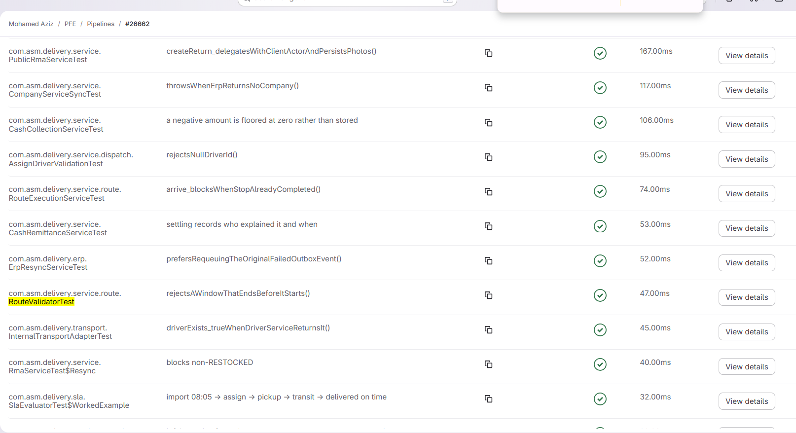 | 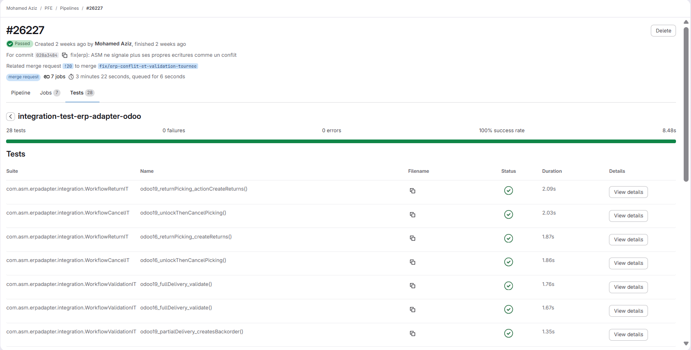 |

| Isolation multi-tenant vérifiée en CI | Contrôle RBAC |
|---|---|
| 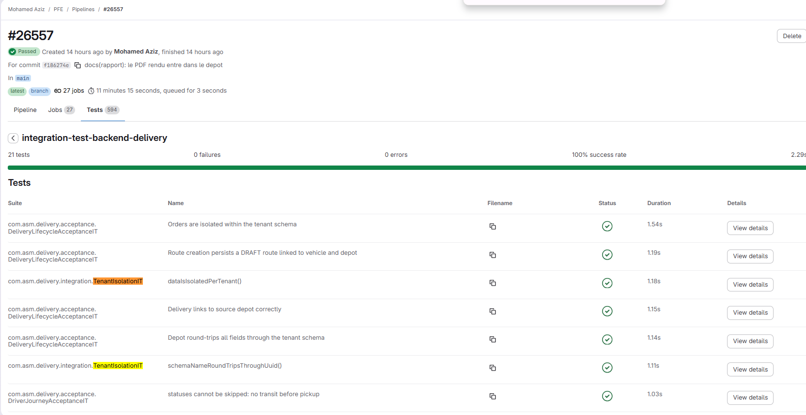 | 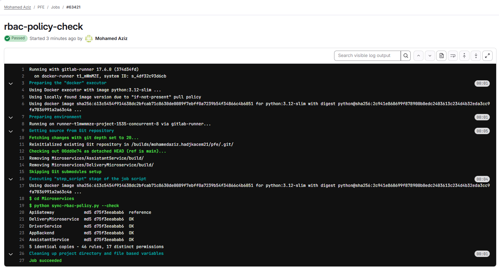 |

L'isolation entre clients et la politique RBAC ne sont pas seulement documentées : elles sont
rejouées à chaque pipeline. Une règle manquante ou un schéma qui fuit fait échouer la construction.

---

## Auteur

**Mohamed Aziz Hadjkacem** — [mohamedaziz.hadjkacem21@gmail.com](mailto:mohamedaziz.hadjkacem21@gmail.com)
