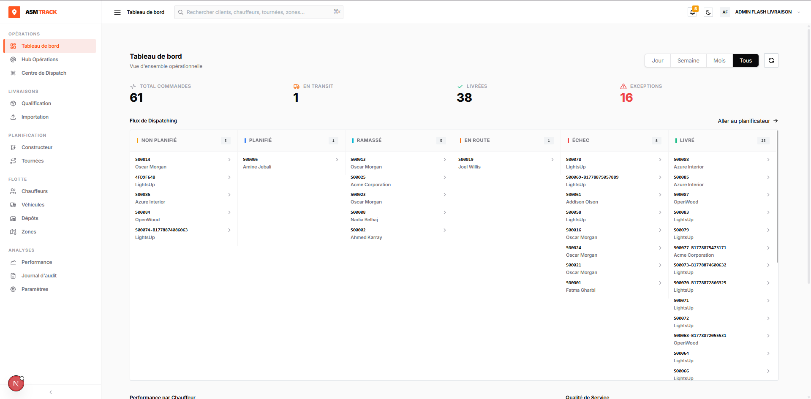
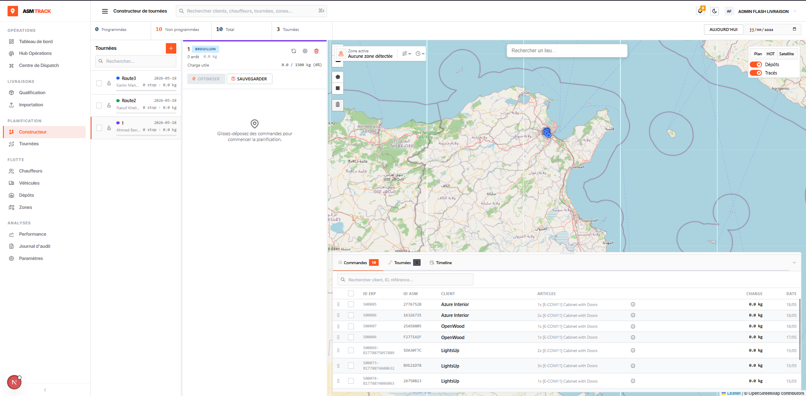

# ASM Track — Plateforme SaaS de Gestion des Livraisons

> Projet de Fin d'Études — ISIMS 2025  
> Mohamed Aziz Hadjkacem — ASM (All Soft Multimédia), Sfax

---

## Aperçu

ASM Track est une plateforme multi-tenant de gestion et de suivi des livraisons en temps réel, conçue pour les opérateurs logistiques. Elle couvre l'intégralité du cycle de vie d'une livraison — de l'import ERP jusqu'à la confirmation de livraison avec preuve photographique (POD).

---

## Captures d'écran

### Tableau de bord opérationnel

### Constructeur de tournées

---

## Architecture

- **6 microservices** : AuthServer, ApiGateway, UserManagementMS, DeliveryMS, DriverService, ErpAdapterMS
- **Application mobile** Flutter (chauffeurs) — mode hors-ligne, POD, QR handoff
- **Dashboard web** Next.js — constructeur de tournées, suivi temps réel, bureau des incidents
- **Intégration ERP** agnostique — Odoo 19 + Dux via pattern Ports & Adapters
- **Patron Outbox transactionnel** — synchronisation ERP fiable avec retry (50 tentatives)
- **WebSocket STOMP + RabbitMQ** — événements temps réel vers le dispatcher

## Stack technique

| Couche | Technologies |
|---|---|
| Backend | Spring Boot 3, Spring Security OAuth2, PostgreSQL |
| Frontend | Next.js 14, Tailwind CSS, @dnd-kit, Leaflet |
| Mobile | Flutter, Hive (offline), MinIO (POD) |
| Infrastructure | Docker, RabbitMQ, OSRM (routage Tunisia OSM) |
| Auth | OAuth2 (RS256 JWT), JWKS, HttpOnly cookies |

---

## Auteur

**Mohamed Aziz Hadjkacem** — [mohamedaziz.hadjkacem21@gmail.com](mailto:mohamedaziz.hadjkacem21@gmail.com)
