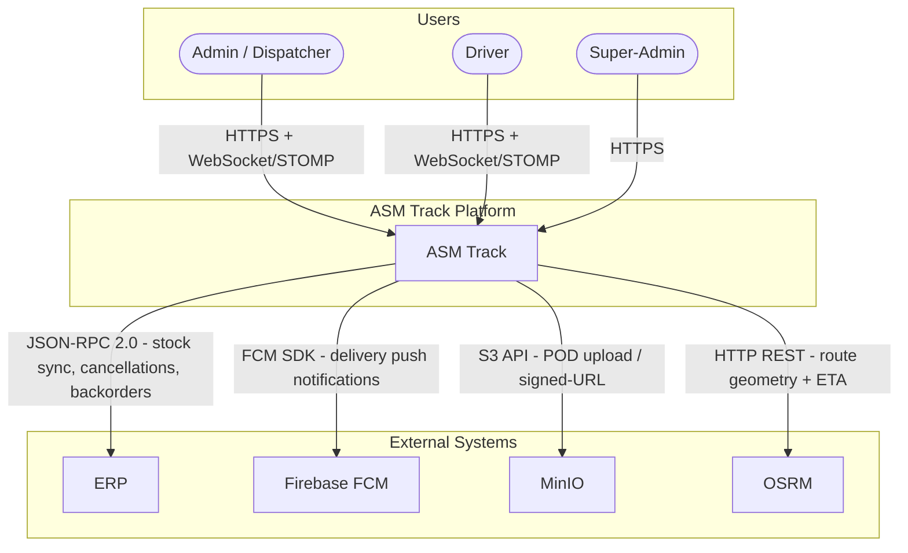
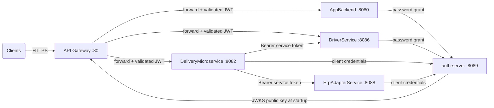
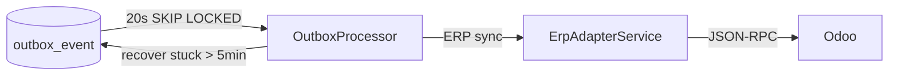
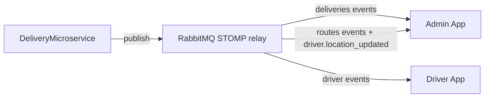
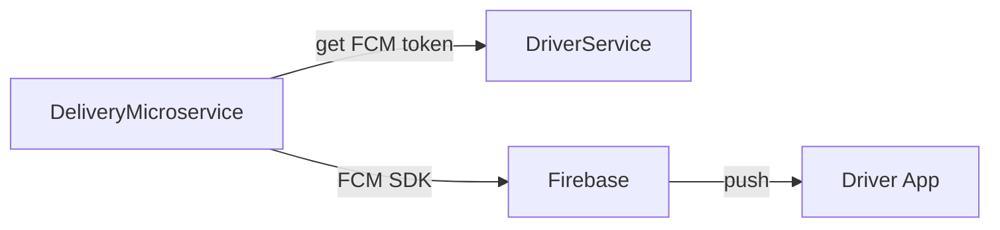
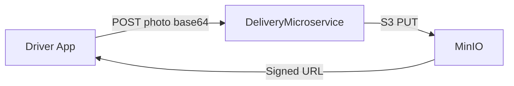
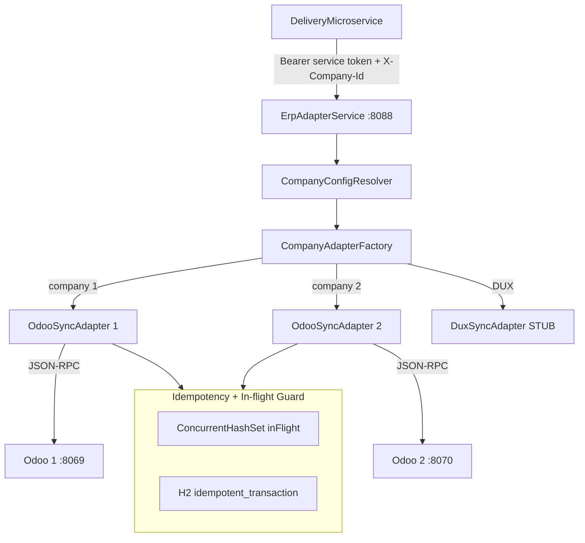

# 01 — Global Architecture

## 1.1 System Context (C4 Level 1)

---

## 1.2 Container Diagram — Overview

| Service | Role |
|---------|------|
| **API Gateway** | Single entry point — routes requests, validates JWT via JWKS, enforces CORS |
| **auth-server** | OAuth2 token issuer — RSA-signed JWTs for users and services. Exposes `/oauth2/token` (password + client_credentials grants) and `/oauth2/jwks` |
| **AppBackend** | Admin user management (companyId, role, multi-tenancy). Proxies login/refresh to auth-server |
| **DeliveryMicroservice** | Core engine — orders, deliveries, routes, dispatch, SLA, outbox, WebSocket |
| **DriverService** | Driver profiles, FCM token storage, stats. Proxies login/refresh to auth-server |
| **ErpAdapterService** | Multi-ERP adapter (Odoo / DUX) — translates delivery events into ERP calls with idempotency. Uses an embedded H2 database to record every processed `transactionId`. If OutboxProcessor retries the same event (e.g. HTTP timeout after Odoo already updated stock), ErpAdapterService detects the duplicate via H2 and skips the Odoo call — preventing a second stock decrement on the same delivery. |

---

## 1.3 Runtime Communication Flows

### Synchronous HTTP/REST

Toutes les requêtes clients passent par l'API Gateway (port 80) qui valide le JWT via la clé publique RSA (récupérée au démarrage depuis `auth-server/oauth2/jwks`). Les appels entre services utilisent des tokens OAuth2 client_credentials .

### Async Outbox

Les opérations critiques (sync ERP) sont écrites dans `outbox_event` dans la même transaction DB, puis traitées toutes les 20s avec SKIP LOCKED pour éviter les doublons en cas d'instances multiples. Les events bloqués en `PROCESSING` (crash container) sont automatiquement remis en `PENDING` après 5 minutes.

### Real-Time WebSocket STOMP

Le DeliveryMicroservice pousse les événements en temps réel via STOMP, relayé par RabbitMQ. L'admin voit les changements de statut et la position GPS du livreur instantanément, sans polling.

### Push Notifications FCM

Pour les notifications mobiles (nouvelle livraison assignée, arrêt ajouté, etc.), le DeliveryMicroservice récupère le token FCM du livreur depuis DriverService puis envoie via Firebase.

### Binary Storage MinIO

Les photos de preuve de livraison (POD) sont envoyées en base64 au DeliveryMicroservice qui les stocke dans MinIO (compatible S3). Une URL signée est retournée pour affichage dans l'admin.

---

## 1.4 Multi-ERP Topology

---

## 1.5 WebSocket Topology

| Publisher | Topic | Subscriber | Événements |
|---|---|---|---|
| `EventPublisher` | `/topic/admin/{companyId}/deliveries` | Admin App | `delivery.scheduled` · `delivery.completed` · `delivery.failed` · `delivery.cancelled` · SLA breach |
| `EventPublisher` | `/topic/admin/{companyId}/routes` | Admin App | `route.validated` · `route.schedule_changed` · `stop_added` · `stop_removed` · `driver.location_updated` |
| `EventPublisher` | `/topic/admin/{companyId}/erp` | Admin App | `erp.synced` · `erp.failed` |
| `RouteWebSocketService` | `/topic/driver.{driverId}` | Driver App | `route.validated` · `STOP_ADDED` · `STOP_REMOVED` · `route.schedule_changed` |
| `SlaMonitoringService` *(60s)* | `/topic/admin/{companyId}/deliveries` | Admin App | alertes SLA dépassé |
| `ErpAutoImportNotifier` *(120s)* | `/topic/admin/{companyId}/erp` | Admin App | nouvelles commandes Odoo prêtes à importer |
