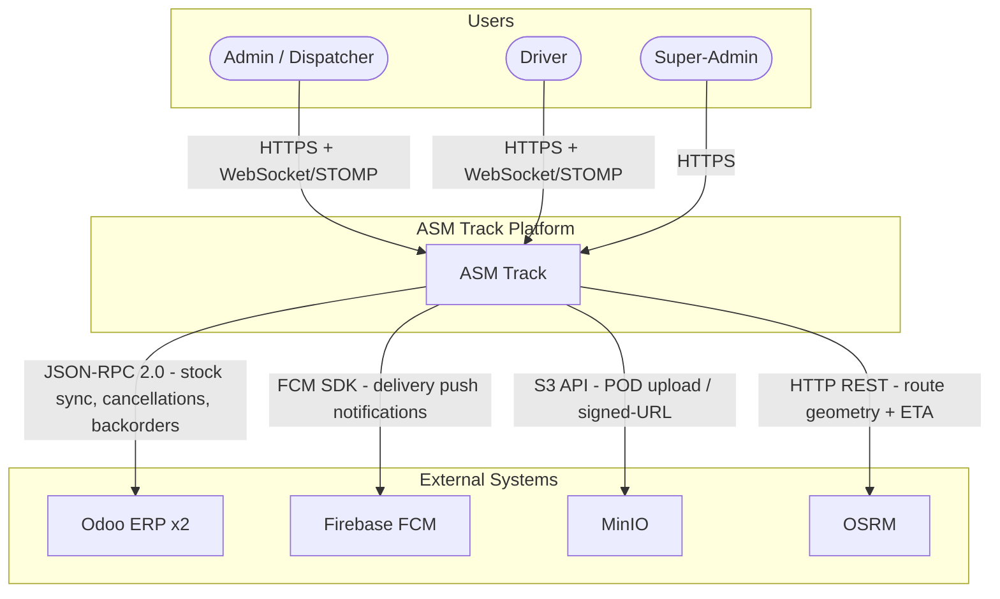
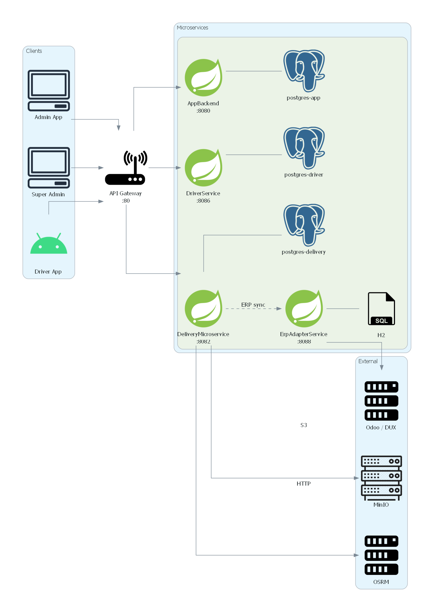
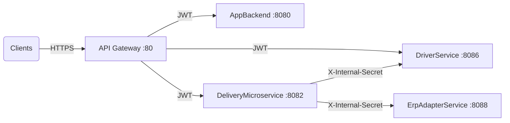
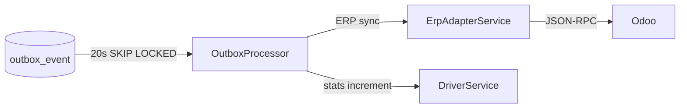
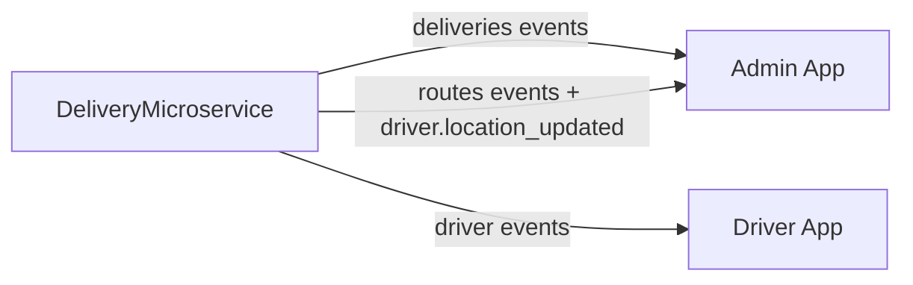
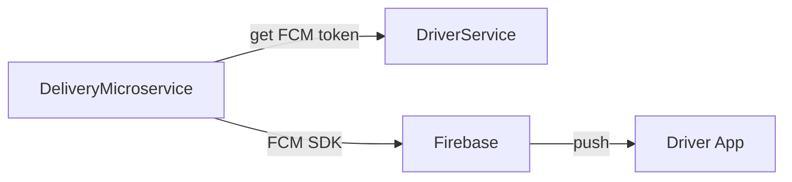
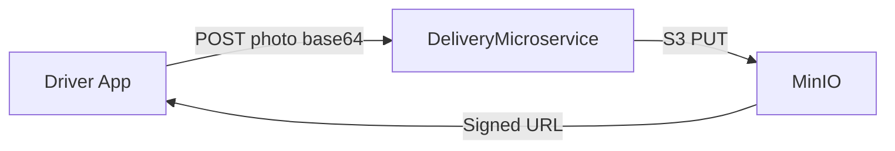
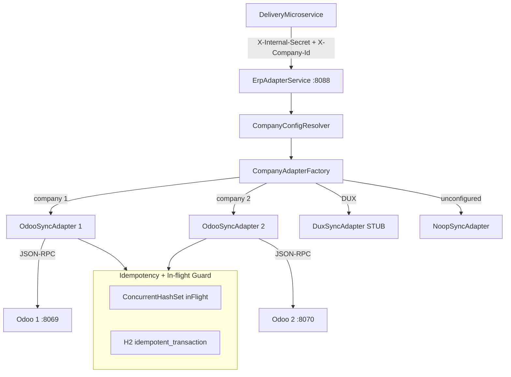
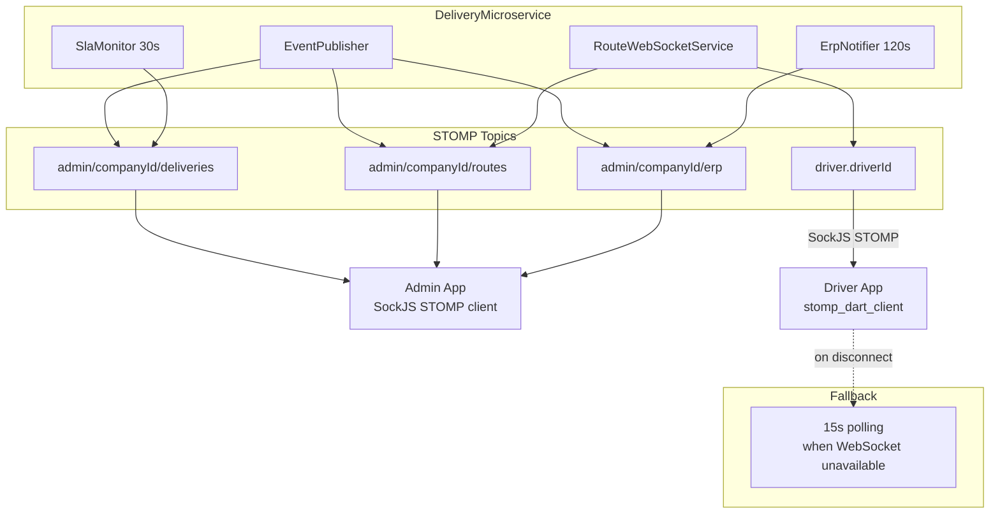

# 01 — Global Architecture

## 1.1 System Context (C4 Level 1)

---

## 1.2 Container Diagram — Overview

| Service | Role |
|---------|------|
| **API Gateway** | Single entry point — routes requests, validates JWT, enforces CORS |
| **AppBackend** | Admin authentication (cookie JWT) and admin user management |
| **DeliveryMicroservice** | Core engine — orders, deliveries, routes, dispatch, SLA, outbox, WebSocket |
| **DriverService** | Driver authentication (Bearer JWT), profiles, FCM token storage, stats |
| **ErpAdapterService** | Multi-ERP adapter (Odoo / DUX) — translates delivery events into ERP calls with idempotency. Uses an embedded H2 database to record every processed `transactionId`. If OutboxProcessor retries the same event (e.g. HTTP timeout after Odoo already updated stock), ErpAdapterService detects the duplicate via H2 and skips the Odoo call — preventing a second stock decrement on the same delivery. |

---

## 1.3 Runtime Communication Flows

### Synchronous HTTP/REST

Toutes les requêtes clients passent par l'API Gateway (port 80) qui valide le JWT avant de router vers le bon service. Les appels entre services utilisent `X-Internal-Secret` et ne passent pas par la Gateway.

### Async Outbox

Les opérations critiques (sync ERP, stats livreur) sont écrites dans `outbox_event` dans la même transaction DB, puis traitées toutes les 20s avec SKIP LOCKED pour éviter les doublons en cas d'instances multiples.

### Real-Time WebSocket STOMP

Le DeliveryMicroservice pousse les événements en temps réel via STOMP. L'admin voit les changements de statut et la position GPS du livreur instantanément, sans polling.

### Push Notifications FCM

Pour les notifications mobiles (nouvelle livraison assignée, arrêt ajouté, etc.), le DeliveryMicroservice récupère le token FCM du livreur depuis DriverService puis envoie via Firebase.

### Binary Storage MinIO

Les photos de preuve de livraison (POD) sont envoyées en base64 au DeliveryMicroservice qui les stocke dans MinIO (compatible S3). Une URL signée est retournée pour affichage dans l'admin.

---

## 1.4 Multi-ERP Topology

---

## 1.5 WebSocket Topology

