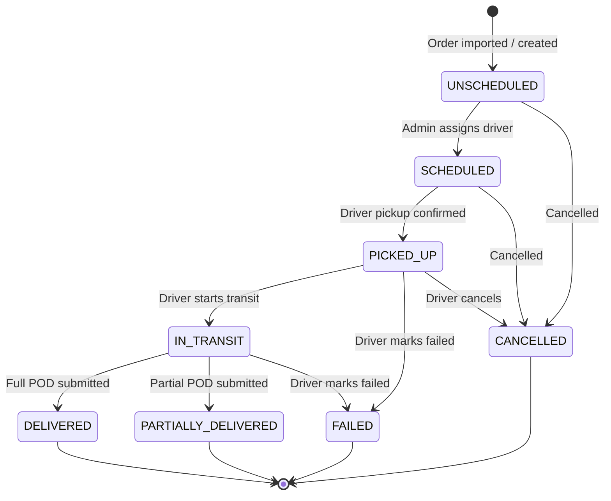
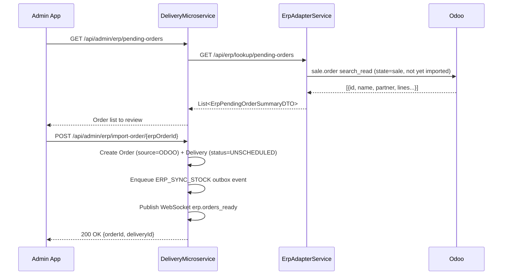
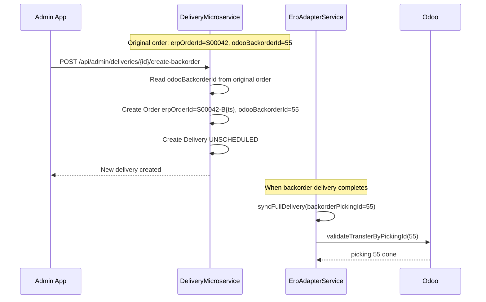

# 04 — Delivery Lifecycle & State Machine

## 4.1 State Diagram



---

## 4.2 Transition Detail

### UNSCHEDULED → SCHEDULED

| Attribute | Value |
|-----------|-------|
| Trigger | `POST /api/admin/deliveries/{id}/assign` |
| Service method | `DispatchService.assignDelivery()` |
| Concurrency | Atomic native SQL update with SKIP LOCKED — race-free assignment |
| `assigned_at` | Set to now() |
| Side effects | FCM push to driver, WebSocket `delivery.scheduled` to admin topic |
| Outbox | None at this step |

### SCHEDULED → PICKED_UP

| Attribute | Value |
|-----------|-------|
| Trigger | `POST /api/driver/deliveries/{id}/pickup` |
| Service method | `DriverDeliveryService.pickup()` |
| `picked_up_at` | Set to now() |
| Side effects | WebSocket `delivery.picked_up`, outbox enqueue `INCREMENT_DRIVER_STAT` |

### PICKED_UP → IN_TRANSIT

| Attribute | Value |
|-----------|-------|
| Trigger | `POST /api/driver/deliveries/{id}/transit` |
| Service method | `DriverDeliveryService.transit()` |
| `in_transit_at` | Set to now() |
| Route fields | `route_geometry`, `route_distance_km`, `route_duration_minutes`, `route_eta_at`, `transit_sla_minutes_computed` set from OSRM response |
| SLA computation | `transit_sla_minutes = max(15, min(240, OSRM_duration × 1.20 + 8))` |
| Side effects | WebSocket `delivery.in_transit` |

### IN_TRANSIT → DELIVERED (Full POD)

| Attribute | Value |
|-----------|-------|
| Trigger | `POST /api/driver/deliveries/{id}/pod` with `isPartial=false` |
| Service method | `ProofOfDeliveryService.submitPod()` |
| `completed_at` | Set to now() |
| POD stored | Photos (base64) uploaded to MinIO → URLs stored in `proof_of_delivery` |
| GPS stored | `lat`, `lng` in `proof_of_delivery` |
| Side effects | WebSocket `delivery.completed`, FCM push, PDF bon de livraison generated |
| Outbox | `ERP_SYNC_STOCK` enqueued `{deliveryId, isPartial: false}` |

### IN_TRANSIT → PARTIALLY_DELIVERED

| Attribute | Value |
|-----------|-------|
| Trigger | `POST /api/driver/deliveries/{id}/pod` with `isPartial=true` and `itemsDone[]` |
| Service method | `DriverDeliveryService.submitPartialPod()` |
| Outbox | `ERP_SYNC_STOCK` enqueued `{deliveryId, isPartial: true, partialItems: [{sku, delivered}]}` |
| Admin action after | `POST /api/admin/deliveries/{id}/create-backorder` creates new delivery for remaining items |

### PICKED_UP or IN_TRANSIT → FAILED

| Attribute | Value |
|-----------|-------|
| Trigger | `POST /api/driver/deliveries/{id}/fail` |
| Service method | `DriverDeliveryService.fail()` |
| Fields set | `failure_code` (CLIENT_ABSENT \| REFUSED \| WRONG_ADDRESS \| DAMAGED \| OTHER), `fail_reason` (free text), `failed_at` |
| Outbox | `ERP_SYNC_FAILURE` enqueued `{deliveryId, failureCode, comment}` |
| Side effects | WebSocket `delivery.failed` |

### ANY → CANCELLED

| Attribute | Value |
|-----------|-------|
| Trigger (driver) | `POST /api/driver/deliveries/{id}/cancel` |
| Trigger (admin) | `POST /api/admin/deliveries/{id}/cancel` or `POST /api/admin/deliveries/orders/{orderId}/cancel` |
| Constraint | Admin cannot cancel if status is IN_TRANSIT or beyond |
| Fields set | `cancel_reason`, `cancelled_by` (Role), `cancelled_at` |
| Order reset | Order status reverted to PENDING for potential re-import |
| Outbox | `ERP_SYNC_CANCELLATION` enqueued `{orderId}` |
| Side effects | WebSocket `delivery.cancelled` |

---

## 4.3 RouteStop Lifecycle

Route stops mirror the delivery they contain:

```
PENDING → COMPLETED   (delivery DELIVERED or PARTIALLY_DELIVERED)
        → FAILED      (delivery FAILED)
        → PARTIAL     (delivery PARTIALLY_DELIVERED)
```

Stop fields updated on arrival:
- `arrived_at`, `actual_arrival_at`
- `sla_status` computed: ON_TIME if `arrived_at <= sla_deadline`, EARLY if early, LATE if past

---

## 4.4 SLA Monitoring

`SlaMonitoringService` runs every 30 seconds and checks:

| Condition | SLA Breach Type | WebSocket Event |
|-----------|-----------------|-----------------|
| UNSCHEDULED delivery > 15 min | SLA_WAITING | `sla.breach` on admin delivery topic |
| SCHEDULED delivery > 20 min since assignment | SLA_ASSIGNMENT | `sla.breach` |
| IN_TRANSIT delivery past computed SLA window | SLA_TRANSIT | `sla.breach` |

De-duplication: `ConcurrentHashMap<"{deliveryId}:{motif}", Boolean>` prevents duplicate alerts within a session.

---

## 4.5 ERP Order Import Flow



---

## 4.6 Backorder Creation Flow

When a partial delivery is confirmed by the admin:



> **Why synthetic `erpOrderId`?** The `orders` table has a UNIQUE constraint on `(erp_order_id, company_id)`.  
> Using the original `S00042` for the backorder order would violate it. The synthetic ID is never
> used for Odoo lookup — `odooBackorderId` (the actual picking ID) is used instead.
