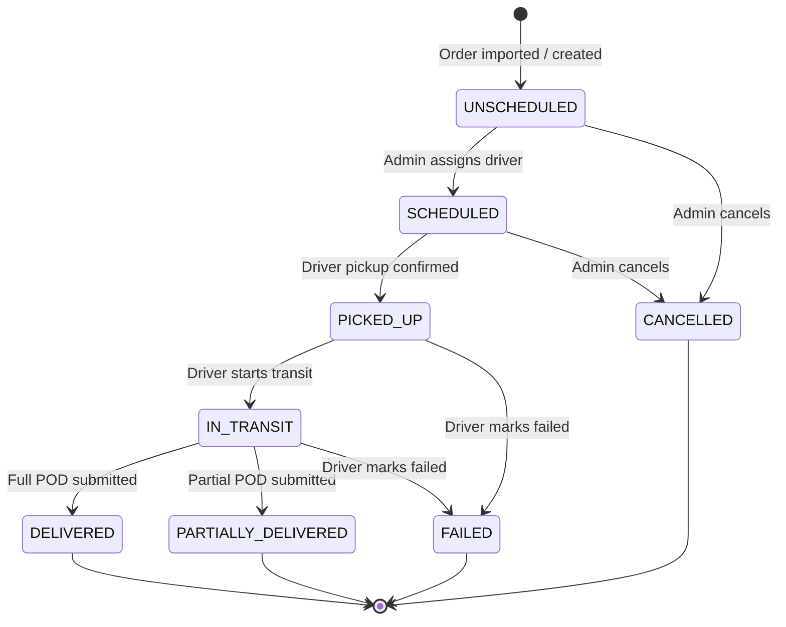
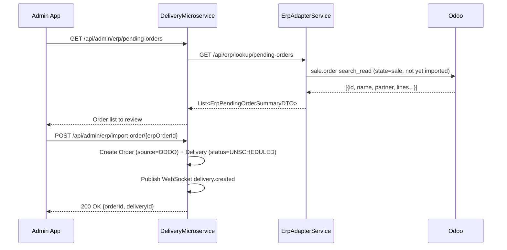
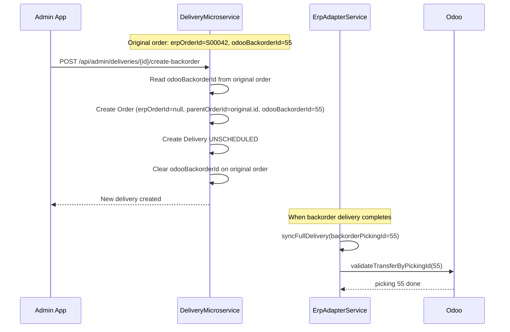

# 04 — Delivery Lifecycle & State Machine

## 4.1 State Diagram



---

## 4.2 Transition Detail

### UNSCHEDULED → SCHEDULED

| Attribute | Value |
|-----------|-------|
| Trigger | `POST /api/admin/deliveries/{id}/assign` |
| Service method | `DispatchService.assignDelivery()` |
| Concurrency | Atomic native SQL update with SKIP LOCKED — race-free assignment |
| `assigned_at` | Set to now() |
| Side effects | FCM push to driver, WebSocket `delivery.scheduled` to admin topic |
| Outbox | None at this step |

### SCHEDULED → PICKED_UP

| Attribute | Value |
|-----------|-------|
| Trigger | `POST /api/driver/deliveries/{id}/pickup` |
| Service method | `DriverDeliveryService.pickup()` |
| `picked_up_at` | Set to now() |
| Side effects | WebSocket `delivery.picked_up`, outbox enqueue `INCREMENT_DRIVER_STAT` |

### PICKED_UP → IN_TRANSIT

| Attribute | Value |
|-----------|-------|
| Trigger | `POST /api/driver/deliveries/{id}/transit` |
| Service method | `DriverDeliveryService.transit()` |
| `in_transit_at` | Set to now() |
| Route fields | `route_geometry`, `route_distance_km`, `route_duration_minutes`, `route_eta_at` set from OSRM response |
| `pickup_sla_minutes` | `inTransitAt − pickedUpAt` — temps entre le pickup et le départ en transit |
| Side effects | WebSocket `delivery.in_transit` |

### IN_TRANSIT → DELIVERED (Full POD)

| Attribute | Value |
|-----------|-------|
| Trigger | `POST /api/driver/deliveries/{id}/pod` with `isPartial=false` |
| Service method | `ProofOfDeliveryService.submitPod()` |
| `completed_at` | Set to now() |
| POD stored | Photos (base64) uploaded to MinIO → URLs stored in `proof_of_delivery` |
| GPS stored | `lat`, `lng` in `proof_of_delivery` |
| Side effects | WebSocket `delivery.completed` |
| Outbox | `ERP_SYNC_STOCK` enqueued `{deliveryId, isPartial: false}` |

### IN_TRANSIT → PARTIALLY_DELIVERED

| Attribute | Value |
|-----------|-------|
| Trigger | `POST /api/driver/deliveries/{id}/pod` with `isPartial=true` and `itemsDone[]` |
| Service method | `DriverDeliveryService.submitPartialPod()` |
| Outbox | `ERP_SYNC_STOCK` enqueued `{deliveryId, isPartial: true, partialItems: [{sku, delivered}]}` |
| Admin action after | `POST /api/admin/deliveries/{id}/create-backorder` creates new delivery for remaining items |

### PICKED_UP or IN_TRANSIT → FAILED

| Attribute | Value |
|-----------|-------|
| Trigger | `POST /api/driver/deliveries/{id}/fail` |
| Service method | `DriverDeliveryService.fail()` |
| Fields set | `failure_code` (CLIENT_ABSENT \| REFUSED \| WRONG_ADDRESS \| DAMAGED \| OTHER), `fail_reason` (free text), `failed_at` |
| Outbox | `ERP_SYNC_FAILURE` enqueued `{deliveryId, failureCode, comment}` |
| Side effects | WebSocket `delivery.failed` |

### → CANCELLED

| Attribute | Value |
|-----------|-------|
| Trigger | `POST /api/admin/deliveries/orders/{orderId}/cancel` — UNSCHEDULED or SCHEDULED only |
| Fields set | `cancel_reason`, `cancelled_by` (Role), `cancelled_at` |
| Final status | `CANCELLED` — terminal, cannot be reassigned |
| Outbox | `ERP_SYNC_CANCELLATION` enqueued `{orderId}` |
| Side effects | WebSocket `delivery.cancelled` |

---

## 4.3 Route & RouteStop Lifecycle

**Route statuses:**
```
DRAFT → VALIDATED → IN_PROGRESS → CLOSED
                               → CANCELLED
```

**RouteStop statuses:**
```
PENDING → SCHEDULED → PICKED_UP → IN_TRANSIT → ARRIVED → COMPLETED
                                                        → FAILED
                                                        → PARTIAL
                                                        → FAILED_ATTEMPT
                                → REMOVED_REPLANNED  (stop removed, delivery back to pool)
                                → REMOVED_CANCELLED  (delivery explicitly cancelled)
```

Stop fields updated on arrival:
- `arrived_at`, `actual_arrival_at`
- `sla_status` computed: ON_TIME if `arrived_at <= sla_deadline`, LATE if past

---

## 4.4 SLA Monitoring

`SlaMonitoringService` runs every 60 seconds (configurable via `app.sla.check-interval-ms`) and checks:

| Condition | Formula | SLA Breach Type |
|-----------|---------|-----------------|
| Delivery UNSCHEDULED too long | `now − createdAt > ops.sla.waiting-limit-minutes` | `SLA_WAITING` |
| Delivery SCHEDULED but not picked up | `now − assignedAt > ops.sla.assign-limit-minutes` | `SLA_ASSIGNMENT` |
| Delivery IN_TRANSIT past stop deadline | `now > route.date + stop.endTimeWindow` | `SLA_TRANSIT` |

All limits configurable per company via `SystemSettings`. Breach triggers WebSocket `sla.breach` on `/topic/admin/{companyId}/deliveries`.

De-duplication: `ConcurrentHashMap<"{deliveryId}:{motif}", Boolean>` prevents duplicate alerts within a session.

---

## 4.5 ERP Order Import Flow



### Demo: Bulk Import from ERP

<video src="http://127.0.0.1:8002/BulkImportFromERP.mp4" controls></video>

---

## 4.6 Backorder Creation Flow

When a partial delivery is confirmed by the admin:



`parentOrderId` links the backorder to its original order. `erpOrderId` is `null` — backorders are ASM-generated, not imported from Odoo.

---

## 4.7 Feature Showcases

### 4.7.0 Full Delivery Workflow — End-to-End Demo

<video src="http://127.0.0.1:8002/EXEMPLEWorkflow.mp4" controls></video>

---

### 4.7.1 Handoff Confirmation via QR Code

Lorsqu'une livraison est réassignée à un autre chauffeur alors que le colis est déjà en main du premier, le transfert physique doit être tracé. Le chauffeur sortant génère un QR code unique (token signé), que le nouveau chauffeur scanne dans son app Flutter pour confirmer la prise en charge. À ce moment, l'API valide le token, marque le stop `HANDOFF_CONFIRMED`, publie un event WebSocket à l'admin, et envoie une notif FCM au chauffeur sortant.

<video src="http://127.0.0.1:8002/QrHandoff.mp4" controls></video>

---

### 4.7.2 Replan a Failed Stop

Quand une livraison échoue (`FAILED`), l'admin peut soit annuler définitivement, soit replanifier. Le replan crée un nouveau stop dans une tournée future, conserve l'historique de l'échec, et notifie le client par SMS/email. Le backorder est créé automatiquement si l'échec était partiel.


---

### 4.7.3 Reassign Stop Mid-Route

Si un chauffeur est en retard ou indisponible, l'admin peut réassigner un ou plusieurs arrêts d'une tournée en cours vers un autre chauffeur. Si la livraison est encore `SCHEDULED` (pas encore pickup), réassignation directe. Si déjà `PICKED_UP`, déclenche le flow handoff QR.


---

### 4.7.4 Proof of Delivery (POD) Capture

Le chauffeur capture photo + signature sur sa Flutter app. L'image est envoyée en base64 au DeliveryMicroservice qui la stocke dans MinIO. Une URL signée 15 min est retournée pour affichage admin. La géolocalisation au moment du POD est aussi enregistrée.


---

### 4.7.5 Partial Delivery → Backorder Creation

Si seulement une partie des items est livrée, le chauffeur saisit les quantités effectivement remises. L'admin valide ensuite la création d'un backorder pour les items restants (voir section 4.6). Odoo crée automatiquement un nouveau picking lié.


---

### 4.7.6 ERP Order Auto-Import

Toutes les 2 minutes, `ErpAutoImportNotifier` interroge Odoo. Si de nouvelles commandes sont prêtes (`state=sale`, non encore importées), un badge apparaît dans l'admin sans rafraîchissement. L'admin peut alors importer en bulk.


---

### 4.7.7 Real-Time SLA Breach Alert

`SlaMonitoringService` détecte toutes les 60s les livraisons hors SLA (waiting/assignment/transit). Un event WebSocket `sla.breach` est poussé à l'admin avec sévérité `WARNING` ou `CRITICAL`. La cloche de notifications s'incrémente, un toast s'affiche, et le clic redirige vers le dispatch desk.


---

### 4.7.8 Route Closure Report (Rapport de Tournée)

Quand une tournée passe au statut `CLOSED` — soit manuellement par l'admin, soit automatiquement quand tous les arrêts atteignent un état terminal (`maybeAutoCloseRoute`) — un rapport immuable est généré et persisté dans la table `route_report` (payload JSON). Le rapport contient :

- **En-tête** : nom, date, chauffeur, véhicule, dépôt, timestamps démarrage/clôture, durée totale
- **9 KPIs** : taux de complétion, taux de ponctualité, distance, durée active, retard cumulé, échecs, retirés, retard de démarrage, arrêts tentés vs planifiés
- **Donut de répartition** : Livrés / Partiels / Échoués / Replanifiés / Annulés
- **Timeline des retards** : bar chart par arrêt (vert = à l'heure, rouge = en retard)
- **Tableau détaillé** des arrêts avec créneaux, retards minute par minute, statut, mouvements (transferts QR, replanifications, annulations)
- **Galerie POD** avec lightbox (photo, signature, BL)
- **Mouvements et exceptions** : journal chronologique des transferts QR, retraits, échecs
- **Audit trail** : 50 dernières transitions de statut depuis `delivery_status_history`

Le rapport est **multi-tenant** (filtré via `companyFilter` Hibernate) et téléchargeable en PDF via `GET /api/admin/routes/{id}/report/pdf`. Si la tournée a été clôturée avant le déploiement de cette feature (V30), le rapport est calculé à la volée puis persisté lors du premier accès.

**Détection à l'heure / en retard** : reprend la logique éprouvée de `DelayCalculationService.calculateCompletionStatus` — un arrêt est `OK` si `SW ≤ T5 ≤ EW`, `KO` si `T5 > EW`. Classification fine pour la UI : ON_TIME, LATE, EARLY, PARTIAL, FAILED, FAILED_ATTEMPT, REPLANNED, CANCELLED.

