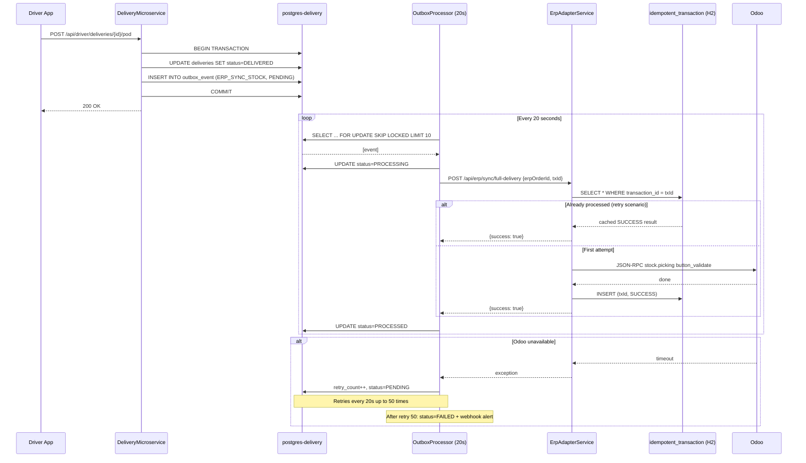
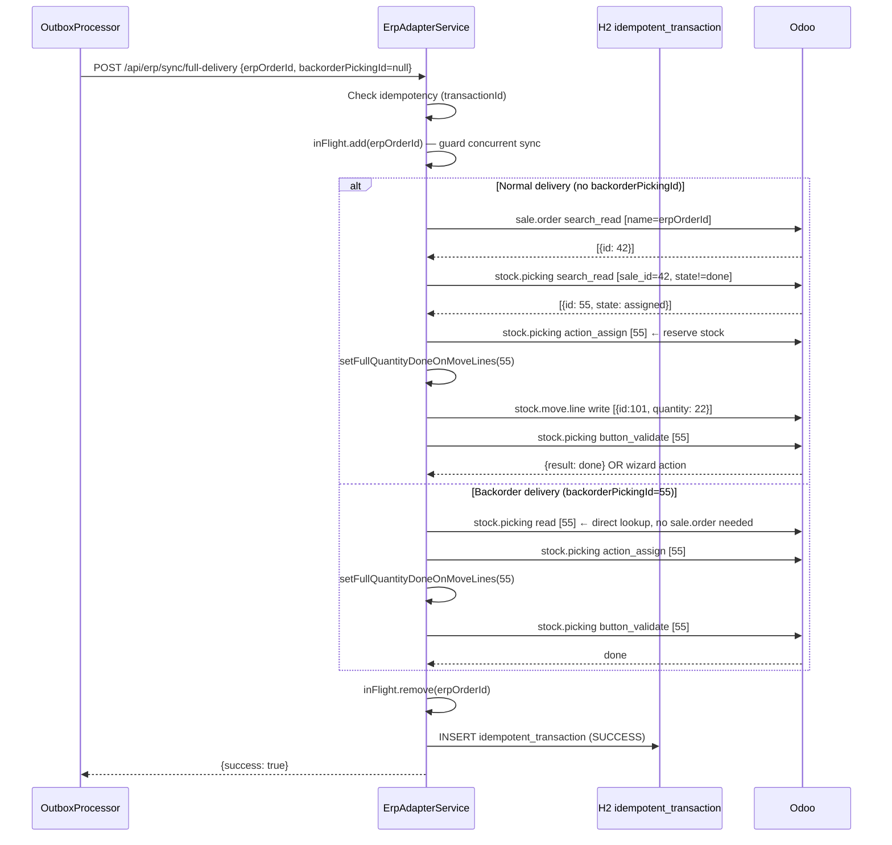
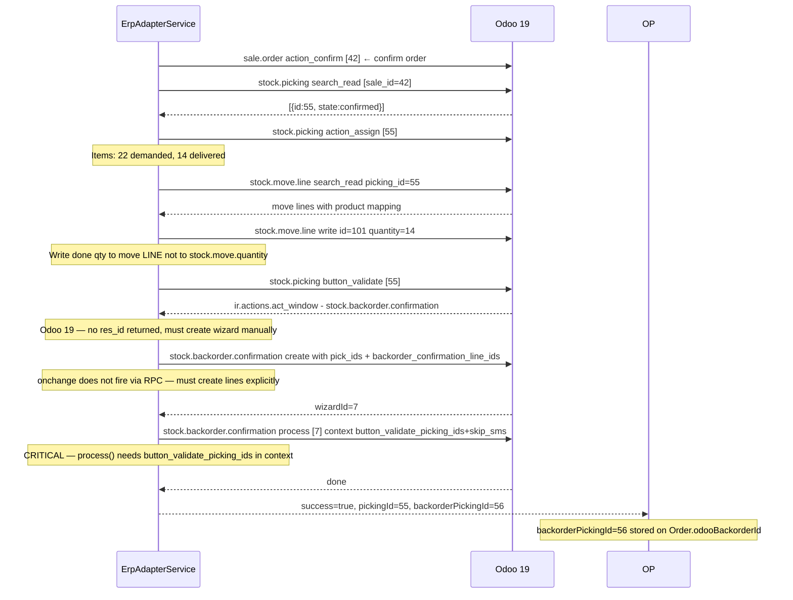
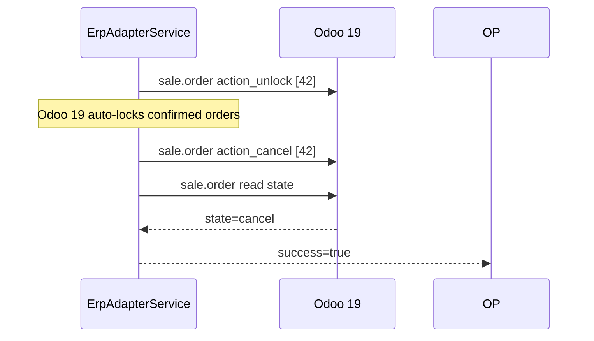

# 05 — Distributed System Patterns

## 1. Transactional Outbox Pattern

### Why It Exists

Delivery status changes and ERP synchronization must be **atomic**. If the delivery is marked DELIVERED
in PostgreSQL but the HTTP call to ErpAdapterService fails, stock in Odoo would be wrong.
The outbox pattern solves this: the delivery state change and the sync event are written in the
**same database transaction**. A separate scheduler then processes events independently with retry.

### Table: `outbox_event`

```sql
CREATE TABLE outbox_event (
    id           UUID PRIMARY KEY DEFAULT gen_random_uuid(),
    event_type   VARCHAR(50)  NOT NULL,
    payload      TEXT         NOT NULL,  -- JSON
    status       VARCHAR(20)  NOT NULL DEFAULT 'PENDING',
    retry_count  INT          NOT NULL DEFAULT 0,
    last_error   TEXT,
    created_at   TIMESTAMP    NOT NULL DEFAULT now(),
    processed_at TIMESTAMP
);

CREATE INDEX idx_outbox_status_created ON outbox_event(status, created_at);
```

### Event Types and Payloads

| Event Type | Payload Fields | Handler |
|------------|----------------|---------|
| `ERP_SYNC_STOCK` | `{deliveryId, isPartial, partialItems?}` | → ErpAdapterService `/api/erp/sync/full-delivery` or `/partial-delivery` |
| `ERP_SYNC_FAILURE` | `{deliveryId, failureCode, comment}` | → ErpAdapterService `/api/erp/sync/failure` |
| `ERP_SYNC_CANCELLATION` | `{orderId}` | → ErpAdapterService `/api/erp/sync/order-cancellation` |
| `INCREMENT_DRIVER_STAT` | `{driverId, stat}` | → DriverService `POST /internal/drivers/{id}/stats/increment` |

### Scheduler (OutboxProcessor)

```
@Scheduled(fixedDelay = 20_000)  // 20 seconds between runs
processOutbox():
  1. claimEvents()  ← SKIP LOCKED batch of 10
  2. for each event: handleEvent() → markProcessed() or handleFailure()
```

### Claim Query (SKIP LOCKED)

```sql
SELECT * FROM outbox_event
WHERE status = 'PENDING'
ORDER BY created_at ASC
LIMIT 10
FOR UPDATE SKIP LOCKED
```

`SKIP LOCKED` ensures that if multiple instances of DeliveryMicroservice are running,
they don't pick up the same events. Each instance atomically claims its own batch.

### Retry and Dead-Letter Logic

```
On success:       status = PROCESSED, processed_at = now()
On failure:
  retry_count++
  last_error = exception.message
  if retry_count <= 50:
    status = PENDING   ← will be retried on next poll
  else:
    status = FAILED    ← permanent dead letter
    POST webhook alert to OUTBOX_ALERT_WEBHOOK_URL
```

- **50 retries × 20 seconds = ~16 minutes** of tolerance for dependency downtime
- Dead-letter webhook payload: `{"text": ":red_circle: ASM Track — Outbox Dead Letter\n• eventId: ...\n• eventType: ...\n• error: ..."}`
- Compatible with Slack Incoming Webhooks

### Sequence Diagram



---

## 2. ERP Synchronization Architecture

### Provider Routing

```
POST /api/erp/sync/full-delivery
  Header: X-Company-Id: {companyId}
  Body:   {erpOrderId, backorderPickingId?, transactionId}
  
  → CompanyConfigResolver.getConfig(companyId)
      → {odooUrl, odooDb, odooUid, odooPassword}
  → CompanyAdapterFactory.getAdapter(erpType)
      → OdooSyncAdapter  (if erpType=odoo)
      → DuxSyncAdapter   (STUB — do not use)
     
```

### Full Delivery Sync Flow (Odoo 19)



### Partial Delivery Sync + Backorder Wizard (Odoo 19)



### Order Cancellation (Odoo 19)



---

## 3. Offline Synchronization (Driver App)

### Architecture

```
Driver performs action while offline
     │
     ▼
DeliveryRepository._mutate()
     │
     ├─ HTTP call fails (DioExceptionType.connectionError or timeout)
     │
     ▼
OfflineQueueService.enqueue(path, method, data, idempotencyKey)
     │
     ├─ Checks: same idempotencyKey already queued? → skip
     │
     ▼
Hive Box<Map> 'offline_queue'
     │
     ▼  (on network restore)
OfflineQueueService.processQueue()
     │
     ├─ For each item (oldest first):
     │    ├─ HTTP call with idempotency key
     │    ├─ 2xx → remove from queue
     │    ├─ 4xx → remove (permanent failure, log)
     │    └─ 5xx → increment retryCount (max 3, then remove)
     │    └─ Network error → keep (do not increment count)
```

### Queue Item Schema

```dart
{
  'id':             String,    // millisecondsSinceEpoch (unique per item)
  'path':           String,    // e.g., /api/driver/deliveries/{id}/pod
  'method':         String,    // POST | PUT | PATCH
  'data':           String?,   // jsonEncode(payload) or null
  'timestamp':      String,    // ISO8601 — used for 24h TTL check
  'idempotencyKey': String,    // e.g., pod-{deliveryId}
  'retryCount':     int,       // 0..3
}
```

### Retry Behavior

| Scenario | Action |
|----------|--------|
| 2xx success | Remove from queue |
| 4xx error | Remove immediately (e.g., 404 = delivery no longer exists) |
| 5xx error | `retryCount++`; if ≥ 3, remove |
| Network error | Keep in queue, do not increment count |
| TTL expired (>24h) | Remove on next processQueue() pass |

### Deduplication

When the same operation is re-attempted (e.g., app restarted mid-queue):
- Same `idempotencyKey` already in queue → new enqueue is silently skipped
- Same `idempotencyKey` sent to server → `processed_requests` table in DeliveryMicroservice deduplicates at server level

### Offline Read Cache

Data cached in SharedPreferences for offline reading (no mutations):

| Cache Key | Contents | Source Endpoint |
|-----------|----------|-----------------|
| `cached_today_route` | Full route + stops JSON | `GET /api/driver/routes/today` |
| `cached_active_deliveries` | List of active deliveries | `GET /api/driver/deliveries/active` |
| `cached_delivery_{id}` | Single delivery detail | `GET /api/driver/deliveries/{id}` |

---

## 4. Multi-Tenancy Model

### Isolation Principle

Every record in the delivery domain is scoped to a `company_id`:

```sql
-- Tables with company_id:
orders, deliveries, routes, route_stops, audit_logs, zones, depots, companies
```

### Tenant Propagation

```
1. Admin logs in → JWT contains companyId claim
2. Request → API Gateway → DeliveryMicroservice
3. JwtAuthFilter extracts companyId from token claims
4. TenantContext.set(companyId)         ← ThreadLocal
5. Hibernate @Filter("companyFilter") WHERE company_id = :companyId
   applied to all entity queries
6. finally { TenantContext.clear() }
```

For super-admin (companyId = null): filter is not applied → sees all companies.

### X-Company-Id Header (ERP routing)

```
DeliveryMicroservice → POST /api/erp/sync/full-delivery
  Header: X-Company-Id: {companyId}

ErpAdapterService:
  CompanyConfigResolver.getConfig(companyId)
    → reads company.erp_api_url, company.erp_api_key, etc.
    → returns OdooConfig {url, db, uid, password}
```

### Driver Pool (Shared Across Companies)

Drivers are **not** bound to a company:
- `Driver` entity has no `company_id` column
- Driver JWT has no `companyId` claim
- `GET /internal/drivers/available` returns all active drivers
- Dispatcher sees all available drivers regardless of company


### Company Entity

```java
companies table:
  id           UUID  (default: 00000000-0000-0000-0000-000000000001 = ASM Track platform)
  name         VARCHAR
  erp_type     VARCHAR  (ODOO | DUX | NONE)
  erp_api_url  VARCHAR  (e.g., http://odoo-company2:8070/jsonrpc)
  erp_api_key  VARCHAR
  erp_db_name  VARCHAR
  erp_username VARCHAR
  erp_uid      INTEGER
  active       BOOLEAN
```

---

## 5. Idempotency Architecture

### Three Layers of Idempotency

```
Layer 1: Driver App
  idempotencyKey on every mutation
  Hive queue deduplication (same key → skip re-enqueue)

Layer 2: DeliveryMicroservice
  @IdempotentOperation annotation on controllers
  processed_requests table (keyed by Idempotency-Key header)
  Prevents duplicate order creation, double delivery state transitions

Layer 3: ErpAdapterService
  idempotent_transaction H2 table (keyed by transactionId = outbox event UUID)
  Prevents double-sync to Odoo on outbox retry
```

### `@IdempotentOperation` Annotated Endpoints (DeliveryMicroservice)

| Endpoint | Key Source |
|----------|-----------|
| `POST /api/admin/deliveries/{id}/assign` | Idempotency-Key header |
| `POST /api/admin/deliveries/orders/{orderId}/cancel` | Idempotency-Key header |
| `POST /api/admin/routes/` | Idempotency-Key header |
| `POST /api/admin/routes/{id}/stops` | Idempotency-Key header |
| `PUT /api/admin/routes/{id}/validate` | Idempotency-Key header |
| `POST /api/admin/routes/{id}/close` | Idempotency-Key header |
| `POST /api/admin/erp/import-order/{erpOrderId}` | erpOrderId itself |
| `POST /api/driver/deliveries/{id}/accept` | `accept-{deliveryId}` |
| `POST /api/driver/deliveries/{id}/pickup` | `pickup-{deliveryId}` |
| `POST /api/driver/deliveries/{id}/transit` | `transit-{deliveryId}` |
| `POST /api/driver/deliveries/{id}/pod` | `pod-{deliveryId}` |
| `POST /api/driver/deliveries/{id}/fail` | `fail-{deliveryId}` |
| `POST /api/driver/deliveries/{id}/cancel` | `cancel-{deliveryId}` |

---

## 6. Real-Time Architecture

### STOMP Broker

DeliveryMicroservice uses **RabbitMQ as the STOMP broker relay** (`enableStompBrokerRelay`). Spring connects to RabbitMQ via TCP on port 61613 (STOMP plugin). This enables horizontal scaling — multiple DeliveryMicroservice instances can publish events and all connected clients receive them regardless of which instance handled the request.

```
WebSocket endpoint: /ws  (SockJS transport)
Application prefix: /app
Broker prefix:      /topic
STOMP relay:        rabbitmq:61613
```

### Post-Commit Publishing

WebSocket messages are published **after the database transaction commits**:

```java
// TransactionSynchronization registered per event
executeAfterCommitAsync(() -> {
    messagingTemplate.convertAndSend(
        "/topic/admin/" + companyId + "/deliveries",
        payload
    );
});
```

This guarantees that clients receive events only after the state change is durable.
If no active transaction: publishes immediately (async).

### Admin Topics

| Topic | Publisher | Events |
|-------|-----------|--------|
| `/topic/admin/{companyId}/deliveries` | EventPublisher | delivery.created, scheduled, picked_up, in_transit, completed, failed, cancelled, reassigned, replanned, sla.breach |
| `/topic/admin/{companyId}/routes` | EventPublisher, RouteWebSocketService | route.validated, schedule_changed, stop_added, stop_removed |
| `/topic/admin/{companyId}/erp` | ErpAutoImportNotifier | erp.orders_ready, erp.sync_failed |

### Driver Topics

| Topic | Publisher | Events |
|-------|-----------|--------|
| `/topic/driver.{driverId}` | RouteWebSocketService | ROUTE_STARTED, ROUTE_CHANGED, STOP_ADDED, STOP_REMOVED |

### Delivery Event Payload Structure

```json
{
  "event":           "delivery.completed",
  "deliveryId":      "uuid",
  "orderId":         "uuid",
  "status":          "DELIVERED",
  "companyId":       "uuid",
  "clientName":      "Acme Corp",
  "driverId":        "uuid",
  "lat":             36.8190,
  "lng":             10.1658,
  "reason":          null,
  "previousDriverId": null,
  "newDriverId":     null
}
```

---

## 7. Failure Recovery Flows

### Outbox Dead Letter

```
TRIGGER: outbox_event.retry_count > 50

SYSTEM ACTION:
  1. outbox_event.status = FAILED
  2. POST {OUTBOX_ALERT_WEBHOOK_URL} (Slack-compatible)
     Body: {"text": ":red_circle: ASM Track — Outbox Dead Letter\n• eventId: ...\n• eventType: ...\n• error: ..."}

HUMAN ACTION (see runbook doc 09):
  1. Check last_error in outbox_event for root cause
  2. If ERP issue: fix in Odoo, then manually reset status=PENDING, retry_count=0
  3. If data issue: inspect payload JSON, fix data, reset
  4. Monitor outbox_event table for cascading failures
```

### ERP Sync Failure (Non-Dead-Letter)

```
TRIGGER: Odoo unreachable or JSON-RPC error during sync

SYSTEM ACTION:
  outbox_event.retry_count++
  outbox_event.last_error = "Connection refused" or Odoo error message
  outbox_event.status = PENDING  (if count <= 50)
  Next retry in 20 seconds

MONITORING:
  SELECT * FROM outbox_event WHERE status IN ('PENDING','PROCESSING')
    AND retry_count > 5
    ORDER BY created_at ASC;
```

### Driver Goes Offline Mid-Delivery

```
TRIGGER: Network lost during mutation (pickup, transit, POD, etc.)

DRIVER APP:
  1. Mutation fails with connection error
  2. OfflineQueueService.enqueue(path, payload, idempotencyKey)
  3. Hive queue persists locally
  4. UI shows: "Hors ligne — action enregistrée pour synchronisation"

ON RECONNECT:
  1. ConnectivityProvider triggers processQueue()
  2. Items replayed in order (oldest first)
  3. Server: @IdempotentOperation + processed_requests prevents double processing
  4. Hive queue cleared on success

FAILURE AFTER 3 RETRIES:
  Item removed from Hive queue
  Dispatcher should follow up manually via admin dashboard
```
