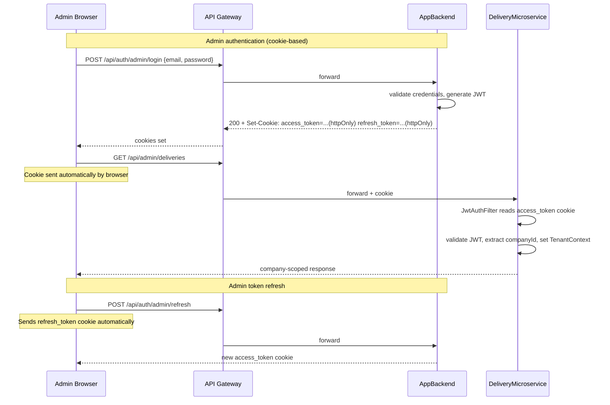
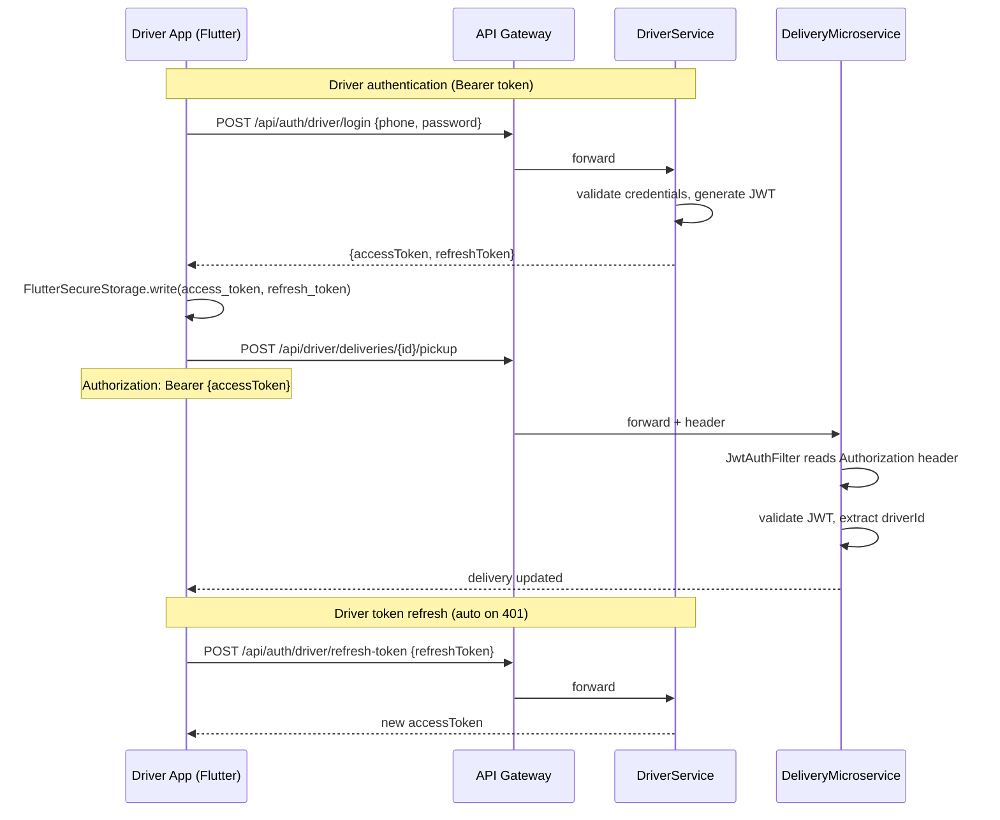

# 07 — Security Model

## 7.1 Authentication Strategies

The platform uses **two distinct JWT strategies** — one for admin users (cookie-based), one for drivers (Bearer token).





---

## 7.2 JWT Claims by Service

### AppBackend (Admin users)

```json
{
  "sub":       "uuid",
  "role":      "ADMIN | SUPER_ADMIN",
  "name":      "Ahmed Ben Ali",
  "type":      "access | refresh",
  "companyId": "uuid | null"
}
```

- `companyId = null` → SUPER_ADMIN (sees all companies)
- `companyId = uuid` → Company-scoped admin (sees only own company data)
- Access token expiry: **1 hour**
- Refresh token expiry: **7 days**

### DriverService (Drivers)

```json
{
  "sub":   "uuid",
  "role":  "DRIVER",
  "name":  "Khalil Mansouri",
  "phone": "+21698765432",
  "type":  "access | refresh"
}
```

- **No `companyId`** — drivers are shared across all companies
- Access token expiry: **24 hours** (longer to avoid mid-delivery token expiry)
- Refresh token expiry: **7 days**

### Shared JWT Secret

All services share `${JWT_SECRET:asmsecret2026}`. The secret is derived via SHA-256 hash before
use as the HMAC signing key.

> **Production:** Set `JWT_SECRET` to a random 64-character hex string: `openssl rand -hex 64`  
> **Never** use the default `asmsecret2026` in production.

---

## 7.3 Role-Based Access Control

### Roles

| Role | Description |
|------|-------------|
| `SUPER_ADMIN` | Platform-level admin. No company scope. Full access. |
| `ADMIN` | Company admin. Full access within own company. |
| `DISPATCHER` | Operational staff. Can dispatch, manage routes, view deliveries. |
| `MANAGER` | Read-only analytics and reports. |
| `DRIVER` | Driver app. Delivery execution only. |
| `CLIENT` | End client. Can create orders and track own deliveries. |

### Endpoint Access Matrix (DeliveryMicroservice)

| Path Pattern | Allowed Roles |
|-------------|---------------|
| `/api/orders/**` | CLIENT |
| `/api/deliveries/**` | CLIENT, DRIVER, DISPATCHER, ADMIN, SUPER_ADMIN |
| `/api/driver/deliveries/**` | DRIVER |
| `/api/driver/routes/**` | DRIVER |
| `/api/admin/deliveries/**` | ADMIN, DISPATCHER, SUPER_ADMIN |
| `/api/admin/routes/**` | ADMIN, DISPATCHER, SUPER_ADMIN |
| `/api/admin/erp/**` | ADMIN, SUPER_ADMIN |
| `/api/admin/stats/**` | ADMIN, DISPATCHER, MANAGER, SUPER_ADMIN |
| `/api/admin/reports/**` | ADMIN, DISPATCHER, MANAGER, SUPER_ADMIN |
| `/api/admin/companies/**` | SUPER_ADMIN |
| `/api/admin/drivers/**` | ADMIN, SUPER_ADMIN |
| `/api/admin/vehicles/**` | ADMIN, SUPER_ADMIN |
| `/api/public/**` | PUBLIC |
| `/ws/**` | PUBLIC (auth via STOMP CONNECT frame) |
| `/internal/**` | X-Internal-Secret only |

---

## 7.4 Internal Service-to-Service Authentication

Services communicate internally using a shared secret header, never externally exposed:

```
Header: X-Internal-Secret: {value}
Value:  ${INTERNAL_SECRET:asm-internal-2026}
```

| Caller | Callee | Endpoints |
|--------|--------|-----------|
| DeliveryMicroservice | DriverService | `/internal/drivers/**` |
| DeliveryMicroservice | ErpAdapterService | `/api/erp/**` |
| AppBackend | DeliveryMicroservice | `/internal/audit` |
| Super Admin App | DeliveryMicroservice | `/api/admin/companies/**`, `/api/admin/drivers/**` |

> **Production:** Set `INTERNAL_SECRET` to a random value different from JWT_SECRET.

---

## 7.5 Multi-Tenant Isolation (Data Layer)

### Hibernate Filter

All tenant-scoped entities are annotated with Hibernate `@Filter("companyFilter")`:

```java
@Filter(name = "companyFilter", condition = "company_id = :tenantId")
```

The filter is activated in the JwtAuthFilter via `TenantContext`:

```java
// JwtAuthFilter
String companyId = claims.get("companyId");
if (companyId != null) {
    TenantContext.set(UUID.fromString(companyId));
    session.enableFilter("companyFilter").setParameter("tenantId", companyId);
}
```

`TenantContext.clear()` is called in a `finally` block to prevent tenant bleed across requests.

### SUPER_ADMIN Bypass

When `companyId` is null (SUPER_ADMIN), the filter is not activated and all company records are visible.

---

## 7.6 Gateway Header Trust (Optional)

DeliveryMicroservice supports an optional mode where it trusts headers injected by the API Gateway
instead of re-validating the JWT itself:

```yaml
app.security.trust-gateway-headers: false  # DISABLED by default
app.security.gateway-secret: ${GATEWAY_SECRET:}
```

When enabled, the service accepts:
- `X-User-Id`, `X-User-Role`, `X-User-Name`, `X-Company-Id`, `X-Odoo-Partner-Id`
- Validated by `X-Gateway-Secret` header

This is disabled by default. Enable only if the API Gateway performs JWT validation and the
`GATEWAY_SECRET` is a strong shared secret.

---

## 7.7 Cookie Security (AppBackend)

```yaml
app.cookie.secure: ${COOKIE_SECURE:false}
```

| Setting | Value | When |
|---------|-------|------|
| `COOKIE_SECURE=false` | Default | Local development (HTTP) |
| `COOKIE_SECURE=true` | **Required in production** | HTTPS deployments |

The `SameSite=Strict` flag is always set. When `secure=true`, cookies are only sent over HTTPS.

---

## 7.8 SSL Pinning (Driver App)

SSL pinning code is present but **disabled** in `api_client.dart` lines 24-30:

```dart
// P2: SSL Pinning Infrastructure
// TODO: Enable before production release
// IOHttpClientAdapter().onHttpClientCreate = (client) {
//   SecurityContext context = SecurityContext();
//   context.setTrustedCertificatesBytes(certBytes);
//   return HttpClient(context: context);
// };
```

> **Production:** Re-enable SSL pinning and pin the production TLS certificate before public release.

---

## 7.9 Secrets Checklist for Production

| Secret | Env Var | Current Default | Required Action |
|--------|---------|-----------------|-----------------|
| JWT signing secret | `JWT_SECRET` | `asmsecret2026` | `openssl rand -hex 64` |
| Internal service secret | `INTERNAL_SECRET` | `asm-internal-2026` | Strong random value |
| MinIO access key | `MINIO_ACCESS_KEY` | `asmtracking` | Change to strong credentials |
| MinIO secret key | `MINIO_SECRET_KEY` | `asmtracking2026` | Change to strong credentials |
| Odoo password | `ODOO_PASSWORD` | `admin` | Change to strong credentials |
| Cookie secure flag | `COOKIE_SECURE` | `false` | Set to `true` for HTTPS |
| Dead-letter webhook | `OUTBOX_ALERT_WEBHOOK_URL` | (empty) | Set to Slack webhook URL |
| FCM service account | `FCM_SERVICE_ACCOUNT_PATH` | `firebase-service-account.json` | Mount actual file |
