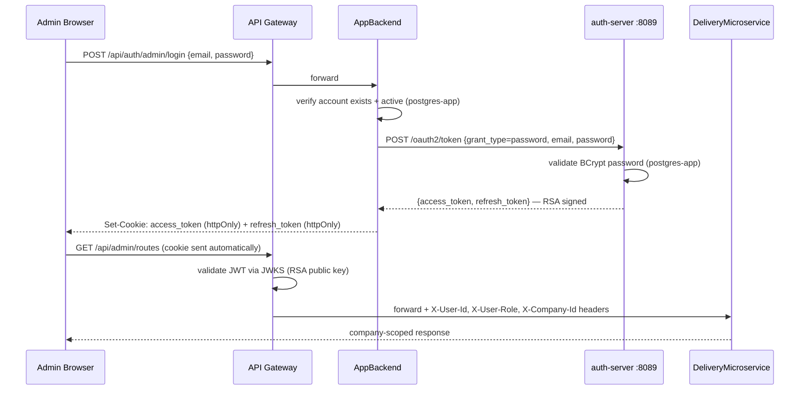
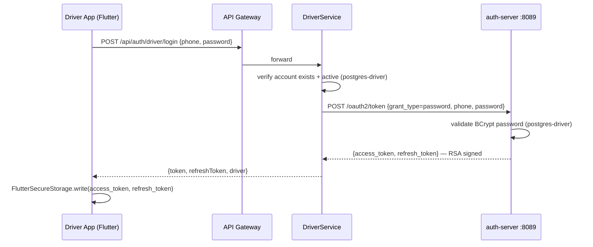
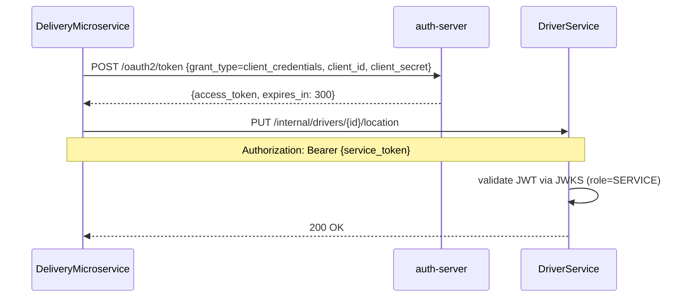

# 07 — Security Model

## 7.1 Authentication Strategies

The platform uses **OAuth 2.0** with a dedicated `auth-server` (Spring Boot) that issues RSA-signed JWTs. All services validate tokens via the JWKS public key endpoint — no shared secret.

### Admin login (cookie-based)



### Driver login (Bearer token)



---

## 7.2 JWT Claims

All tokens are issued by `auth-server` and signed with **RSA-2048** (algorithm: RS256). Services validate using the public key from `GET /oauth2/jwks` — no shared secret.

### User access token (admin / driver)

```json
{
  "sub":       "uuid",
  "role":      "ADMIN | DISPATCHER | MANAGER | SUPER_ADMIN | DRIVER",
  "name":      "Ahmed Ben Ali",
  "type":      "access",
  "companyId": "uuid | null",
  "phone":     "+21698765432"
}
```

| Field | Admin | Driver |
|-------|-------|--------|
| `sub` | adminUser.id | driver.id |
| `role` | ADMIN / DISPATCHER / MANAGER / SUPER_ADMIN | DRIVER |
| `companyId` | uuid (null for SUPER_ADMIN) | absent |
| `phone` | absent | present |
| expiry | **1 hour** | **1 hour** |

### Service token (client_credentials)

```json
{
  "sub":  "delivery-service",
  "role": "SERVICE",
  "type": "service"
}
```

- Expiry: **5 minutes** — short-lived, auto-refreshed with caching
- Used for all internal service-to-service calls

### RSA Key Management

- Key pair generated from `AUTH_RSA_SEED` env var (deterministic — survives restarts)
- Public key exposed at `http://auth-server:8089/oauth2/jwks`
- All services fetch and cache the public key at startup
- **Key rotation:** change `AUTH_RSA_SEED` → all existing tokens immediately invalid → users re-login

---

## 7.3 Role-Based Access Control

### Roles

| Role | Description |
|------|-------------|
| `SUPER_ADMIN` | Platform-level admin. No company scope. Full access. |
| `ADMIN` | Company admin. Full access within own company. |
| `DISPATCHER` | Operational staff. Can dispatch, manage routes, view deliveries. |
| `MANAGER` | Read-only analytics and reports. |
| `DRIVER` | Driver app. Delivery execution only. |
| `CLIENT` | End client. Can create orders and track own deliveries. |

### Endpoint Access Matrix (DeliveryMicroservice)

| Path Pattern | Allowed Roles |
|-------------|---------------|
| `/api/orders/**` | CLIENT |
| `/api/deliveries/**` | CLIENT, DRIVER, DISPATCHER, ADMIN, SUPER_ADMIN |
| `/api/driver/deliveries/**` | DRIVER |
| `/api/driver/routes/**` | DRIVER |
| `/api/admin/deliveries/**` | ADMIN, DISPATCHER, SUPER_ADMIN |
| `/api/admin/routes/**` | ADMIN, DISPATCHER, SUPER_ADMIN |
| `/api/admin/erp/**` | ADMIN, SUPER_ADMIN |
| `/api/admin/stats/**` | ADMIN, DISPATCHER, MANAGER, SUPER_ADMIN |
| `/api/admin/reports/**` | ADMIN, DISPATCHER, MANAGER, SUPER_ADMIN |
| `/api/admin/companies/**` | SUPER_ADMIN |
| `/api/admin/drivers/**` | ADMIN, SUPER_ADMIN |
| `/api/admin/vehicles/**` | ADMIN, SUPER_ADMIN |
| `/api/public/**` | PUBLIC |
| `/ws/**` | PUBLIC (auth via STOMP CONNECT frame) |
| `/internal/**` | OAuth2 service token (role=SERVICE) |

---

## 7.4 Internal Service-to-Service Authentication

Services use **OAuth 2.0 Client Credentials** flow. Each service has a `client_id` + `client_secret` registered in `auth-server`. Before calling another service, it fetches a short-lived (5 min) service token and caches it.



| Client ID | Secret Env Var | Calls |
|-----------|----------------|-------|
| `delivery-service` | `CLIENT_SECRET_DELIVERY` | DriverService, ErpAdapterService |
| `erp-adapter` | `CLIENT_SECRET_ERP` | DeliveryMicroservice (company config) |
| `app-backend` | `CLIENT_SECRET_APP` | DeliveryMicroservice (user deactivation) |
| `driver-service` | `CLIENT_SECRET_DRIVER` | (reserved) |

> **Replaces:** the previous `X-Internal-Secret` shared header approach.

---

## 7.5 Multi-Tenant Isolation (Data Layer)

### Hibernate Filter

All tenant-scoped entities are annotated with Hibernate `@Filter("companyFilter")`:

```java
@Filter(name = "companyFilter", condition = "company_id = :tenantId")
```

The filter is activated in the JwtAuthFilter via `TenantContext`:

```java
// JwtAuthFilter
String companyId = claims.get("companyId");
if (companyId != null) {
    TenantContext.set(UUID.fromString(companyId));
    session.enableFilter("companyFilter").setParameter("tenantId", companyId);
}
```

`TenantContext.clear()` is called in a `finally` block to prevent tenant bleed across requests.

### SUPER_ADMIN Bypass

When `companyId` is null (SUPER_ADMIN), the filter is not activated and all company records are visible.

---

## 7.6 Gateway Header Trust (Optional)

DeliveryMicroservice supports an optional mode where it trusts headers injected by the API Gateway
instead of re-validating the JWT itself:

```yaml
app.security.trust-gateway-headers: false  # DISABLED by default
app.security.gateway-secret: ${GATEWAY_SECRET:}
```

When enabled, the service accepts:
- `X-User-Id`, `X-User-Role`, `X-User-Name`, `X-Company-Id`, `X-Odoo-Partner-Id`
- Validated by `X-Gateway-Secret` header

This is disabled by default. Enable only if the API Gateway performs JWT validation and the
`GATEWAY_SECRET` is a strong shared secret.

---

## 7.7 Cookie Security (AppBackend)

```yaml
app.cookie.secure: ${COOKIE_SECURE:false}
```

| Setting | Value | When |
|---------|-------|------|
| `COOKIE_SECURE=false` | Default | Local development (HTTP) |
| `COOKIE_SECURE=true` | **Required in production** | HTTPS deployments |

The `SameSite=Strict` flag is always set. When `secure=true`, cookies are only sent over HTTPS.

---

## 7.8 SSL Pinning (Driver App)

SSL pinning code is present but **disabled** in `api_client.dart` lines 24-30:

```dart
// P2: SSL Pinning Infrastructure
// TODO: Enable before production release
// IOHttpClientAdapter().onHttpClientCreate = (client) {
//   SecurityContext context = SecurityContext();
//   context.setTrustedCertificatesBytes(certBytes);
//   return HttpClient(context: context);
// };
```

> **Production:** Re-enable SSL pinning and pin the production TLS certificate before public release.

---

## 7.9 Secrets Checklist for Production

| Secret | Env Var | Current Default | Required Action |
|--------|---------|-----------------|-----------------|
| RSA key seed | `AUTH_RSA_SEED` | `asm-rsa-key-seed-2026-change-in-prod` | Change to a random 64-char string |
| Service secret — delivery | `CLIENT_SECRET_DELIVERY` | `delivery-svc-secret-2026` | Strong random value |
| Service secret — driver | `CLIENT_SECRET_DRIVER` | `driver-svc-secret-2026` | Strong random value |
| Service secret — erp | `CLIENT_SECRET_ERP` | `erp-svc-secret-2026` | Strong random value |
| Service secret — app | `CLIENT_SECRET_APP` | `app-svc-secret-2026` | Strong random value |
| MinIO access key | `MINIO_ACCESS_KEY` | `asmtracking` | Change to strong credentials |
| MinIO secret key | `MINIO_SECRET_KEY` | `asmtracking2026` | Change to strong credentials |
| Odoo password | `ODOO_PASSWORD` | `admin` | Change to strong credentials |
| Cookie secure flag | `COOKIE_SECURE` | `false` | Set to `true` for HTTPS |
| Dead-letter webhook | `OUTBOX_ALERT_WEBHOOK_URL` | (empty) | Set to Slack webhook URL |
| FCM service account | `FCM_SERVICE_ACCOUNT_PATH` | `firebase-service-account.json` | Mount actual file |
