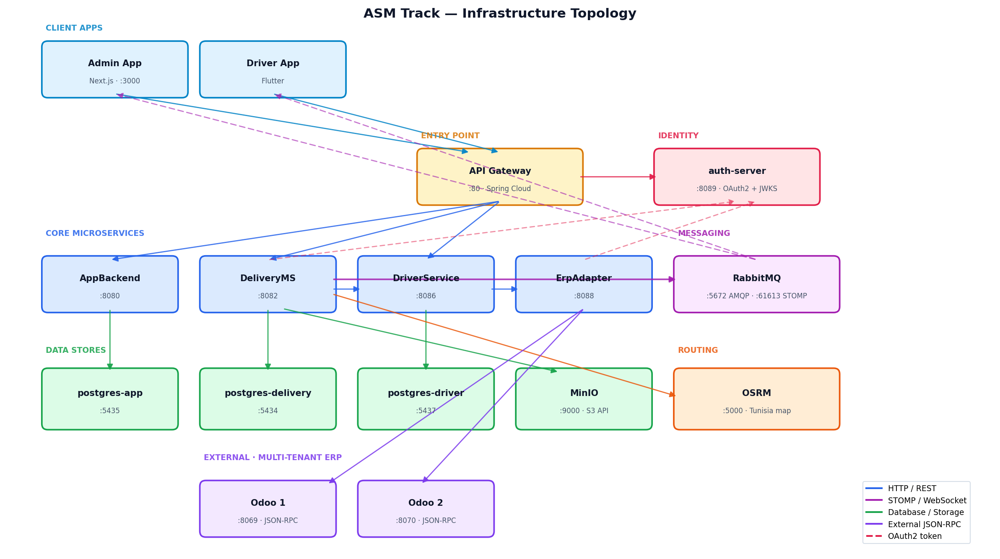

# 08 — Infrastructure & Deployment

## 8.1 Docker Compose Topology



---

## 8.2 Services Reference

| Service | Image / Build | Port (host:container) | Health Check |
|---------|--------------|----------------------|--------------|
| `postgres-app` | postgres:16-alpine | 5435:5432 | pg_isready |
| `postgres-delivery` | postgres:16-alpine | 5434:5432 | pg_isready |
| `postgres-driver` | postgres:16-alpine | 5437:5432 | pg_isready |
| `rabbitmq` | rabbitmq:4-management | 5672:5672 · 15672:15672 · 61613:61613 | rabbitmq-diagnostics ping |
| `minio` | minio/minio:latest | 9000:9000 · 9001:9001 | curl /minio/health/live |
| `osrm` | osrm/osrm-backend:latest | 5000:5000 | — (depends on osrm-prepare) |
| `auth-server` | ./AuthServer/Dockerfile | 8089:8089 | nc -z localhost 8089 |
| `app-backend` | ./AppBackend/Dockerfile | 8080:8080 | nc -z localhost 8080 |
| `delivery-service` | ./DeliveryMicroservice/Dockerfile | 8082:8082 | nc -z localhost 8082 |
| `driver-service` | ./DriverService/Dockerfile | 8086:8086 | nc -z localhost 8086 |
| `erp-adapter` | ./ErpAdapterService/Dockerfile | 8088:8088 | wget /actuator/health |
| `api-gateway` | ./ApiGateway/Dockerfile | 80:80 | — |

---

## 8.3 Environment Variables — Full Reference

### auth-server

```env
TZ=Africa/Tunis
AUTH_RSA_SEED=asm-rsa-key-seed-2026-change-in-prod   # CHANGE IN PRODUCTION
CLIENT_SECRET_DELIVERY=<base64-secret>
CLIENT_SECRET_DRIVER=<base64-secret>
CLIENT_SECRET_ERP=<base64-secret>
CLIENT_SECRET_APP=<base64-secret>
CLIENT_SECRET_GW=<base64-secret>
```

### app-backend

```env
TZ=Africa/Tunis
SPRING_DATASOURCE_URL=jdbc:postgresql://postgres-app:5432/app_db
SPRING_DATASOURCE_USERNAME=app_user
SPRING_DATASOURCE_PASSWORD=app_password              # CHANGE IN PRODUCTION
AUTH_SERVER_URL=http://auth-server:8089
AUTH_SERVER_JWKS_URI=http://auth-server:8089/oauth2/jwks
CLIENT_ID=app-backend
CLIENT_SECRET=<base64-secret>                        # CHANGE IN PRODUCTION
DELIVERY_SERVICE_URL=http://delivery-service:8082
COOKIE_SECURE=false                                  # SET TO true IN PRODUCTION (HTTPS)
```

### delivery-service

```env
TZ=Africa/Tunis
SPRING_PROFILES_ACTIVE=prod
DB_HOST=postgres-delivery
DB_PORT=5432
DB_NAME=delivery_db
DB_USER=delivery
DB_PASS=delivery                                     # CHANGE IN PRODUCTION
AUTH_SERVER_URL=http://auth-server:8089
AUTH_SERVER_JWKS_URI=http://auth-server:8089/oauth2/jwks
CLIENT_ID=delivery-service
CLIENT_SECRET=<base64-secret>                        # CHANGE IN PRODUCTION
RABBITMQ_HOST=rabbitmq
WEBSOCKET_BROKER_RELAY_ENABLED=true
DRIVER_SERVICE_URL=http://driver-service:8086
TRANSPORT_PROVIDER=internal
MINIO_URL=http://minio:9000
MINIO_PUBLIC_URL=http://localhost:9000               # SET TO external URL in production
MINIO_ACCESS_KEY=asmtracking                         # CHANGE IN PRODUCTION
MINIO_SECRET_KEY=asmtracking2026                     # CHANGE IN PRODUCTION
MINIO_BUCKET=pod-files
ROUTING_OSRM_ENABLED=true
ROUTING_OSRM_BASE_URL=http://osrm:5000
ERP_ADAPTER_URL=http://erp-adapter:8088
FCM_ENABLED=true
FCM_SERVICE_ACCOUNT_PATH=/app/firebase-service-account.json
OUTBOX_ALERT_WEBHOOK_URL=                            # SET TO Slack webhook URL
OPS_SLA_WAITING_MINUTES=1                            # prod: 15
```

### driver-service

```env
TZ=Africa/Tunis
DB_HOST=postgres-driver
DB_PORT=5432
DB_NAME=driver_db
DB_USER=driver
DB_PASS=driver                                       # CHANGE IN PRODUCTION
AUTH_SERVER_URL=http://auth-server:8089
AUTH_SERVER_JWKS_URI=http://auth-server:8089/oauth2/jwks
CLIENT_ID=driver-service
CLIENT_SECRET=<base64-secret>                        # CHANGE IN PRODUCTION
```

### erp-adapter

```env
TZ=Africa/Tunis
SERVER_PORT=8088
AUTH_SERVER_URL=http://auth-server:8089
AUTH_SERVER_JWKS_URI=http://auth-server:8089/oauth2/jwks
CLIENT_ID=erp-adapter
CLIENT_SECRET=<base64-secret>                        # CHANGE IN PRODUCTION
DELIVERY_SERVICE_URL=http://delivery-service:8082
```

### api-gateway

```env
APP_BACKEND_URL=http://app-backend:8080
DELIVERY_SERVICE_URL=http://delivery-service:8082
DRIVER_SERVICE_URL=http://driver-service:8086
AUTH_SERVER_JWKS_URI=http://auth-server:8089/oauth2/jwks
CLIENT_SECRET_GW=<base64-secret>                     # CHANGE IN PRODUCTION
```

### rabbitmq

```env
RABBITMQ_DEFAULT_USER=guest                          # CHANGE IN PRODUCTION
RABBITMQ_DEFAULT_PASS=guest                          # CHANGE IN PRODUCTION
```

---

## 8.4 Volumes

| Volume | Mounted To | Purpose |
|--------|-----------|---------|
| `app-pgdata` | postgres-app | Admin user data |
| `delivery-pgdata` | postgres-delivery | Delivery domain data |
| `driver-pgdata` | postgres-driver | Driver profiles and stats |
| `minio_data` | minio | POD photos (proof of delivery) |
| `osrm-data` | osrm | Tunisia OSM routing data (pre-processed) |
| `rabbitmq-data` | rabbitmq | Message broker persistence |
| *(bind mount)* | delivery-service:/app/firebase-service-account.json | FCM credentials (read-only) |

---

## 8.5 Network

All services share a single Docker bridge network `asm-network`. Internal DNS resolution:

```
auth-server:8089
postgres-delivery:5432
driver-service:8086
erp-adapter:8088
rabbitmq:5672          # AMQP
rabbitmq:61613         # STOMP relay
minio:9000
osrm:5000
host.docker.internal   # access to Odoo dev instances on the Docker host
```

---

## 8.6 Database Schema Management

### DeliveryMicroservice — Flyway

29 migrations, V1 → V29:

| Migration | Change |
|-----------|--------|
| V1 | Baseline schema |
| V17 | `companies` table with default ASM Track company |
| V18 | `company_id` FK on all core tables (multi-tenancy) |
| V22 | UNIQUE constraint `(erp_order_id, company_id)` on orders |
| V25 | `version` column on deliveries (optimistic locking) |
| V26 | `processed_requests` table (HTTP idempotency) |
| V27 | `outbox_event` table with index |
| V28 | Drop duplicate `outbox_events` table |
| V29 | `parent_order_id` on orders (backorder traceability) |

### AppBackend — schema.sql

Applied via `spring.sql.init.mode=always` on startup. No Flyway.

### DriverService — Hibernate DDL

`spring.jpa.hibernate.ddl-auto=update` — schema auto-created by Hibernate. Suitable for development; use Flyway before production.

---

## 8.7 OSRM Setup

OSRM pre-processes Tunisia OSM data before the routing service starts. Data is cached in `osrm-data` volume and only re-processed when the volume is cleared.

```yaml
osrm-download:   # one-shot: downloads Tunisia .pbf map
osrm-prepare:    # one-shot: extract → partition → customize
osrm:            # long-running routing API
  depends_on: [osrm-prepare]
```

---

## 8.8 MinIO Setup

On first run, create the `pod-files` bucket:

```bash
docker exec -it minio mc alias set local http://localhost:9000 asmtracking asmtracking2026
docker exec -it minio mc mb local/pod-files
```

In production, `MINIO_PUBLIC_URL` must be an externally accessible URL — this is the URL drivers and browsers use to view POD photos via presigned URLs.

---

## 8.9 RabbitMQ STOMP Setup

RabbitMQ 4 includes the STOMP plugin by default. Port 61613 is exposed for Spring's `StompBrokerRelayMessageHandler`.

DeliveryMicroservice connects as system user on startup:
```
StompBrokerRelayMessageHandler : "System" session connected.
BrokerAvailabilityEvent[available=true]
```

If RabbitMQ is unavailable at startup, WebSocket events are lost until reconnect. The service itself remains functional — only real-time push is affected.

---

## 8.10 Multi-Odoo Setup

For a second Odoo instance (second tenant company), use `docker-compose.odoo2.yml`:

- Company 1: `erp_api_url = http://host.docker.internal:8069/jsonrpc`
- Company 2: `erp_api_url = http://host.docker.internal:8070/jsonrpc`

The `X-Company-Id` header in ERP calls routes to the correct Odoo instance via `CompanyConfigResolver`.
