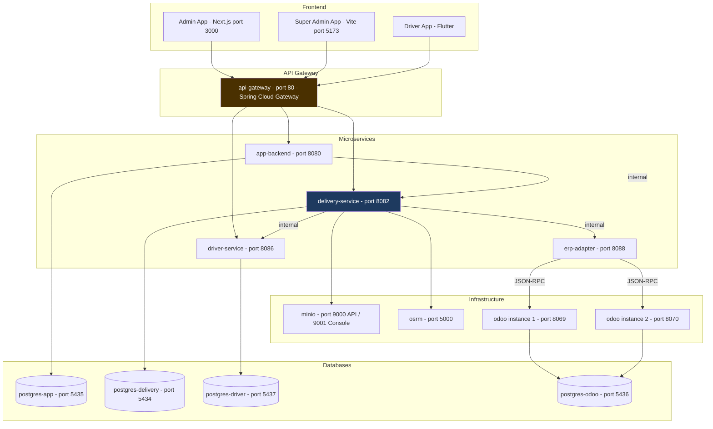

# 08 — Infrastructure & Deployment

## 8.1 Docker Compose Topology



---

## 8.2 Services Reference

| Service | Image / Source | Port (host:container) | Depends On | Health Check |
|---------|---------------|----------------------|------------|--------------|
| `postgres-app` | postgres:16-alpine | 5435:5432 | — | pg_isready |
| `postgres-delivery` | postgres:16-alpine | 5434:5432 | — | pg_isready |
| `postgres-driver` | postgres:16-alpine | 5437:5432 | — | pg_isready |
| `postgres-odoo` | postgres:15 | 5436:5432 | — | pg_isready |
| `minio` | minio/minio:latest | 9000:9000, 9001:9001 | — | curl /minio/health/live |
| `osrm` | osrm/osrm-backend:latest | 5000:5000 | osrm-prepare (init) | — |
| `odoo` | odoo:16 | 8069:8069 | postgres-odoo | — |
| `app-backend` | ./AppBackend/Dockerfile | 8080:8080 | postgres-app (healthy) | nc -z localhost 8080 |
| `delivery-service` | ./DeliveryMicroservice/Dockerfile | 8082:8082 | postgres-delivery, minio (healthy) | nc -z localhost 8082 |
| `driver-service` | ./DriverService/Dockerfile | 8086:8086 | postgres-driver (healthy) | nc -z localhost 8086 |
| `erp-adapter` | ./ErpAdapterService/Dockerfile | 8088:8088 | — | wget /actuator/health |
| `api-gateway` | ./ApiGateway/Dockerfile | 80:80 | app-backend, delivery-service, driver-service (healthy) | — |

---

## 8.3 Environment Variables — Full Reference

### app-backend

```env
TZ=Africa/Tunis
SPRING_DATASOURCE_URL=jdbc:postgresql://postgres-app:5432/app_db
SPRING_DATASOURCE_USERNAME=app_user
SPRING_DATASOURCE_PASSWORD=app_password
JWT_SECRET=asmsecret2026                          # CHANGE IN PRODUCTION
DELIVERY_SERVICE_URL=http://delivery-service:8082
INTERNAL_SECRET=asm-internal-2026                # CHANGE IN PRODUCTION
ODOO_URL=http://host.docker.internal:8069/jsonrpc
ODOO_DB=DBTEST
ODOO_UID=2
ODOO_PASSWORD=admin                              # CHANGE IN PRODUCTION
APP_JWT_ACCESS_EXPIRY_MS=3600000                 # 1 hour
COOKIE_SECURE=false                              # SET TO true IN PRODUCTION (HTTPS)
```

### delivery-service

```env
TZ=Africa/Tunis
SPRING_PROFILES_ACTIVE=prod
DB_HOST=postgres-delivery
DB_PORT=5432
DB_NAME=delivery_db
DB_USER=delivery
DB_PASS=delivery
JWT_SECRET=asmsecret2026                         # CHANGE IN PRODUCTION
INTERNAL_SECRET=asm-internal-2026               # CHANGE IN PRODUCTION
DRIVER_SERVICE_URL=http://driver-service:8086
TRANSPORT_PROVIDER=internal
MINIO_URL=http://minio:9000
MINIO_PUBLIC_URL=http://localhost:9000           # SET TO external URL (e.g., https://files.yourdomain.com)
MINIO_ACCESS_KEY=asmtracking                    # CHANGE IN PRODUCTION
MINIO_SECRET_KEY=asmtracking2026                # CHANGE IN PRODUCTION
MINIO_BUCKET=pod-files
ROUTING_OSRM_ENABLED=true
ROUTING_OSRM_BASE_URL=http://osrm:5000
ROUTING_OSRM_PROFILE=driving
ROUTING_TRANSIT_SLA_MULTIPLIER=1.20
ROUTING_TRANSIT_SLA_BUFFER_MINUTES=8
ERP_ADAPTER_URL=http://erp-adapter:8088
ERP_DEFAULT_PROVIDER=odoo
FCM_ENABLED=true
FCM_SERVICE_ACCOUNT_PATH=/app/firebase-service-account.json
OUTBOX_ALERT_WEBHOOK_URL=                       # SET TO Slack webhook URL for dead-letter alerts
OPS_SLA_WAITING_MINUTES=1                       # dev: 1 min; prod: 15 min
OPS_SLA_TRANSIT_MINUTES=2                       # dev: 2 min; prod: appropriate value
WAREHOUSE_NAME=Main Warehouse
WAREHOUSE_CITY=Tunis
WAREHOUSE_COUNTRY_CODE=TN
```

### driver-service

```env
TZ=Africa/Tunis
DB_URL=jdbc:postgresql://postgres-driver:5432/driver_db
DB_USER=driver
DB_PASS=driver
JWT_SECRET=asmsecret2026                         # CHANGE IN PRODUCTION (must match all services)
INTERNAL_SECRET=asm-internal-2026               # CHANGE IN PRODUCTION
```

### erp-adapter

```env
TZ=Africa/Tunis
SERVER_PORT=8088
INTERNAL_SECRET=asm-internal-2026               # CHANGE IN PRODUCTION
ODOO_URL=http://host.docker.internal:8069/jsonrpc
ODOO_DB=DBTEST
ODOO_UID=2
ODOO_PASSWORD=admin                              # CHANGE IN PRODUCTION
ODOO_CONNECT_TIMEOUT_MS=5000
ODOO_READ_TIMEOUT_MS=15000
```

### api-gateway

```env
APP_BACKEND_URL=http://app-backend:8080
DELIVERY_SERVICE_URL=http://delivery-service:8082
DRIVER_SERVICE_URL=http://driver-service:8086
JWT_SECRET=asmsecret2026                         # CHANGE IN PRODUCTION
```

---

## 8.4 Volumes

| Volume Name | Mounted To | Purpose |
|-------------|-----------|---------|
| `app-pgdata` | postgres-app:/var/lib/postgresql/data | Admin user data persistence |
| `delivery-pgdata` | postgres-delivery:/var/lib/postgresql/data | Delivery domain data |
| `driver-pgdata` | postgres-driver:/var/lib/postgresql/data | Driver profiles and stats |
| `postgres_odoo_data` | postgres-odoo:/var/lib/postgresql/data | Odoo database |
| `minio_data` | minio:/data | POD files (photos, signatures) |
| `osrm-data` | osrm:/data | Tunisia OSM routing data |
| `odoo_addons` | odoo:/mnt/extra-addons | Odoo custom modules |
| (bind mount) | delivery-service:/app/firebase-service-account.json | FCM credentials (read-only) |

---

## 8.5 Network

All services are on a single Docker bridge network: `microservices_asm-network`.

Service DNS resolution within the network:
- `postgres-delivery:5432`
- `driver-service:8086`
- `erp-adapter:8088`
- `minio:9000`
- `osrm:5000`
- `host.docker.internal` → access to services on the Docker host (Odoo dev instances)

---

## 8.6 Database Schema Management

### DeliveryMicroservice (Flyway)

28 migrations, versioned V1 through V28:

| Migration | Change |
|-----------|--------|
| V1 | Baseline schema |
| V17 | Create `companies` table with default ASM Track company |
| V18 | Add `company_id` FK to all core tables |
| V22 | UNIQUE constraint `(erp_order_id, company_id)` on orders |
| V25 | Add `version` column to deliveries (optimistic locking) |
| V26 | Create `processed_requests` table (idempotency) |
| V27 | Create `outbox_event` table with index |
| V28 | Drop duplicate `outbox_events` table |

### AppBackend (schema.sql)

Schema applied via `spring.sql.init.mode=always` on startup. No Flyway — DDL managed by `schema.sql`.

### DriverService (Hibernate DDL)

`spring.jpa.hibernate.ddl-auto=update` — Hibernate auto-creates/updates schema. Not suitable for production schema migrations without caution.

---

## 8.7 OSRM Setup

OSRM requires pre-processing the Tunisia OSM data before the routing service starts:

```yaml
osrm-download:  # One-shot: downloads Tunisia map
  image: curlimages/curl:8.11.1
  command: curl -L -o /data/tunisia-latest.osm.pbf https://...

osrm-prepare:   # One-shot: extracts + partitions + customizes
  image: osrm/osrm-backend:latest
  command: |
    osrm-extract /data/tunisia-latest.osm.pbf -p /opt/car.lua
    osrm-partition /data/tunisia-latest.osrm
    osrm-customize /data/tunisia-latest.osrm

osrm:           # Long-running routing service
  image: osrm/osrm-backend:latest
  command: osrm-routed --algorithm mld /data/tunisia-latest.osrm
  depends_on: [osrm-prepare]
```

OSRM data is cached in `osrm-data` volume — only re-processed when the volume is cleared.

---

## 8.8 MinIO Setup

On first run, create the `pod-files` bucket:

```bash
docker exec -it minio mc alias set local http://localhost:9000 asmtracking asmtracking2026
docker exec -it minio mc mb local/pod-files
docker exec -it minio mc policy set download local/pod-files  # or use presigned URLs
```

For production, `MINIO_PUBLIC_URL` should be an externally accessible URL (e.g., `https://files.yourdomain.com`) — this is the URL that drivers and browsers use to view POD photos.

---

## 8.9 Multi-Odoo Setup

For a second Odoo instance (second tenant company), use `docker-compose.odoo2.yml`:

```yaml
odoo2:
  image: odoo:19
  ports:
    - "8070:8069"
  environment:
    HOST: postgres-odoo
    USER: odoo
    PASSWORD: odoo
```

Each company in the `companies` table gets its own `erp_api_url`:
- Company 1: `erp_api_url = http://host.docker.internal:8069/jsonrpc`
- Company 2: `erp_api_url = http://host.docker.internal:8070/jsonrpc`

The `X-Company-Id` header in ERP calls routes to the correct instance via `CompanyConfigResolver`.
