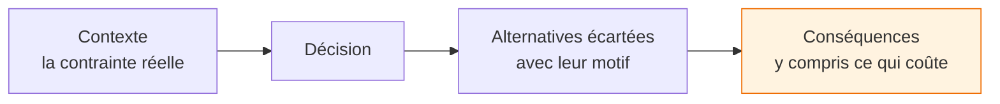
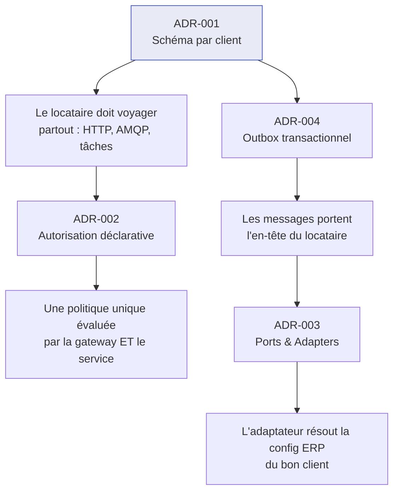

# Décisions d'architecture (ADR)

Ce dossier consigne les décisions structurantes d'ASM Track : celles qui seraient coûteuses à
défaire, et dont la raison ne se lit pas dans le code.

!!! quote "Ce qu'un ADR est, et n'est pas"
    Un ADR ne décrit pas **ce que** fait le système — le code le fait mieux. Il répond à la seule
    question que le code ne peut pas documenter : **pourquoi cette solution, et qu'a-t-on refusé ?**

    Six mois plus tard, c'est cette réponse qui manque, jamais l'autre.

---

## Les décisions

| # | Décision | Ce qu'elle a coûté |
|---|---|---|
| [001](001-multi-tenant-par-schema.md) | Isolation des clients par schéma PostgreSQL | migrations à rejouer sur chaque schéma |
| [002](002-politique-rbac-unique.md) | Politique d'autorisation déclarative, unique et *fail-closed* | l'URL porte une part du sens métier |
| [003](003-ports-adapters-erp.md) | Intégration ERP par Ports & Adapters | plus petit dénominateur commun entre ERP |
| [004](004-outbox-transactionnel.md) | Synchronisation ERP par outbox transactionnel | cohérence à terme, pas immédiate |

---

## Format

Chaque fiche suit la même structure :

!!! warning "La dernière section est la plus importante"
    Un ADR qui n'énonce que des avantages n'a pas été écrit honnêtement. Chacun de ces quatre
    documents nomme ce que la décision coûte, et ce qui reste ouvert.

---

## Comment ces décisions se répondent

**Aucune n'est isolée.** Le multi-tenant impose que le locataire traverse chaque frontière — ce qui
explique les post-processeurs AMQP, l'en-tête sur les messages, et pourquoi l'adaptateur ERP importe
la configuration tenant sans importer la partie Hibernate.
