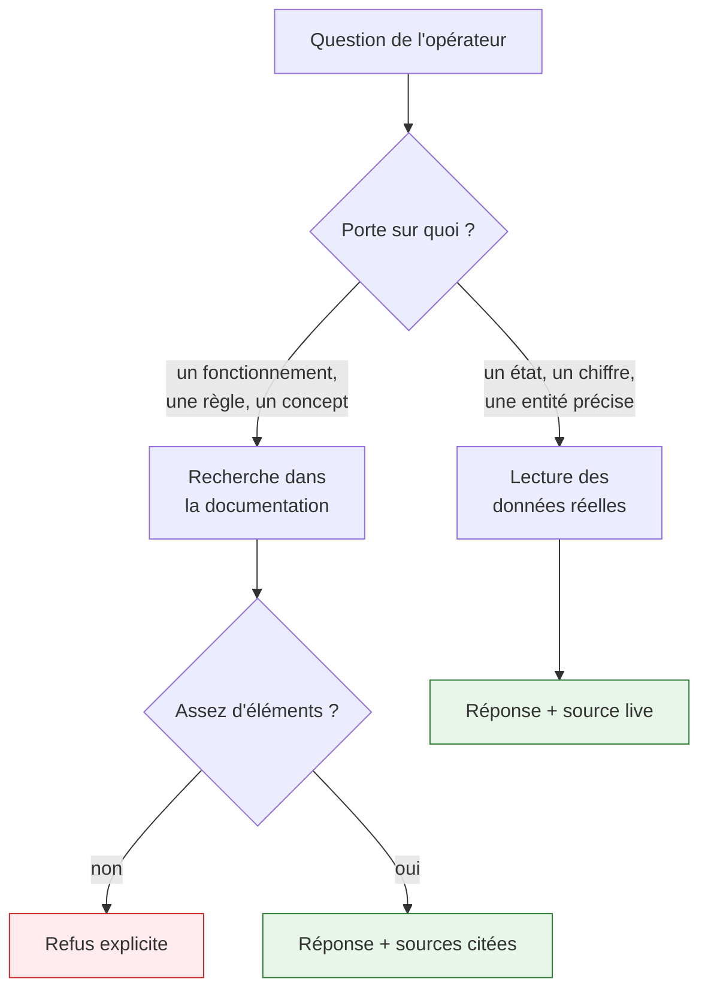
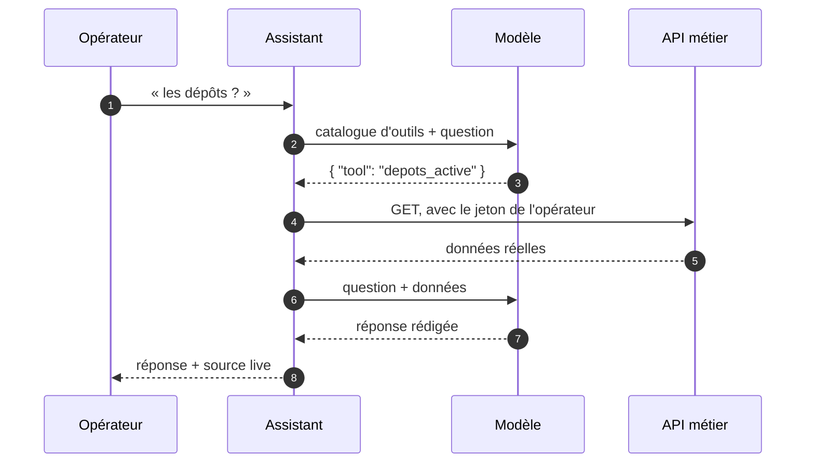

# Assistant interne

Un assistant en langage naturel pour les opérateurs : il répond sur le fonctionnement de la
plateforme **et** sur l'état réel de l'entreprise, en citant toujours d'où vient sa réponse.

La contrainte de départ tient en une phrase : **il ne doit jamais inventer**. Un assistant qui répond
faux avec assurance est pire qu'un assistant qui se tait.

---

## Deux sources, une décision

Le refus est un **résultat normal**, pas une panne. Quand la recherche ne remonte rien de suffisant,
l'assistant le dit et s'arrête là.

---

## Côté documentation

Le corpus est cette documentation même, plus les spécifications OpenAPI. Elle est découpée en
passages, indexée, puis retrouvée par une recherche mêlant **sens** (vecteurs) et **mots exacts**, dont
les résultats sont fusionnés.

Seuls les meilleurs passages sont donnés au modèle, avec la consigne de ne répondre qu'à partir
d'eux et de citer chaque affirmation. Les citations affichées renvoient au fichier et à la section
d'origine : l'opérateur peut vérifier.

!!! warning "Ce qui n'est pas dans la documentation n'existe pas pour lui"
    Une question sur un sujet non documenté reçoit un refus, même si le sujet existe dans le code.
    C'est le prix de la fiabilité — et un bon détecteur de trous dans la documentation.

---

## Côté données réelles

Certaines questions n'ont pas de réponse dans un document : « les dépôts ? », « combien de livraisons
aujourd'hui ? », « quels livreurs sont disponibles ? ». Elles portent sur les données de l'entreprise.

L'assistant dispose pour cela d'un **catalogue fermé de lectures autorisées**. Le modèle n'y voit que
des noms et des descriptions — jamais une URL. Il ne peut donc ni atteindre un endpoint non déclaré,
ni ajouter un paramètre, ni transformer une lecture en écriture.

**Le jeton transmis est celui de l'opérateur**, jamais un compte de service. L'assistant ne peut donc
rien lire que son utilisateur n'aurait pas pu consulter lui-même : les autorisations et l'isolation
entre clients s'appliquent inchangées.

!!! note "Le choix de l'outil échoue en douceur"
    Réponse illisible, outil inconnu, modèle injoignable, ou outil réclamant une référence absente de
    la question : tous ces cas renvoient vers la documentation. Aucun identifiant n'est jamais deviné.

---

## Le fournisseur du modèle est interchangeable

Le modèle est derrière un port. Deux adaptateurs coexistent — un pour les passerelles au format
OpenAI (OpenRouter, Groq, un modèle local), un pour Gemini — et l'un sert de **secours automatique**
à l'autre.

C'est une nécessité pratique, pas une élégance : les paliers gratuits répondent régulièrement
« capacité atteinte », et un assistant muet parce qu'un fournisseur sature n'est pas acceptable.
Chaque fournisseur garde son propre disjoncteur, sinon celui qui tombe entraînerait son remplaçant.

---

## Garde-fous

| Risque | Réponse |
|---|---|
| Réponse inventée | Répondre uniquement à partir des éléments fournis ; refuser sinon |
| Injection de consignes | Documents et données traités comme des **données**, jamais comme des instructions |
| Fuite entre clients | Recherche et lectures limitées au tenant de l'appelant |
| Usage abusif | Quota par utilisateur ; répondre coûte cher |
| Fournisseur en panne | Bascule automatique, puis message contrôlé — jamais une réponse fabriquée |

---

## Voir aussi

- [Autorisation](autorisation.md) — les permissions que l'assistant hérite de l'opérateur
- [Multi-tenant](multi-tenant.md) — l'isolation qui s'applique à ses lectures
