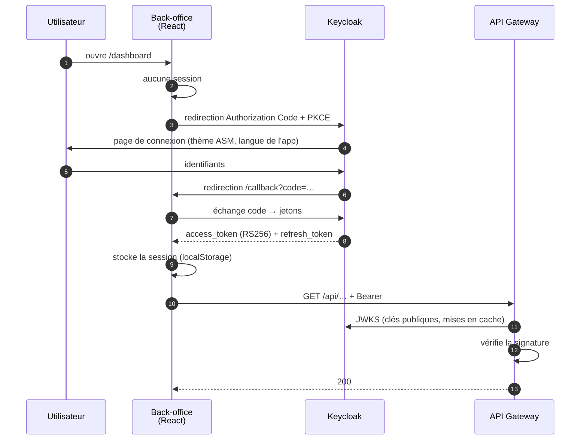
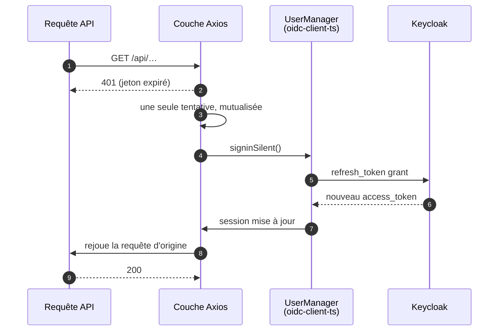
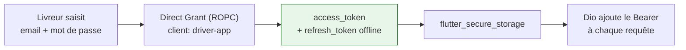

# Authentification

## La décision : ne pas l'écrire

L'authentification est déléguée à **Keycloak 26**. Aucun code maison ne vérifie un mot de passe, ne
génère un jeton ni ne gère une session.

!!! quote "Pourquoi"
    Écrire un serveur d'authentification aurait été le plus sûr moyen de mal le faire. Rotation de
    clés, révocation, expiration, rafraîchissement, déconnexion multi-appareils, verrouillage après
    échecs : chacun de ces points est une faille s'il est approximatif, et aucun n'est un
    différenciateur pour une plateforme de livraison.

**Ce que Keycloak apporte au-delà des jetons :** les **organisations**, qui portent directement la
notion de client de la plateforme. La claim `organization` d'un jeton *est* l'identifiant du
locataire.

---

## Le flux — back-office

**Observations.**

- **Authorization Code + PKCE**, pas de flux implicite : le jeton ne transite jamais dans une URL.
- La gateway ne détient **aucun secret partagé** — elle valide une signature avec une clé publique.
- Le thème de connexion Keycloak reçoit la langue et le mode sombre de l'application, pour que la
  bascule ne soit pas visible par l'utilisateur.

---

## Le renouvellement silencieux — et le piège qu'il cache

!!! danger "Le bug que ce schéma a permis de résoudre"
    Le renouvellement passait initialement par le `signinSilent` fourni par `useAuth()`. Or celui-ci
    est un **enrobage** : il déclenche un `NAVIGATOR_INIT` qui met `isLoading` à `true`. Le garde de
    route lisant `isLoading` démontait alors **toute la page** à chaque rafraîchissement de jeton ;
    au remontage, toutes les requêtes repartaient, et une seule 401 parmi elles relançait le cycle.

    Le résultat était un écran de chargement infini **composé uniquement de renouvellements qui
    réussissaient**. Aucune erreur nulle part — c'est ce qui le rendait introuvable.

    Le renouvellement se fait désormais sur l'instance `UserManager` directement, sans toucher à
    l'état React.

---

## Le flux — application livreur

**La portée `offline_access` est demandée volontairement.** Sans elle, le jeton de rafraîchissement
expire avec la session SSO — et un livreur se retrouvait **déconnecté au milieu d'une tournée**, en
zone de mauvaise couverture, sans moyen de se reconnecter. Avec elle, Keycloak émet un jeton de type
`Offline` sans expiration liée à la session.

!!! note "Pourquoi ROPC ici, et pas ailleurs"
    Le flux *Resource Owner Password Credentials* est déconseillé pour le web, où le navigateur peut
    porter une redirection. Sur mobile, l'application est le client de confiance et un aller-retour
    navigateur dégrade fortement l'expérience terrain. Le compromis est assumé et limité à ce client.

---

## Déconnexion

Keycloak notifie les services par **OIDC Back-Channel Logout** (`POST /api/auth/backchannel-logout`).
Ce point d'entrée n'est appelé par aucun de nos clients : son appelant est **Keycloak lui-même**.

!!! tip "À savoir pour l'analyse de code mort"
    Un endpoint sans appelant dans le dépôt n'est pas forcément mort. Celui-ci est requis par la
    spécification OIDC. Deux autres cas similaires existent : les points `/internal/` appelés par
    d'autres services, et les proxys.
