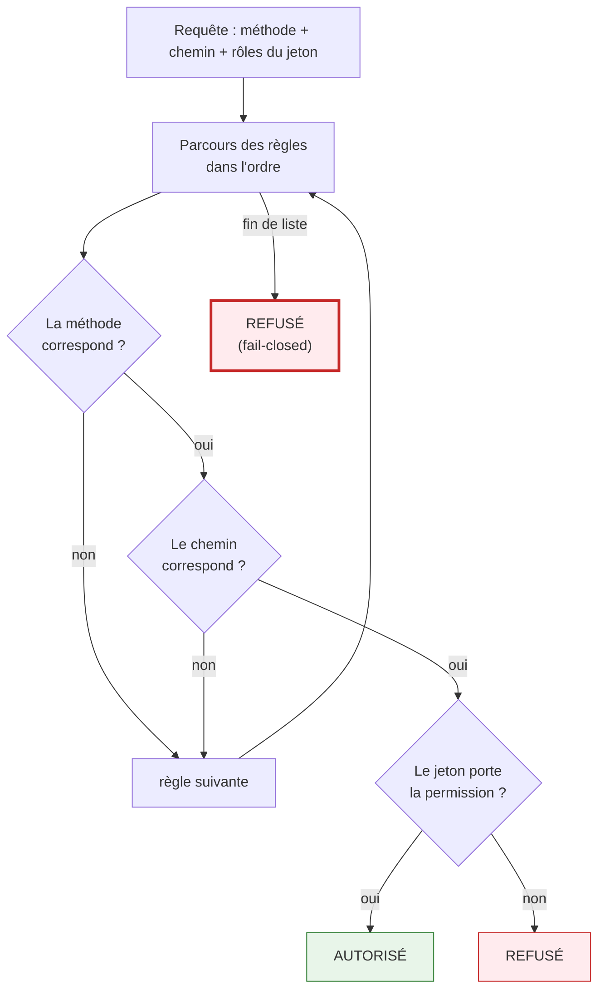
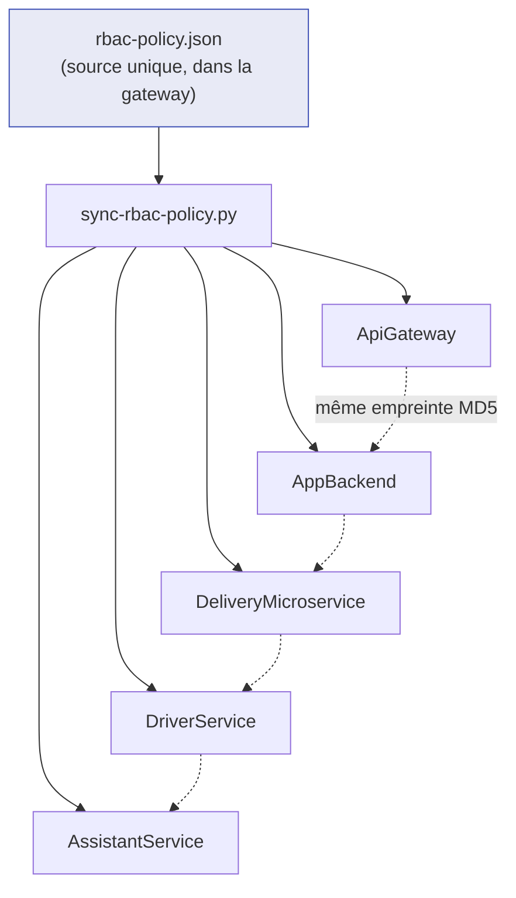
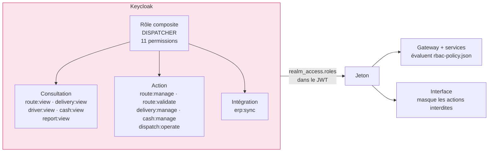

# Autorisation

> Décision et alternatives écartées : [ADR-002](../adr/002-politique-rbac-unique.md).

---

## Le problème que ça résout

La plateforme expose ~250 endpoints sur six services, pour des profils aux droits très différents.
La question à laquelle il faut pouvoir répondre — en revue comme en exploitation — est simple à poser
et redoutable à tenir :

> **Qui a le droit de faire quoi ?**

Avec des annotations `@PreAuthorize`, la réponse est répartie sur 250 méthodes dans 47 fichiers.
Personne ne peut la donner, et personne ne peut vérifier qu'un endroit n'a pas été oublié.

---

## Une politique déclarative unique

```json
{ "methods": ["GET"], "pathPrefix": "/api/v1/admin/routes",    "require": { "perm": "perm:route:view" } },
{ "methods": ["*"],   "pathPrefix": "/api/v1/admin/routes",    "require": { "perm": "perm:route:manage" } },
{ "methods": ["*"],   "pathPrefix": "/api/v1/admin/",          "require": { "perm": "perm:dispatch:operate" } }
```

46 règles, une par ligne, lisibles par un non-développeur.

L'ordre compte : la première règle qui correspond l'emporte. Les lectures sont donc déclarées avant
les écritures d'un même préfixe, et la règle la plus large ferme la liste. Une route non déclarée
n'est jamais ouverte par défaut — elle tombe sur la dernière règle, qui exige `perm:dispatch:operate`.



**Pourquoi ce diagramme.** Deux propriétés en découlent et ne se devinent pas :

1. **Premier match gagnant.** Les cas particuliers précèdent le cas général, comme dans une table de
   routage. La règle `/api/v1/admin/` en dernière position est un filet : tout ce qui n'a pas été
   prévu plus haut exige au minimum `perm:dispatch:operate`.
2. **Aucune règle = refus.** C'est la dernière ligne de l'évaluation :

```java
public static boolean isAuthorized(String path, Set<String> roles, HttpMethod method) {
    for (Rule r : RULES) {
        if (methodMatches(r, method) && pathMatches(r, path)) {
            return evaluate(r.require(), roles);
        }
    }
    return false;   // ← fail-closed
}
```

!!! success "Ce que le *fail-closed* garantit"
    Un endpoint ajouté et oublié dans la politique est **inaccessible**, pas ouvert. L'erreur se
    manifeste par un 403 pendant le développement — jamais par une fuite en production.

Quelques routes se contentent de `{ "authenticated": true }` : le profil de l'utilisateur connecté,
ses notifications. « Authentifié » y veut dire **porteur d'un jeton valide** — l'utilisateur anonyme,
que Spring Security considère pourtant comme *authentifié* au sens technique, est écarté avant
l'évaluation. Sans cette précision, ces quelques routes auraient été les seules ouvertes sans jeton
à un appel qui atteindrait un service directement.

---

## Répliquée, pas partagée à l'exécution



Chaque service **embarque** sa copie plutôt que d'interroger la gateway à l'exécution :

- pas d'appel réseau sur le chemin critique de chaque requête ;
- pas de point de défaillance unique — une gateway indisponible n'empêche pas un service d'autoriser.

Les cinq copies portent la **même empreinte MD5**. Elles ne peuvent pas diverger sans que ce soit
visible.

!!! warning "Le coût assumé"
    Les règles reposent sur des **préfixes de chemin**, donc l'URL porte une part du sens métier :
    renommer `/api/v1/admin/routes` sans toucher à la politique change les droits. C'est la
    contrepartie de la lisibilité.

    Le fichier doit aussi être resynchronisé après chaque modification. Le script le fait ; l'oublier
    laisserait un service avec une politique périmée. **Une vérification en CI serait le
    prolongement naturel de cette décision** — elle n'existe pas encore.

---

## Les permissions viennent de Keycloak

Un rôle composite ne porte aucun droit en propre : il n'est qu'un sac de permissions. Le DISPATCHER
en contient onze, réparties en trois familles — ce qu'il consulte, ce qu'il modifie, et ce qu'il
déclenche vers l'extérieur.



Les trois rôles se répartissent ainsi : **ADMIN** détient les dix-huit permissions, **DISPATCHER**
les onze ci-dessus, **MANAGER** six permissions de lecture — dont `audit:view`, qu'aucun autre rôle
opérationnel ne possède : superviser suppose de relire les actions de ceux qui opèrent.

**Une seule source de vérité.** L'interface masque un bouton en lisant les mêmes chaînes `perm:*` que
le backend utilise pour refuser l'appel. L'UI ne peut donc pas dériver de ce que le backend autorise
réellement.

!!! danger "Erreur classique"
    Croire que masquer un bouton protège quelque chose. L'interface n'est qu'un **confort** : le
    refus réel a lieu côté serveur, deux fois. Un utilisateur qui appelle l'API directement se heurte
    à la même politique.

---

## Les chemins internes

```yaml
.requestMatchers("/internal/**").hasRole("SERVICE")
```

Les appels entre services empruntent des chemins préfixés `/internal/`, exigeant le rôle `SERVICE`
— obtenu par *client credentials*, jamais par un utilisateur. La gateway ne route aucun de ces
chemins : ils ne sont joignables que depuis l'intérieur du réseau.
