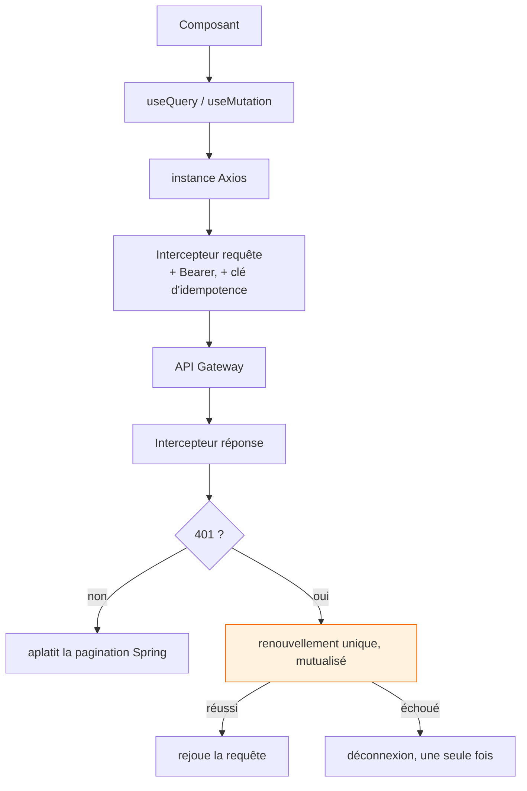
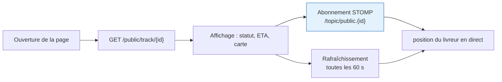

# Clients — web et mobile

## Back-office (React)

```
src/
├── pages/          23 modules, un par écran métier
├── components/     partagés : tableaux, cartes, superpositions
├── lib/
│   ├── api/        couche Axios, OIDC, permissions
│   ├── i18n/       3 langues, avec test de parité
│   └── ui/         toasts, jetons de design
├── hooks/          hooks transverses
└── layouts/
```

| Couche | Choix | Raison |
|---|---|---|
| Build | Vite 8 | démarrage à froid quasi instantané |
| Framework | React 19 | — |
| Données | TanStack Query 5 | cache, invalidation, états de chargement gratuits |
| Style | Tailwind 4 + jetons | `npm run check:design` refuse les couleurs en dur |
| Carte | Leaflet | fonds OSM |
| Glisser-déposer | @dnd-kit | constructeur de tournées |

### La couche API en un schéma



**Trois détails qui évitent des bugs récurrents :**

- **Clé d'idempotence** posée sur chaque `POST`/`PUT`/`PATCH`, générée une fois par configuration de
  requête — donc elle **survit aux rejeux**. Le backend reconnaît le doublon.
- **Aplatissement de la pagination.** Spring Boot 3.3 sérialise une `Page` en
  `{content, page: {…}}`. L'intercepteur remonte `totalPages`, `totalElements`, `number`, `size` au
  premier niveau, une fois pour toutes.
- **Verrou de déconnexion.** Une page qui lance douze requêtes voit douze 401 quand la session meurt.
  Sans verrou, douze déconnexions et douze redirections.

!!! tip "Internationalisation"
    Trois fichiers de traduction (`ux-copy.ts` FR, `en-copy.ts`, `ar-copy.ts`) et **un test de
    parité** qui échoue si une clé manque dans l'un d'eux. L'arabe bascule le document en `dir="rtl"`.

---

## Application livreur (Flutter)

```
lib/src/features/
├── auth/          connexion, jetons, rafraîchissement
├── home/          tournée du jour, statut
├── routes/        détail de tournée, arrêts
├── deliveries/    exécution : accepter, transit, échec
├── pod/           preuve de livraison : photo du bon signé, photo du colis
├── cash/          encaissement et remise
└── profile/       profil, disponibilité
```

| Besoin | Choix |
|---|---|
| État | Riverpod |
| HTTP | Dio |
| Cache local | Hive |
| Jetons | flutter_secure_storage |
| Position | geolocator |
| QR (transfert) | mobile_scanner |
| Photos | image_picker |

### Le mode hors ligne

Un livreur en zone industrielle ou en sous-sol perd le réseau régulièrement. L'application reste
entièrement utilisable sans connexion : elle lit dans un cache préchargé, projette localement les
actions validées pour que l'écran avance, et rejoue les écritures au retour du signal sous une clé
d'idempotence.

[:material-arrow-right: Le mécanisme en détail](hors-ligne.md)

### Ce que la portée `offline_access` corrige

Sans elle, le jeton de rafraîchissement expire avec la session SSO — et un livreur se retrouvait
**déconnecté au milieu d'une tournée**, précisément là où il ne pouvait pas se reconnecter. Voir
[Authentification](authentification.md).

---

## Page de suivi public

Un seul écran, sans authentification, atteint par un lien contenant l'identifiant de livraison.



**Deux mécanismes volontairement redondants.** Le WebSocket donne l'immédiateté ; le sondage à 60 s
garantit que la page reste juste même si la connexion STOMP tombe, ce qui arrive sur mobile.

!!! warning "Limite de débit"
    Ce point d'entrée expose le nom du livreur, son téléphone et sa position. Un lien qui fuite
    permettrait de suivre une personne indéfiniment. D'où une limite de **120 appels par 10 minutes**
    et par couple IP/livraison — largement au-dessus d'un usage humain (≈ 10), très en dessous de ce
    qu'il faut à un script.
