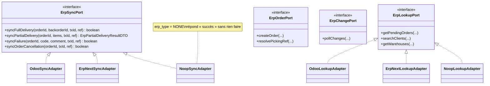
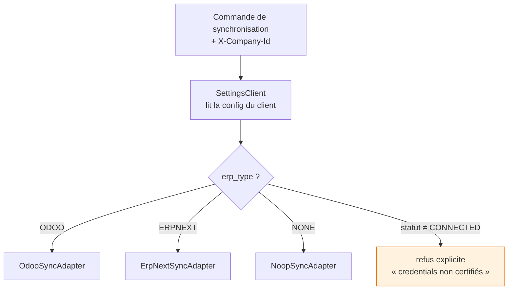
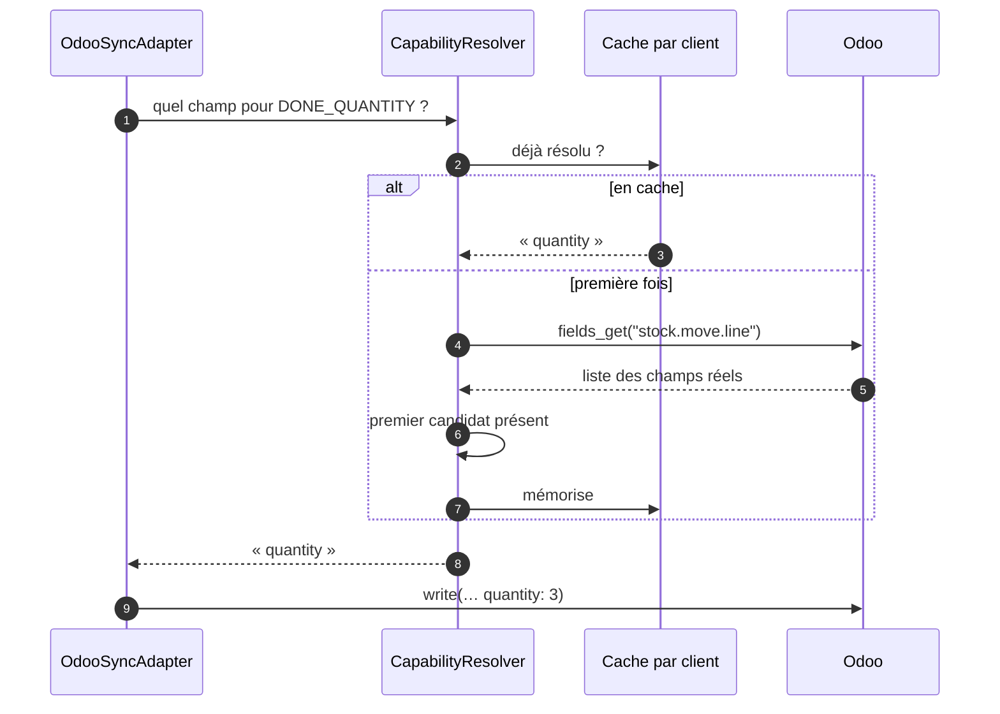
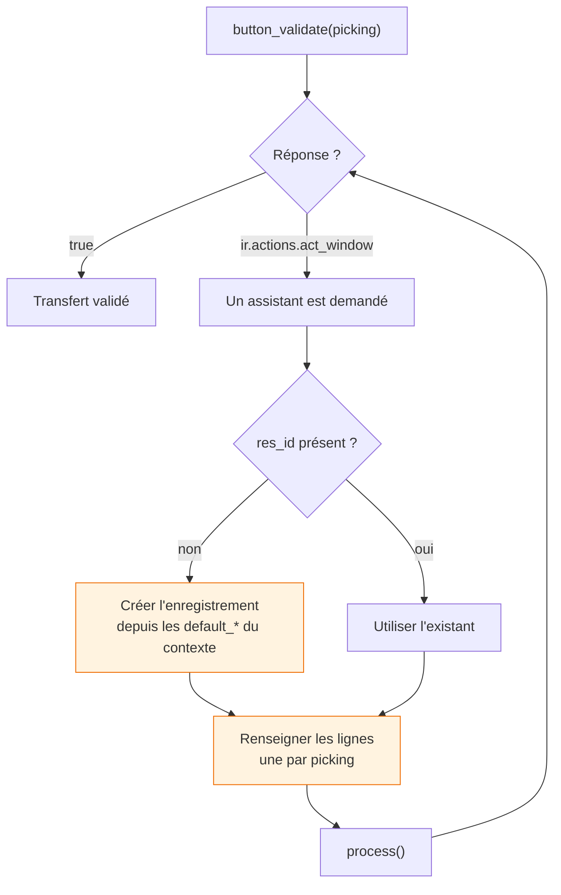
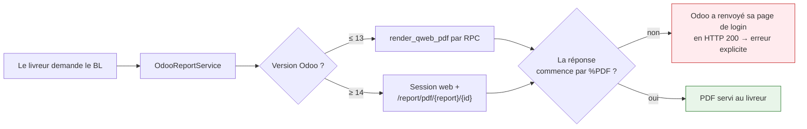

# Intégration ERP

> Décision et alternatives écartées : [ADR-003](../adr/003-ports-adapters-erp.md).

---

## Trois variations à absorber

1. **Les clients n'ont pas le même ERP.** Odoo domine le marché tunisien des PME, mais pas seul.
2. **Un même ERP change entre versions.** Entre Odoo 16 et 19, `stock.move.line.qty_done` devient
   `quantity`, et `create_returns` devient `action_create_returns`.
3. **Certains clients n'ont pas d'ERP du tout**, et doivent quand même utiliser la plateforme.

Si ces trois variations remontent dans le code métier, chaque règle de livraison finit entourée de
conditions sur le fournisseur et sa version.

---

## Ports & Adapters



**Pourquoi ce diagramme.** Les quatre interfaces décrivent ce dont le **métier** a besoin, sans nommer
aucun ERP. C'est la frontière qui rend le reste possible.

| Implémentation | Volume | Transport |
|---|---|---|
| Odoo | 25 classes, 5 108 lignes | JSON-RPC |
| ERPNext | 4 classes, 1 520 lignes | REST (Frappe) |
| Noop | 3 classes, 47 lignes | — |

!!! success "L'abstraction est justifiée, pas spéculative"
    Une interface qui n'a jamais été confrontée à un second cas est presque toujours modelée sur le
    premier, et ne survit pas au second. **Ces ports ont été validés par ERPNext** — dont l'ajout n'a
    demandé aucune modification des interfaces.

!!! note "Le patron Objet Nul"
    Un client sans ERP est servi par `NoopSyncAdapter`, dont les méthodes répondent « succès » sans
    rien faire. L'alternative — un `if (erp == null)` dispersé — aurait mis la question de l'ERP dans
    chaque chemin métier, ce que le port existe précisément pour éviter.

---

## Le routage par fournisseur



`ErpProviderRouter` sélectionne l'implémentation par **nom de bean** : `OdooSyncAdapter` devient
`"odoo"`, `ErpNextLookupAdapter` devient `"erpnext"`. Ajouter un ERP ne modifie aucun code existant.

!!! warning "Le garde-fou sur la connexion"
    Un client dont l'intégration n'est pas en statut `CONNECTED` voit ses appels **refusés
    explicitement** plutôt que tentés avec des identifiants douteux. Une synchronisation qui échoue
    bruyamment vaut mieux qu'une qui écrit au mauvais endroit.

---

## Le moteur de capacités : absorber les versions

Les différences entre versions ne sont pas codées en dur mais **déclarées** :

```json
"DONE_QUANTITY": {
  "model": "stock.move.line",
  "type": "FIELD",
  "candidates": ["quantity", "qty_done"]
}
```



**Le connecteur ne teste jamais un numéro de version — il teste la présence.** Une version
intermédiaire non prévue fonctionne donc sans modification.

!!! danger "Erreur classique"
    Écrire `if (version >= 17) { … } else { … }`. Les éditeurs rétroportent, les clients installent
    des modules qui ajoutent ou retirent des champs, et un numéro de version ne dit rien de ce que
    l'instance expose réellement.

---

## Ce que le connecteur doit savoir piloter

Odoo ne se contente pas de champs : il répond par des **assistants de confirmation** qu'il faut
conduire.



**Deux pièges, tous deux silencieux :**

1. **L'assistant n'existe pas encore.** L'action revient sans `res_id`, seulement des `default_*`
   dans son contexte. Le client web crée l'enregistrement à partir de ceux-ci ; par RPC, personne ne
   le fait. Un code qui cherche un `res_id` et abandonne laisse le transfert en `assigned` **sans
   lever d'erreur**.
2. **Un assistant sans ses lignes ne répond de rien.** `process()` parcourt les lignes par picking ;
   sans elles, il transfère zéro. Sur Odoo 16, le transfert immédiat vide déclenche alors un reliquat
   pour la totalité : la chaîne « réussit » deux fois et ne livre rien.

Ces deux comportements sont vérifiés par la suite d'intégration, exécutée contre **deux instances
Odoo simultanées, 16 et 19** — voir [Tests](../technique/tests.md).

---

## Le bon de livraison vient de l'ERP



**Pourquoi ce détour.** À partir d'Odoo 14, la méthode devient `_render_qweb_pdf` — et le RPC
**refuse les méthodes préfixées d'un underscore**. Le PDF doit donc passer par une session web.

**Le contrôle `%PDF` n'est pas de la paranoïa** : une session invalide fait répondre Odoo **200 avec
sa page de connexion**. Sans ce contrôle, le livreur recevrait une page HTML nommée `.pdf`.

!!! quote "Le principe qui gouverne cette page"
    **Le système qui possède un document possède sa conformité.** Le bon de livraison a des mentions
    légales, une numérotation continue, une TVA — tout cela vit dans l'ERP. Le régénérer serait
    reproduire une conformité qu'on ne maîtrise pas.

---

## Où chaque client range ses données

Les adaptateurs savent parler à un ERP ; ils ne savent pas où *ce* client a mis sa référence client.
C'est l'objet du mapping de champs, avec son propre système de types et ses garde-fous.

[:material-arrow-right: Mapping des champs ERP](mapping-champs.md)
