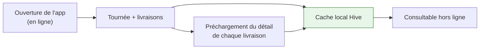
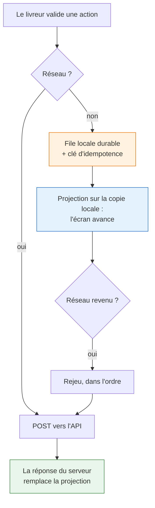
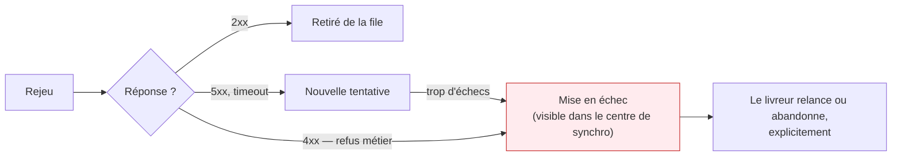

# Mode hors ligne

Un livreur perd le réseau plusieurs fois par jour : sous-sols, parkings, zones industrielles, ascenseurs.
L'application livreur doit donc rester **entièrement utilisable sans connexion**, puis se remettre
d'accord avec le serveur au retour du signal.

Trois problèmes distincts, trois mécanismes.

---

## 1. Lire sans réseau : le cache local

Tout ce que le livreur peut avoir à consulter est copié sur l'appareil **pendant qu'il a du réseau** :
son profil, sa tournée du jour, et le détail de chacune de ses livraisons.

**Le préchargement est le point important.** Ne mettre en cache que les fiches ouvertes obligeait le
livreur à deviner à l'avance lesquelles lui seraient utiles ; toutes les autres s'ouvraient sur une
erreur réseau. Le profil relève de la même logique : sans lui, un démarrage à froid hors connexion
laissait une application authentifiée mais sans identité, donc vide.

Le cache conserve la **réponse du serveur telle quelle**, sans la reconstruire champ par champ. Un
mapping écrit à la main perd silencieusement tout champ ajouté à l'API après lui.

!!! note "Le cache part avec la session"
    La déconnexion vide le cache : il contient la tournée, les clients et le profil d'un livreur
    précis, et un même téléphone peut servir à plusieurs.

---

## 2. Écrire sans réseau : la file et la projection

Mettre l'action en file **ne suffit pas**. Une application qui enregistre l'intention sans rien
montrer laisse le livreur devant un écran figé : il confirme un enlèvement, lit « synchronisation
différée », et ses colis restent affichés « à charger ». Pour lui, l'action n'a pas eu lieu — il la
refait, ou il s'arrête.

L'action est donc **projetée sur la copie locale** : la même transition que celle qu'appliquerait le
serveur. Confirmer un enlèvement termine l'arrêt et passe « chargées » les livraisons tirées de ce
dépôt, exactement comme en ligne.

!!! tip "Optimiste, et volontairement de courte durée"
    La projection n'est jamais la vérité. La première lecture serveur réussie l'écrase. C'est ce qui
    fait qu'une action finalement refusée se corrige d'elle-même, sans aucun code de réconciliation.

---

## 3. Rejouer sans dupliquer : l'idempotence

Chaque écriture porte une **clé d'idempotence** stable, conservée à travers les rejeux. Si la requête
d'origine avait en réalité abouti juste avant la coupure, le serveur reconnaît le doublon et renvoie
la réponse déjà produite au lieu d'exécuter une seconde fois — ce qui, sur une preuve de livraison,
relancerait la synchronisation ERP et l'encaissement.

Le serveur mémorise une requête traitée **plus longtemps que le client ne garde la sienne en file**.
L'inverse ouvrirait une fenêtre où une écriture rejouée juste avant d'expirer serait retraitée comme
neuve.

### Ce qui ne passe pas

Rien n'est jamais supprimé en silence. Une écriture définitivement rejetée reste visible dans le
centre de synchronisation, avec son motif : le livreur décide. Une panne réseau, elle, n'est pas un
échec — seuls les vrais refus et les erreurs serveur répétées comptent.

---

## 4. L'heure du geste

Une action rejouée est horodatée **au moment où le livreur a appuyé**, pas à la reconnexion.

Sans cela, un colis remis à 14 h 10 dans un sous-sol était prouvé livré à 17 h 53 dans la camionnette :
faux sur la preuve de livraison, faux dans le verdict SLA, faux dans l'ERP.

L'application transmet donc l'heure du geste, et le serveur ne la retient **que si elle est
plausible** : jamais dans le futur au-delà de la dérive d'horloge tolérée, jamais plus ancienne que la
durée de vie d'une écriture en file. Une horloge de téléphone se règle à la main ; la croire sur
parole permettrait d'antidater une livraison. Hors de ces bornes, l'heure du serveur s'applique —
tardive, mais jamais inventée.

---

## Voir aussi

- [Clients (web et mobile)](clients.md) — structure de l'application livreur
- [Authentification](authentification.md) — pourquoi la portée `offline_access` est nécessaire
- [Cycle de vie d'une livraison](../metier/livraison.md) — les transitions projetées localement
