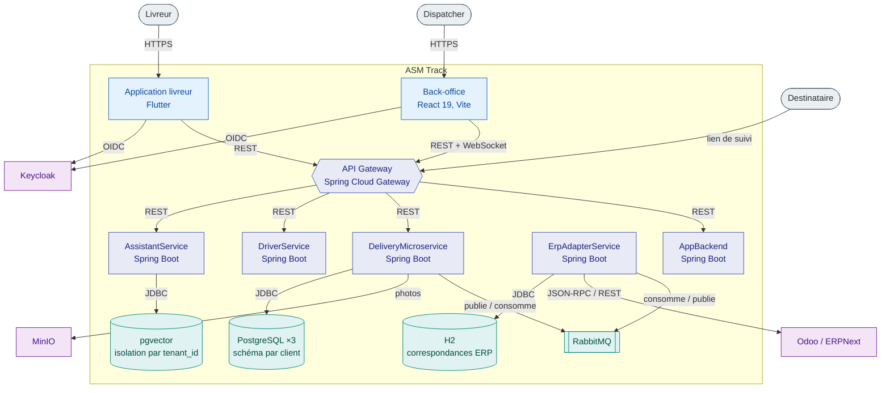
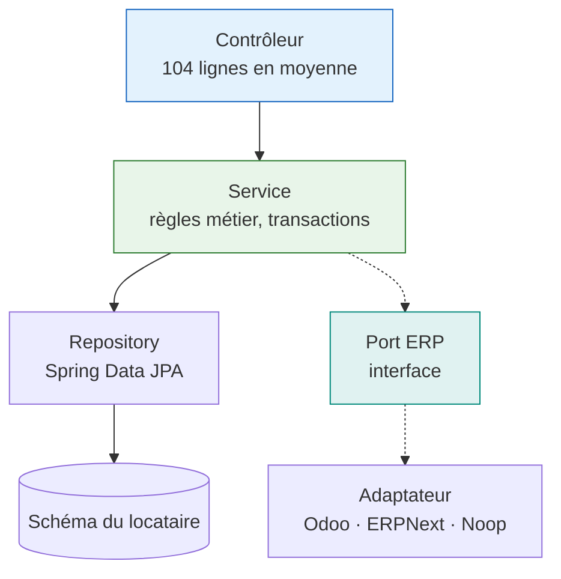

# Vue d'ensemble de l'architecture

## Le découpage, et sa logique

Six services Spring Boot, **chacun propriétaire de sa base de données**. Aucun ne lit la base d'un
autre — vérifiable : aucune configuration ne pointe vers la base d'un voisin.

**Pourquoi ce diagramme.** Il répond d'un coup à « qui parle à qui », et surtout à **qui ne parle pas
à qui** — l'information la plus difficile à obtenir en lisant du code.

**Observations importantes.**

- L'`ErpAdapterService` **n'a aucun lien avec la gateway**. Il ne reçoit que des messages RabbitMQ et
  des appels internes. Un ERP mal configuré ne peut donc pas être atteint depuis Internet.
- Le **suivi public** est le seul chemin non authentifié. Il traverse quand même la gateway.
- Keycloak est un **système externe**, pas un de nos services. C'est une décision, pas un raccourci :
  écrire un serveur d'authentification aurait été le meilleur moyen de mal le faire.

---

## Qui fait quoi

| Service | Port | Responsabilité | Base |
|---|---|---|---|
| `ApiGateway` | 80 | Routage (45 routes), agrégation OpenAPI, première évaluation RBAC | — |
| `AppBackend` | 8080 | Comptes back-office, paramètres entreprise, pilotage Keycloak | PostgreSQL |
| `DeliveryMicroservice` | 8082 | **Cœur métier** : livraisons, tournées, retours, encaissements, SLA | PostgreSQL |
| `DriverService` | 8086 | Livreurs, véhicules, disponibilité | PostgreSQL |
| `ErpAdapterService` | 8088 | Traduction vers l'ERP du client — **interne** | H2 (fichier) |
| `AssistantService` | 8087 | Assistant RAG — recherche et réponses sur les données du client | pgvector |

!!! info "Pourquoi `DeliveryMicroservice` est si gros"
    Il porte 60 % du code backend. Ce n'est pas un défaut de découpage mais une conséquence du
    domaine : livraisons, tournées, retours et encaissement sont **fortement couplés par la donnée**
    — un retour partage la commande d'origine, un encaissement appartient à une livraison, une
    tournée est une séquence de livraisons. Les séparer aurait imposé des transactions distribuées
    pour maintenir des invariants qu'une seule base garantit gratuitement.

---

## Les trois modes de communication

```mermaid
flowchart TB
    subgraph S1["1 · Requête d'un utilisateur"]
        direction LR
        C1["Client"] -->|"REST + JWT"| G1["Gateway"] -->|"REST + X-Company-Id"| SV1["Service"]
    end

    subgraph S2["2 · Entre services, asynchrone (la règle)"]
        direction LR
        SV2["Service A"] -->|"publie"| MQ2{{"RabbitMQ"}} -->|"consomme"| SV3["Service B"]
    end

    subgraph S3["3 · Entre services, synchrone (l'exception)"]
        direction LR
        SV4["Service A"] -->|"/internal/** + rôle SERVICE"| SV5["Service B"]
    end

    style S1 fill:#e3f2fd,stroke:#1565c0
    style S2 fill:#f3e5f5,stroke:#7b1fa2
    style S3 fill:#fff3e0,stroke:#ef6c00
```

**Pourquoi ce diagramme.** Trois chemins coexistent et leurs règles de sécurité diffèrent. Les
confondre est la source d'erreur la plus fréquente.

**Ce qu'il faut retenir.**

- **Mode 2 est la règle.** Tout ce qui peut attendre passe par RabbitMQ : une synchronisation ERP,
  un journal d'audit, un changement de statut de livreur. Le service émetteur n'attend pas.
- **Mode 3 est l'exception**, réservé à ce qui doit répondre immédiatement : provisionner un
  locataire, résoudre un nom d'utilisateur. Ces chemins sont préfixés `/internal/` et exigent le rôle
  `SERVICE` — un jeton d'utilisateur, si valide soit-il, est refusé.

!!! danger "Erreur classique"
    Ajouter un appel HTTP synchrone entre services « parce que c'est plus simple ». Chaque appel de
    ce type transforme la panne d'un service en panne de deux. Le mode 2 existe pour que la
    disponibilité ne se propage pas.

---

## Où vit la logique métier

**La règle :** un contrôleur ne contient **aucune** règle métier. Il valide la forme de la requête,
appelle un service, renvoie une réponse. Les 30 contrôleurs font 104 lignes en moyenne, le plus gros
en fait 364.

**Ce qui appartient au service :** les invariants, les transitions d'état, les transactions.

**Ce qui appartient au port ERP :** tout ce qui dépend du système externe. Le métier ne sait jamais
s'il parle à Odoo ou à ERPNext.

---

## Pour aller plus loin

- [Cycle de vie d'une requête](requete.md) — du clic au `SET search_path`
- [Multi-tenant](multi-tenant.md) — comment les données des clients restent séparées
- [Messagerie](messagerie.md) — les échanges, les files, et l'outbox
- [Intégration ERP](erp.md) — ports, adaptateurs, et moteur de capacités
