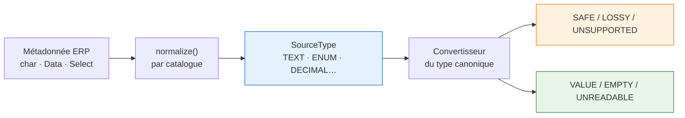

# Mapping des champs ERP

Deux clients du même ERP ne rangent pas leurs données au même endroit. L'un met la référence
client sur `x_ref_client`, l'autre sur une note de la commande. Aucune sonde ne peut le deviner : un
humain doit le dire. C'est ce que fait l'écran de mapping.

Ce document décrit ce qui garantit qu'un mapping choisi par un humain produit une donnée exploitable.

---

## Le contrat canonique

ASM nomme les données dont il a besoin, indépendamment de tout ERP : `CUSTOMER_PHONE`,
`ITEM_QUANTITY`, `SCHEDULED_AT`. L'intégrateur mappe **vers** ce vocabulaire.

Chaque champ canonique déclare trois choses, et une seule fois :

| | |
|---|---|
| **portée** | en-tête (une fois par commande) ou ligne (une fois par article) |
| **type** | `TEXT`, `INTEGER`, `DECIMAL`, `BOOLEAN`, `DATE_TIME` |
| **source par défaut** | où ASM lit quand le client n'a rien mappé |

### Pourquoi le type canonique n'est pas configurable par tenant

Un tenant choisit **d'où** vient une valeur — le chemin source, le mode de lecture, le champ ERP.
Jamais **ce qu'elle est**.

Si un client pouvait déclarer `ITEM_QUANTITY` décimale et un autre entière, alors tout ce qui
consomme cette donnée en aval — planification, SLA, application livreur, écriture retour vers l'ERP —
devrait se brancher sur le tenant. C'est la fin du modèle partagé, et le début d'un système qui se
comporte différemment selon le client.

Quand une vraie différence métier exige un autre type, elle devient **un autre champ canonique**, pas
le même champ avec un type variable.

---

## De la métadonnée ERP au type ASM



**La normalisation est le seul endroit où le vocabulaire d'un fournisseur a le droit de compter.**
Odoo dit `char`, ERPNext dit `Data` ; les deux deviennent `TEXT`, et tout ce qui suit est écrit une
fois pour les deux. Sans cette couture, le typage serait dupliqué par fournisseur — c'est-à-dire
exactement la duplication qu'il existe pour empêcher.

Un type qu'aucun catalogue ne sait nommer devient `UNKNOWN`, refusé par tous les convertisseurs. Le
défaut visible est « non supporté », jamais une lecture silencieusement fausse.

---

## Le convertisseur est la source de vérité

Il n'existe **aucune table de compatibilité** dans le code. Chaque convertisseur déclare les types
source qu'il accepte, et c'est le même objet qui les lit :

```
Convertisseur INTEGER
   integer  → SAFE
   decimal  → LOSSY   « les décimales seront perdues »
   (le reste est absent, donc UNSUPPORTED)
```

La matrice affichée à l'écran est **calculée** à partir des convertisseurs enregistrés.

C'est le point d'architecture qui compte. Une table maintenue à la main dérive du code qui convertit :
elle peut annoncer qu'un type `date` est supporté alors que le lecteur ne sait pas lire un jour sans
heure. C'était le cas, et le symptôme était une date de livraison vide, indiscernable d'un ERP vide.
Ici, accepter un type et savoir le lire sont le même engagement.

### Les trois niveaux

| Niveau | Sens | Exemple |
|---|---|---|
| `SAFE` | aucune perte de sens | Odoo `integer` → `INTEGER` |
| `LOSSY` | convertit, mais quelque chose est perdu ou deviné | Odoo `float` 2,5 → `INTEGER` 3 |
| `UNSUPPORTED` | aucun convertisseur ne l'accepte → mapping refusé | Odoo `char` → `INTEGER` |

Deux niveaux n'auraient pas suffi. `float → INTEGER` **converti**, donc un système binaire l'aurait
autorisé sans un mot — et une ligne facturée au kilo aurait changé de quantité en silence. Le niveau
intermédiaire transforme une perte réelle en décision prise sciemment.

---

## Les trois résultats à l'exécution

| État | Sens |
|---|---|
| `VALUE` | présent dans l'ERP et converti |
| `EMPTY` | réellement vide à la source — le `false` d'Odoo, une chaîne blanche |
| `UNREADABLE` | présent, mais aucune conversion honnête n'existe ; porte la raison |

Avant, les trois donnaient `null`. Une cellule vide voulait dire à la fois « le champ ERP est vide »,
« la valeur est illisible » et « le chemin est faux » — donc personne ne pouvait rien diagnostiquer.

`UNREADABLE` ne porte jamais de valeur : une conversion qui a échoué n'a rien d'honnête à proposer.

---

## Quatre moments de contrôle

**1. Au démarrage.** Si un champ canonique déclare un type qu'aucun convertisseur ne produit,
l'application **ne démarre pas**, en listant les champs concernés. Un convertisseur manquant, c'est
une famille entière de champs qui s'importerait en blanc ; l'échec appartient à l'écran d'un
développeur, pas à une livraison.

**2. Au choix du champ.** Le sélecteur grise ce qui sera refusé et affiche le motif.

**3. À l'enregistrement.** Le même verdict est appliqué côté serveur. Un `UNSUPPORTED` est rejeté ;
un `LOSSY` répond `LOSSY_FIELD_MAPPING`, que l'écran transforme en confirmation et rejoue avec
`acceptLossy`. La règle vit dans le service et pas seulement dans l'écran : un client d'API, une
requête rejouée ou un onglet resté ouvert passent tous par là.

### Ce que voit l'intégrateur

Le sélecteur affiche le type ERP de chaque champ (`x_qte · float`), grise ceux que le serveur
refuserait avec le motif au survol, et marque « perte » ceux qui convertissent en perdant quelque
chose. Choisir un champ marqué « perte » ouvre une confirmation qui dit exactement ce qui est perdu.

L'écran lit la matrice servie par `/type-matrix` plutôt que de rejouer les règles : une copie finirait
par diverger, et l'intégrateur serait autorisé par une liste puis refusé par une boîte de dialogue.
Quand la matrice n'a pas pu être chargée, le sélecteur ne bloque rien — le serveur reste l'autorité.

**4. À l'aperçu et à l'import.** Le même moteur de conversion, sur de vraies commandes. Un écran
d'aperçu qui ferait sa propre conversion montrerait quelque chose que l'import pourrait ne pas
reproduire.

---

## Détection de dérive

Le type ERP observé au moment de l'enregistrement est conservé sur la ligne de mapping
(`erp_field_mapping.source_type`).

Un client peut transformer un `selection` en champ texte six mois après la mise en service. Le mapping
continue de résoudre — il cesse simplement de vouloir dire ce qu'il voulait dire. Comparer le type vu
aujourd'hui à celui enregistré transforme ça en événement rapportable au lieu de valeurs qui
deviennent blanches sans bruit.

Une valeur absente signifie « pas de référence », jamais « inchangé ».

---

## Exemples

### Odoo

| Champ ASM | Chemin source | Type Odoo | Verdict |
|---|---|---|---|
| `ERP_ORDER_ID` | `name` | `char` | SAFE |
| `SCHEDULED_AT` | `scheduled_date` | `datetime` | SAFE |
| `SCHEDULED_AT` | `x_date_livraison` | `date` | LOSSY — heure fixée à 00:00 |
| `ITEM_QUANTITY` | `product_uom_qty` | `float` | LOSSY — décimales perdues |
| `ITEM_QUANTITY` | `x_ref_client` | `char` | **UNSUPPORTED** |
| `CUSTOMER_NAME` | `partner_id.name` | `many2one` | LOSSY — libellé seulement |
| `TOTAL_AMOUNT` | `sale.order:amount_total` | `monetary` | SAFE |

### ERPNext

| Champ ASM | Chemin source | Type ERPNext | Verdict |
|---|---|---|---|
| `BL_NUMBER` | `name` | `Data` | SAFE |
| `SCHEDULED_AT` | `delivery_date` | `Date` | LOSSY — heure fixée à 00:00 |
| `ITEM_QUANTITY` | `qty` | `Float` | LOSSY |
| `TOTAL_AMOUNT` | `grand_total` | `Currency` | SAFE |
| `READY` | `status` | `Select` | LOSSY — vocabulaire reconnu |

Les deux tableaux appliquent **les mêmes règles** : seul le nom du type change.

---

## Limites connues

**Le typage n'attrape pas les erreurs de sens.** Mapper l'adresse de facturation au lieu de l'adresse
de livraison est parfaitement typé et complètement faux. Seul l'aperçu sur une vraie commande le
montre — c'est pour ça qu'il existe.

**Un `selection` donne son code, pas son libellé.** Odoo stocke `assigned`, pas « Prêt » : le libellé
vit dans la définition du champ, pas dans l'enregistrement. Aucune lecture ne peut le récupérer, d'où
le classement en `LOSSY`.

**Le `RICH_TEXT` est transmis tel quel.** Les balises HTML arrivent jusqu'à l'écran du livreur.

**Un chemin qui traverse une relation n'est pas vérifiable à l'enregistrement** : nommer le document
d'arrivée demanderait de suivre la relation sur des données réelles. Le mapping est accepté et
l'aperçu tranche.

**Les types collection restent exclus** — `one2many`, `many2many`, `Table` — parce qu'une valeur ASM
unique ne peut pas venir d'une liste ; et les types fichier — `binary`, `Attach`, `Image` — parce
qu'un chemin de fichier dans un nom de client n'est jamais ce que quelqu'un voulait.

---

## Voir aussi

- [Intégration ERP](erp.md) — ports, adaptateurs, routage par fournisseur
- [Dépôts](../metier/depots.md) — un champ de ligne dont le mapping change la tournée
