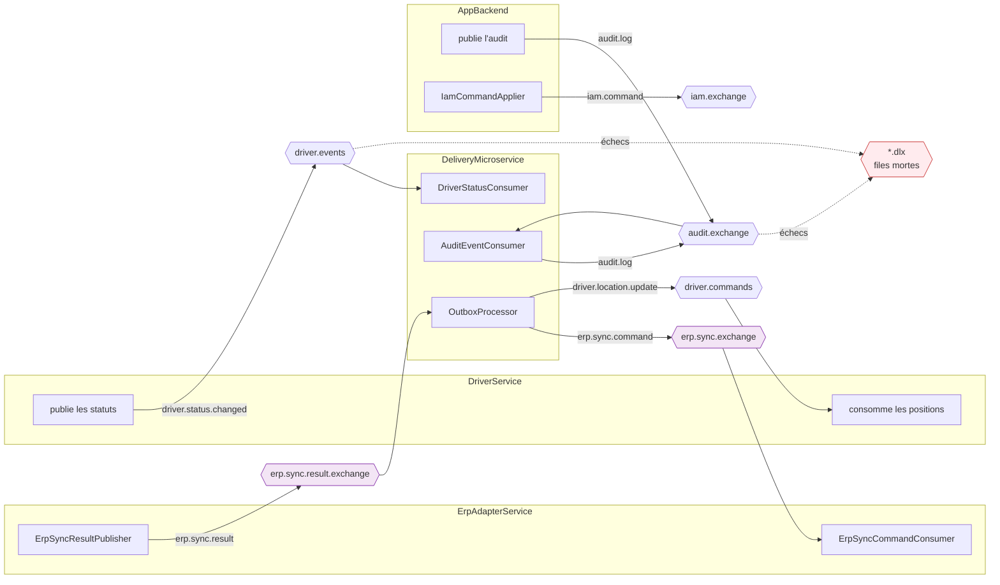
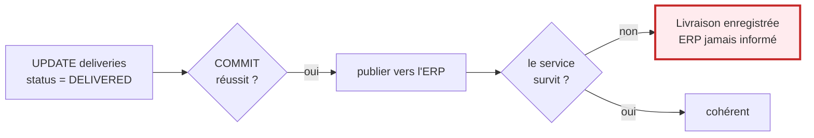
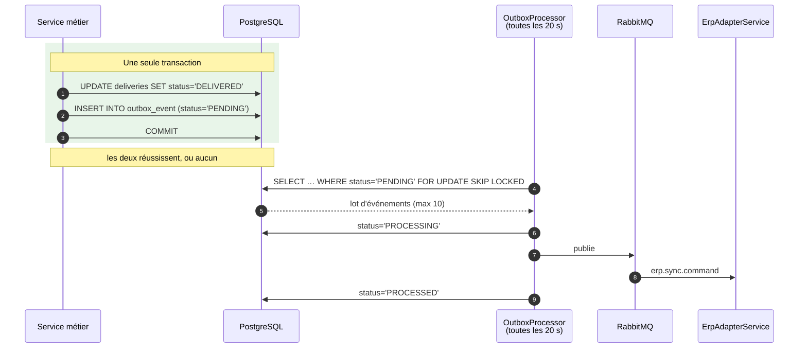
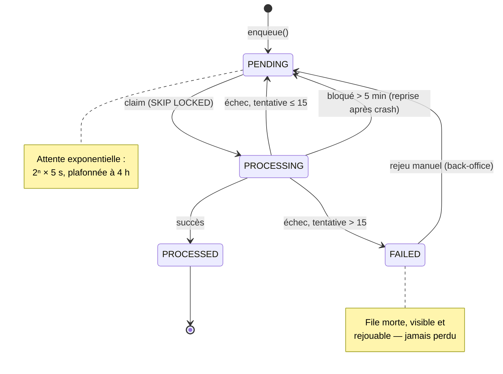
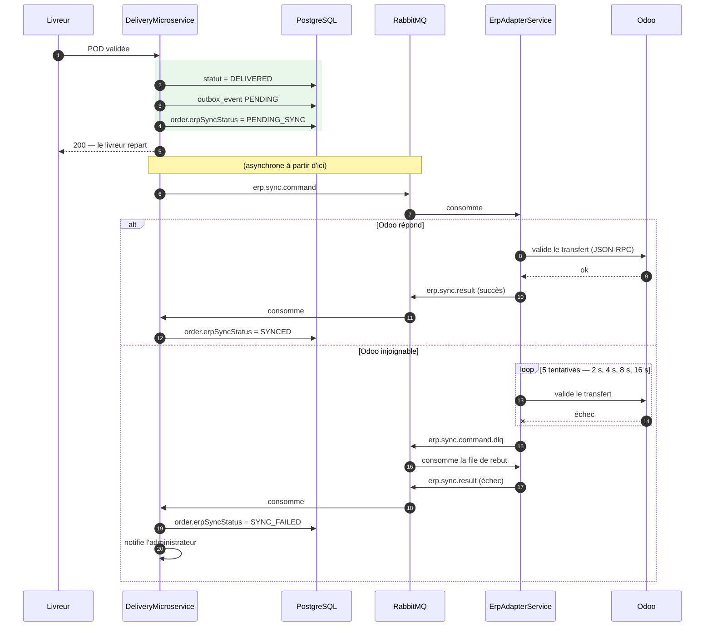

# Messagerie et événements

> Décision et alternatives écartées : [ADR-004](../adr/004-outbox-transactionnel.md).

---

## La topologie réelle



**Pourquoi ce diagramme.** C'est la seule vue qui montre que la synchronisation ERP est une **boucle
en deux temps** — une commande part, un résultat revient — et non un appel.

**Observations importantes.**

- **Deux échanges pour l'ERP**, pas un. La commande et le résultat voyagent séparément, ce qui permet
  à l'adaptateur de répondre longtemps après, sans que personne n'attende.
- **Des files mortes (`.dlx`) sur les flux critiques.** Un message qui échoue définitivement n'est pas
  perdu : il est consultable et rejouable depuis le back-office.
- Chaque message porte l'en-tête `X-Company-Id` — voir [Multi-tenant](multi-tenant.md).

---

## Le patron Outbox

### Le problème



La fenêtre entre le `COMMIT` et le `publish` est courte mais **réelle**. Un arrêt à cet instant perd
l'événement, sans trace. Le défaut ne se manifeste que sous charge ou pendant un incident —
exactement quand on ne peut pas l'analyser.

### La solution



!!! success "La garantie n'est pas laissée à la vigilance de l'appelant"
    ```java
    @Transactional(propagation = Propagation.MANDATORY)
    public void enqueue(String type, Object payload) { … }
    ```

    `MANDATORY` fait **échouer** l'appel s'il n'existe pas déjà une transaction. Écrire dans l'outbox
    hors d'une transaction métier n'est donc pas une erreur qu'on peut commettre : le conteneur la
    refuse. La propriété centrale du patron est vérifiée par le framework, pas seulement documentée.

**`SKIP LOCKED` mérite un mot.** Il permet à plusieurs instances du service de traiter l'outbox en
parallèle sans se marcher dessus : chacune saute les lignes verrouillées par une autre. Sans lui,
deux instances enverraient le même événement deux fois.

---

## La reprise sur échec



**Ce que la politique couvre réellement : 21,7 heures.**

| Tentative | Attente | Cumul |
|---|---|---|
| 1 → 11 | 10 s → 2 h 50 | 5,7 h |
| 12 → 15 | 4 h chacune | **21,7 h** |

!!! warning "Une affirmation corrigée"
    Le code annonçait « 45+ hours, fully protecting against weekend outages ». La somme n'avait
    jamais été calculée : elle vaut **21,7 h**. Atteindre 60 heures — une panne du vendredi soir
    résolue le lundi — demanderait **25 tentatives**.

    21,7 h couvrent confortablement une panne nocturne et entièrement une journée de travail. Le
    compromis est assumé : un événement en échec depuis une journée relève plus souvent d'une
    configuration cassée que d'une indisponibilité, et la file morte le garde visible.

---

## Deux étages de reprise, à ne pas confondre

Ces 15 tentatives ne concernent **que la publication** : elles couvrent le cas où RabbitMQ est
injoignable. Une fois le message publié, l'outbox a terminé son travail et passe l'événement à
`PROCESSED` — quoi qu'il advienne ensuite chez l'ERP.

La suite relève d'un **second compteur**, côté consommateur, aux valeurs bien plus courtes. Les
confondre fait croire qu'une panne d'Odoo est tolérée pendant 21 heures ; elle l'est en réalité
pendant **30 secondes**.

| | Étage outbox | Étage consommateur |
|---|---|---|
| **Qui** | `OutboxProcessor` (Service Livraison) | `ErpSyncCommandConsumer` (Adaptateur ERP) |
| **Couvre la panne de** | RabbitMQ | l'ERP (Odoo / ERPNext) |
| **Tentatives** | 15 | **5** |
| **Attentes** | 2ⁿ × 5 s, plafond 4 h | 2 s → 4 s → 8 s → 16 s, plafond 30 s |
| **Durée totale** | 21,7 h | **≈ 30 s** |
| **À l'épuisement** | `FAILED` en base | message vers `erp.sync.command.dlq` |

!!! warning "Odoo n'est toléré que 30 secondes"
    Passé ce délai, la commande part en file de rebut. Elle n'est pas perdue : le consommateur de
    rebut publie aussitôt un résultat en échec, la commande passe à `SYNC_FAILED` et l'administrateur
    est notifié — elle ne reste jamais bloquée sur « synchronisation en cours ». Mais la reprise
    devient **manuelle** (bouton *Resynchroniser*), elle n'est plus automatique.

    C'est un choix à assumer : une panne ERP de plus de trente secondes demande un geste humain.

Un troisième compteur existe, à ne pas ajouter aux deux autres : `ErpResyncService` autorise 10
tentatives, mais il s'agit de la reprise **déclenchée par un opérateur** sur une commande déjà
`SYNC_FAILED` — une escalade, pas une boucle automatique.

---

## Le cycle complet d'une synchronisation ERP



**Le point essentiel : le livreur n'attend jamais l'ERP.** Il valide, l'écran répond, il repart. Un
ERP indisponible ralentit la synchronisation sans jamais bloquer le terrain.

**La contrepartie**, à assumer dans l'interface : la cohérence est **à terme**, pas immédiate. C'est
ce que reflète l'état `PENDING_SYNC` sur la commande, plutôt que de laisser croire à une écriture
instantanée.
