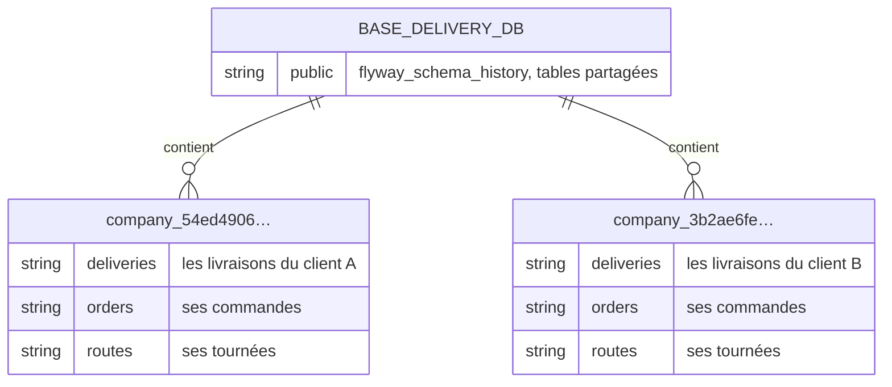
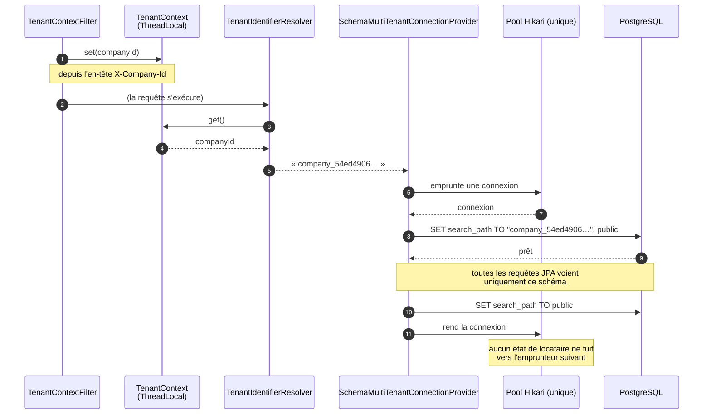
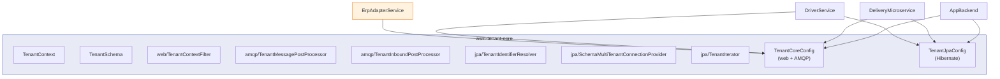
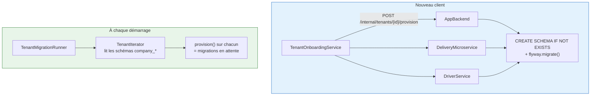
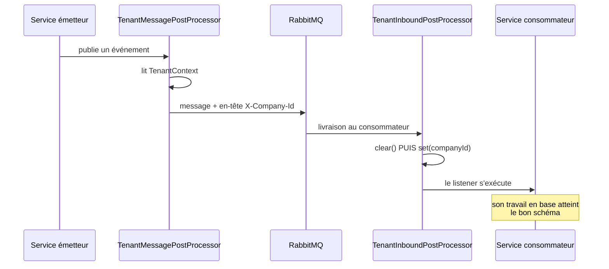

# Multi-tenant

> Décision et alternatives écartées : [ADR-001](../adr/001-multi-tenant-par-schema.md).
> Cette page explique **comment ça marche**.

---

## Un schéma PostgreSQL par client



Le nom du schéma est dérivé de l'UUID de l'entreprise, tirets retirés :

```java
public static String schemaFor(UUID companyId) {
    return "company_" + companyId.toString().replace("-", "");
}
```

!!! success "Sûreté par construction"
    L'argument est un `UUID` **déjà parsé**. Son alphabet de sortie se limite donc à `[0-9a-f]`, et
    aucune chaîne injectable ne peut atteindre le `SET search_path` qui concatène ce nom. La sûreté
    vient du **type**, pas d'un échappement — elle se vérifie en lisant une signature.

---

## Comment le schéma est choisi à l'exécution



**Pourquoi ce diagramme.** Il montre le point que tout le monde manque : le `search_path` est posé
sur **la connexion que Hibernate va utiliser**, puis remis à zéro au retour. C'est ce qui permet
d'avoir **un seul pool** partagé par tous les clients.

**Observations importantes.**

- **Un seul pool**, pas un pool par client. Sans cela, cent clients signifieraient cent pools et une
  explosion du nombre de connexions PostgreSQL.
- La remise à `public` au retour n'est pas cosmétique : sans elle, la requête suivante hériterait du
  schéma du client précédent.
- Le mécanisme est celui d'Hibernate (`MultiTenantConnectionProvider`), pas une invention maison.

!!! danger "Erreur classique"
    Poser le `search_path` dans un filtre servlet, sur une connexion empruntée pour l'occasion. Ce
    n'est **pas** la connexion que le transaction manager utilisera ensuite. C'est précisément la
    version qui ne fonctionnait pas et que ce provider a remplacée.

---

## Le module partagé

Les huit classes de cette mécanique vivent dans **`asm-tenant-core`**, consommé par les quatre
services via un *composite build* Gradle.



**Pourquoi deux configurations séparées.** L'`ErpAdapterService` propage un locataire par HTTP et
AMQP — pour choisir les bons identifiants ERP — mais garde son propre magasin H2 **sans aucun schéma
par client**. Un module monolithique lui aurait imposé la multi-tenance Hibernate et serait resté
inadoptable chez lui.

!!! note "Ce que la duplication cachait"
    Ces classes ont d'abord existé en trois ou quatre copies. Elles avaient déjà divergé :
    `TenantContextFilter` comptait quatre variantes. Pire, une capacité ajoutée à **une seule** copie
    — lister les schémas provisionnés — restait invisible aux trois autres. La duplication n'empêche
    pas seulement les correctifs de se propager : les fonctionnalités non plus.

---

## Provisionner et faire évoluer un client



**Les deux moments sont nécessaires, et c'est le second qu'on oublie.**

Sans `TenantMigrationRunner`, une nouvelle migration atteindrait le schéma `public` et les clients
créés **après**, jamais ceux déjà en base. Ils garderaient le schéma de leur naissance pendant que
les entités JPA attendraient les nouvelles colonnes.

!!! warning "C'est exactement le défaut qu'avait `AppBackend`"
    Il exécutait un `schema.sql` sans suivi de version. Modifier le fichier ne touchait que les
    nouveaux clients. Le passage à Flyway **seul** n'aurait rien corrigé — il fallait aussi le runner.

**La source de vérité des locataires est le catalogue des schémas**, pas une table `companies` :

```sql
SELECT schema_name FROM information_schema.schemata
WHERE schema_name LIKE 'company\_%'
```

C'est la vérité opérationnelle : exactement les clients qui ont un schéma à traiter. Une entreprise
créée dans Keycloak mais pas encore provisionnée n'a pas de schéma, donc rien à parcourir — et aucun
risque qu'un traitement échoue sur des tables inexistantes.

---

## Et le locataire dans les messages ?



**Le `clear()` avant le `set()` est la partie importante.** Un message arrivant **sans** en-tête ne
doit jamais hériter du locataire du message précédent traité sur le même thread. Il retombe sur le
schéma par défaut — jamais sur celui d'un autre client. Un en-tête manquant est ainsi *fail-safe*,
pas une fuite.
