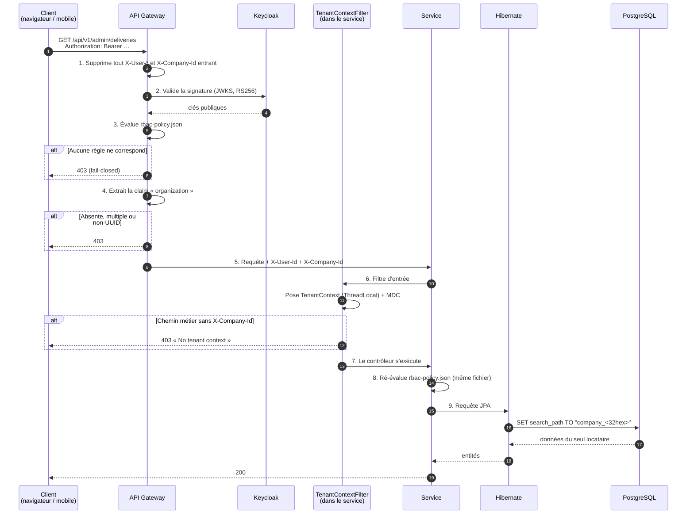
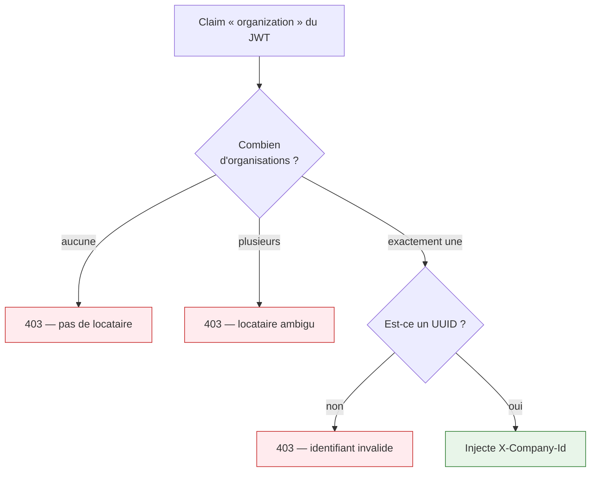
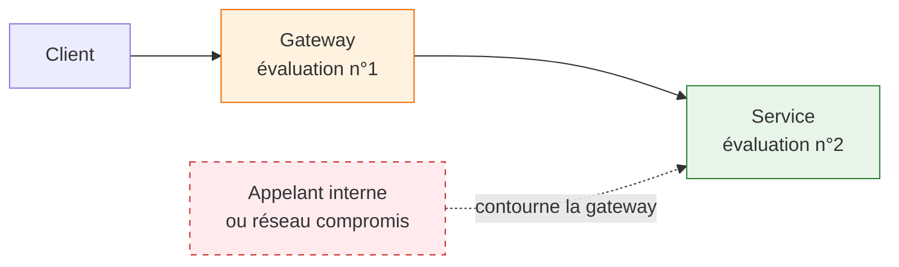
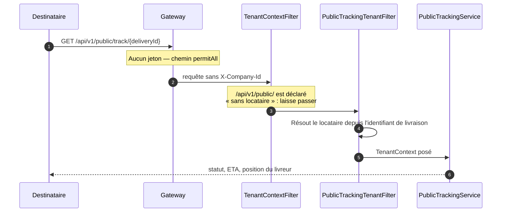

# Cycle de vie d'une requête

Comprendre ce trajet, c'est comprendre comment la sécurité et l'isolation des clients tiennent
ensemble. Rien d'autre dans la documentation ne remplace cette page.

---

## Le trajet complet



**Pourquoi ce diagramme.** Il rend visibles quatre contrôles qu'on ne voit nulle part en lisant une
classe isolée, et il montre que l'isolation ne repose pas sur la discipline du développeur.

---

## Les quatre contrôles, dans l'ordre

### 1 · Nettoyage des en-têtes — anti-usurpation

```java
copiedHeaders.remove("X-User-Id");
copiedHeaders.remove("X-User-Role");
copiedHeaders.remove("X-Company-Id");
// …puis la requête est décorée avec cette copie
```

!!! danger "Ce que ça empêche"
    Sans cette étape, n'importe qui pourrait envoyer `X-Company-Id: <uuid d'un concurrent>` et lire
    ses données. Les en-têtes de contexte ne sont **jamais** acceptés de l'extérieur : ils sont
    reconstruits à partir du jeton, à chaque requête.

### 2 · Validation du jeton

Signature RS256 vérifiée contre le JWKS de Keycloak. La gateway ne détient aucun secret partagé.

### 3 · Autorisation déclarative

Le fichier `rbac-policy.json` est évalué. Les règles sont **ordonnées**, premier match gagnant, et
**l'absence de règle vaut refus**. Détail complet : [Autorisation](autorisation.md).

### 4 · Résolution du locataire



**Le cas « plusieurs organisations » mérite une explication.** Un utilisateur appartenant à deux
organisations produirait un locataire **différent selon l'ordre d'itération de la map de claims** —
donc un basculement silencieux d'un client à l'autre, d'une requête à la suivante. Le refus explicite
est préférable à un comportement non déterministe sur une frontière de données.

---

## Pourquoi l'autorisation est évaluée deux fois



Une seule évaluation à la gateway ferait reposer la sécurité sur le fait que **personne n'atteint
jamais un service directement** — une propriété du déploiement, pas du code. En développement, où les
services écoutent sur leurs ports, elle est déjà fausse.

Les deux évaluations lisent **le même fichier**, répliqué à l'identique. Elles ne peuvent pas
diverger.

---

## Le cas particulier : le suivi public



**Le point à comprendre.** Ce chemin n'a pas de jeton, donc pas de claim `organization`. Le locataire
est déduit **de l'identifiant de livraison lui-même**, plus bas dans la chaîne. C'est pourquoi
`/api/v1/public/` figure dans les chemins exemptés de la configuration :

```yaml
asm:
  tenant:
    tenant-less-prefixes: /api/v1/public/,/api/v1/auth/,/api/v1/dev/
```

!!! warning "Le compromis assumé"
    L'identifiant de livraison **est** le jeton d'accès. C'est le modèle des transporteurs réels
    (lien de suivi partageable), et un UUIDv4 n'est pas devinable. Mais la réponse contient le nom du
    livreur, son téléphone et sa position en temps réel : un lien qui fuite permet de suivre une
    personne. D'où une limite de débit — 120 appels par 10 minutes et par couple IP/livraison.

---

## À retenir

| Question | Réponse |
|---|---|
| Où le locataire est-il décidé ? | À la **gateway**, depuis le jeton. Jamais depuis un en-tête client. |
| Que se passe-t-il si un service reçoit une requête sans locataire ? | **403**, sauf sur les chemins déclarés sans locataire. |
| Où l'isolation est-elle appliquée ? | Par PostgreSQL, via `SET search_path` — pas par un `WHERE` applicatif. |
| Que se passe-t-il si un endpoint n'est pas dans la politique ? | Il est **inaccessible**. Une erreur se manifeste en 403 pendant le développement, jamais en fuite. |
