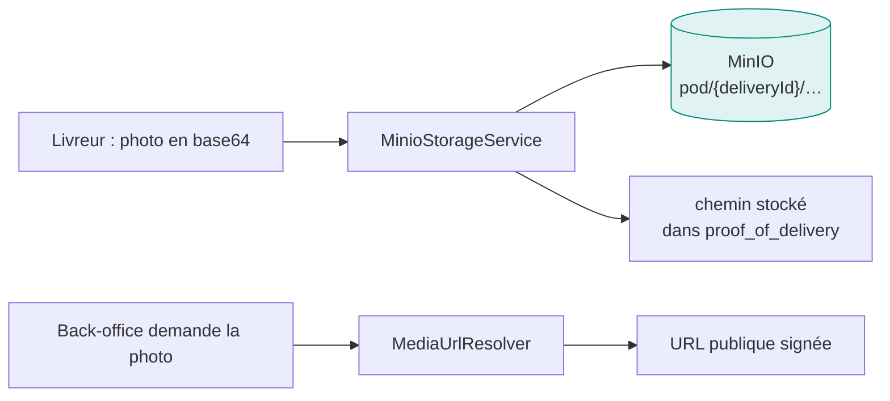
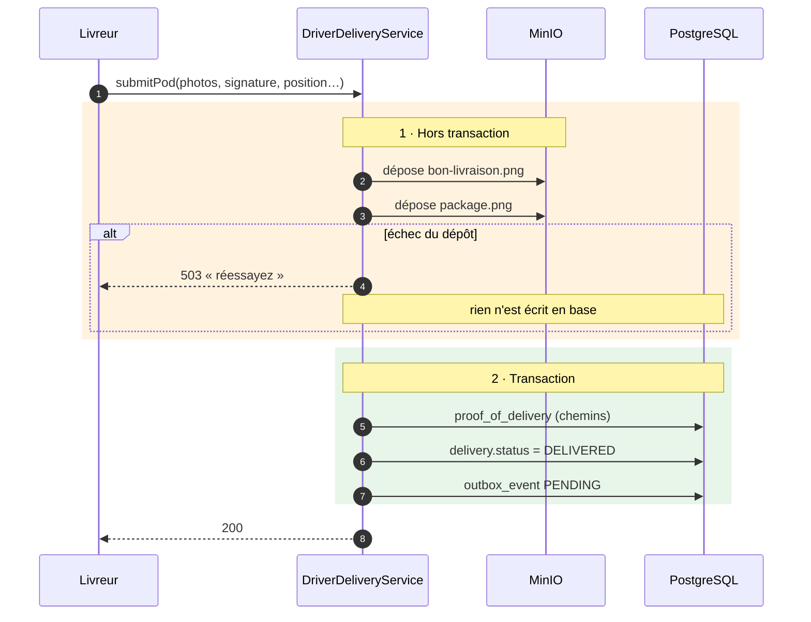

# Stockage de fichiers

## Pourquoi pas la base de données

Les photos de preuve de livraison sont volumineuses, nombreuses, et ne sont jamais interrogées par
leur contenu. Les stocker en base gonflerait les sauvegardes, alourdirait chaque réplication et
n'apporterait rien.

**MinIO** — compatible S3 — les héberge. La base ne garde que le **chemin**.

---

## L'ordre des opérations, et pourquoi il compte

**Le dépôt des fichiers précède la transaction, volontairement.**

Un appel réseau vers MinIO à l'intérieur d'une transaction PostgreSQL la maintiendrait ouverte
pendant toute la durée du transfert — sur une connexion mobile, plusieurs secondes. Le pool de
connexions s'épuiserait sous charge.

!!! warning "La contrepartie assumée"
    Si la transaction échoue **après** un dépôt réussi, les fichiers restent dans MinIO sans être
    référencés. Ce sont des orphelins — coût en stockage, aucune incohérence fonctionnelle. Le chemin
    étant déterministe (`pod/{deliveryId}/…`), une nouvelle tentative les écrase.

    L'inverse — écrire en base puis échouer sur le dépôt — donnerait une preuve de livraison
    **pointant vers une photo inexistante**. C'est cette asymétrie qui dicte l'ordre.

---

## Ce qui est stocké

| Type | Chemin | Produit par |
|---|---|---|
| Bon de livraison signé | `pod/{deliveryId}/bon-livraison.png` | Livreur (POD) |
| Photo du colis | `pod/{deliveryId}/package.png` | Livreur (POD) |
| Photos de retour | via `RmaPhotoStorageService` | Destinataire ou livreur |
| Photos d'incident | rapports terrain | Livreur |

!!! note "Le bon de livraison est optionnel pour un retour"
    Une collecte de retour n'a pas de bon de livraison — le document n'existe pas pour un mouvement
    inverse. Le code le prévoit explicitement, plutôt que d'imposer une photo vide.
