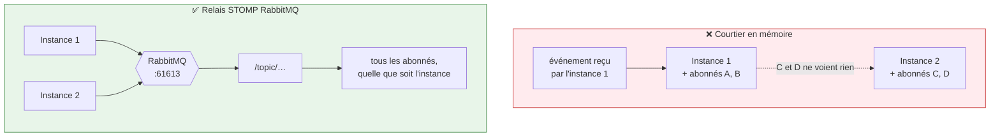
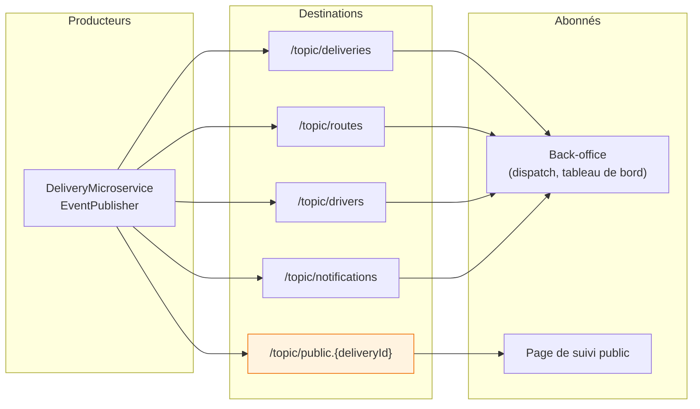
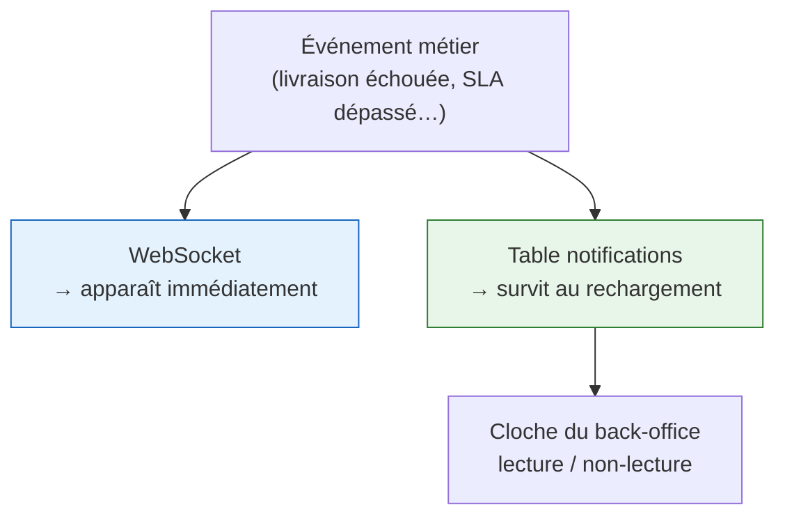

# Temps réel et notifications

## Pourquoi RabbitMQ relaie le WebSocket



```java
registry.enableStompBrokerRelay("/topic").setRelayHost(rabbitHost);
registry.setApplicationDestinationPrefixes("/app");
registry.addEndpoint("/ws").setAllowedOriginPatterns("*");
```

**Le courtier en mémoire de Spring fonctionne tant qu'il n'y a qu'une instance.** Dès qu'on en
déploie deux, un dispatcher connecté à la seconde ne voit plus les événements produits par la
première. Le relais RabbitMQ élimine cette dépendance à la topologie.

!!! note "Ce que ça n'apporte pas"
    Ce n'est pas de la persistance. Un client déconnecté au moment de l'émission **rate**
    l'événement. Les données restent en base ; le WebSocket ne sert qu'à éviter d'attendre le
    prochain rafraîchissement.

---

## Qui écoute quoi



**`/topic/public.{deliveryId}` est isolé volontairement.** La page de suivi n'est pas authentifiée :
elle ne doit recevoir **que** les événements de la livraison dont elle porte l'identifiant, jamais un
flux global.

---

## La sécurité du WebSocket

Un intercepteur (`WebSocketSecurityInterceptor`) valide le jeton **à la connexion STOMP**, pas
seulement à l'ouverture HTTP.

!!! danger "Erreur classique"
    Croire que `setAllowedOriginPatterns("*")` ouvre une faille. L'origine n'est pas un contrôle
    d'accès : le contrôle réel est le jeton présenté dans la trame `CONNECT`. Une origine permissive
    est nécessaire ici parce que le back-office et le suivi public sont servis depuis des origines
    différentes.

---

## Les notifications persistantes

Deux mécanismes coexistent et ne servent pas la même chose :



| | WebSocket | Table `notifications` |
|---|---|---|
| Portée | l'instant | l'historique |
| Si le dispatcher est absent | perdu | conservé |
| Usage | badge qui apparaît en direct | liste consultable, marquage lu |

!!! tip "Pourquoi les deux"
    Un dispatcher qui arrive à 9 h doit voir ce qui s'est passé à 7 h. Le WebSocket seul ne le
    permet pas ; la table seule imposerait un rafraîchissement permanent.

---

## Notifications mobiles (FCM)

L'application livreur enregistre un jeton FCM (`PUT /driver/fcm-token`), effacé à la déconnexion. Les
notifications poussées servent les événements que le livreur doit voir **application fermée** : une
nouvelle livraison assignée, un transfert de garde à confirmer.
