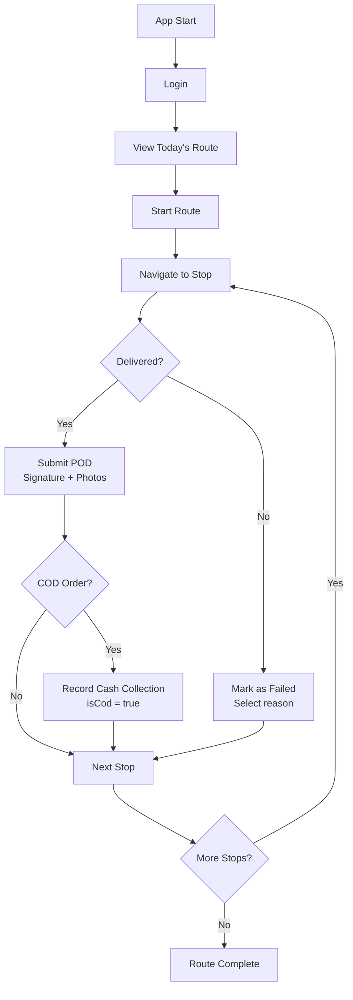

# Driver App

**Tech:** Flutter (Dart) · Android / iOS  
**Connects to:** API Gateway on port `80`

## Responsibility

The mobile application used by delivery drivers. Handles the full delivery workflow from accepting a delivery to submitting proof of delivery, including GPS tracking, COD collection, and parcel handoff between drivers.

## Key Screens

| Screen | Functionality |
|---|---|
| Login | Phone + password authentication |
| Home / Dashboard | Today's route + available deliveries |
| Route Detail | Ordered stops with ETAs, map navigation |
| Delivery Detail | Client info, address, COD amount if applicable |
| POD Capture | Camera for photos, stylus/finger signature pad, recipient name |
| Incident Report | Multi-photo incident report with GPS location |
| Handoff | QR code scanner for parcel transfer between drivers |
| Profile | Personal stats, duty toggle, password change |

## Delivery Workflow (Driver Side)



## Key API Calls

```
GET  /api/driver/routes/today          → today's route with stops
POST /api/driver/routes/{id}/start     → start route
POST /api/driver/deliveries/{id}/pod   → submit proof of delivery
PATCH /api/driver/deliveries/{id}/cod  → record COD cash collection
POST /api/driver/location              → update GPS position (periodic)
GET  /api/driver/deliveries/{id}/bon-livraison → download delivery note PDF
```

## Push Notifications (FCM)

The driver app receives Firebase Cloud Messaging push notifications for:
- New delivery assigned
- Stop added to active route
- Stop removed from route
- Delivery reassigned to another driver
- Handoff request from another driver

The FCM token is registered via `PUT /api/driver/fcm-token` on each app launch.
