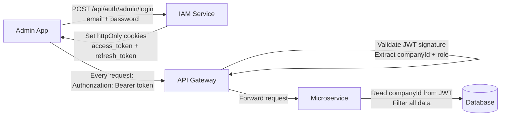

# Authentication & Security

## Token Strategy

ASM Track uses **three separate token types** — they cannot be mixed:

| Token type | Issued by | Used by | Header |
|---|---|---|---|
| Admin JWT | IAM Service | Admin web app | `Authorization: Bearer <token>` |
| Driver JWT | Driver Service | Driver mobile app | `Authorization: Bearer <token>` |
| Internal Secret | Static (env var) | Service-to-service | `X-Internal-Secret: asm-internal-2026` |

## JWT Flow



## Multi-tenancy

Every admin JWT contains a `companyId` claim. All data in the Delivery Service is automatically scoped:

```java
// TenantFilterAspect.java — applied globally to all repository calls
@Filter(name = "companyFilter", condition = "company_id = :companyId")
```

This means:
- Admins from Company A **never see** Company B's deliveries, routes, or drivers
- No manual `WHERE company_id = ?` needed in service code
- Enforced at the Hibernate session level

## Internal Service Communication

Services call each other over the Docker internal network using a shared secret — no JWT needed:

```
Delivery Service → ERP Adapter
Headers:
  X-Internal-Secret: asm-internal-2026
  X-Company-Id: {uuid}   ← identifies which company's ERP config to use
```

## API Gateway Security

The Nginx gateway validates JWTs before forwarding any request. If the token is missing, expired, or has an invalid signature → 401 returned immediately, the downstream service is never hit.
