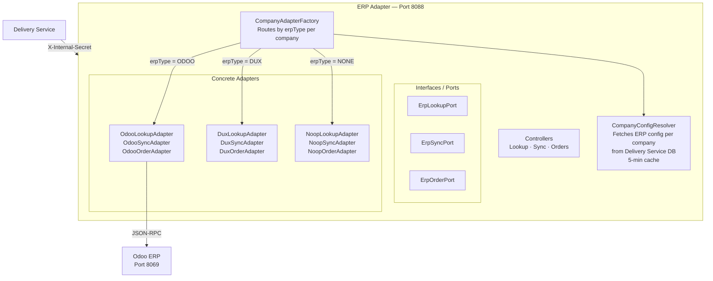

# ERP Integration

## Architecture Pattern

The ERP Adapter uses the **Hexagonal Architecture (Ports & Adapters)** pattern. Adding a new ERP requires implementing 3 interfaces — zero changes to the Delivery Service.



## Inbound: ERP → ASM Track

Orders flow from Odoo into ASM Track in two modes:

**Manual (default):** Admin opens `/import` page → clicks Synchroniser → reviews orders → clicks Importer.

**Semi-automatic:** `ErpAutoImportNotifier` scheduler runs every 2 minutes:
1. Queries DB for companies that have imported from Odoo before
2. Fetches pending orders from Odoo per company
3. Compares count with last known count
4. If new orders found → sends WebSocket event `erp.orders_ready` to admin
5. Admin gets a notification badge → clicks → bulk imports from the import page

## Outbound: ASM Track → ERP (Status Sync)

After every delivery outcome, the Delivery Service calls the ERP Adapter to sync back:

| Outcome | Odoo Operation |
|---|---|
| DELIVERED (full) | Validate stock picking → invoice triggered |
| DELIVERED (partial) | Validate with done quantities → creates Odoo backorder |
| FAILED | Post failure note on stock picking |
| CANCELLED | Cancel sale order |

### Retry with Exponential Backoff

If Odoo is unavailable at sync time, the order is marked `PENDING_RETRY` and the `ErpSyncRetryScheduler` retries automatically:

| Attempt | Retry delay |
|---|---|
| 1 | 1 min |
| 2 | 2 min |
| 3 | 4 min |
| 4–5 | 8–16 min |
| 6–7 | 32–64 min |
| 8+ | 4 hours (cap) |
| 10 (max) | → `SYNC_FAILED`, manual intervention needed |

## COD Detection

When importing an order, `isCod` is set based on Odoo's payment term:

```java
.isCod(isImmediatePayment(preview.getPaymentTermName()))
```

The `isImmediatePayment()` helper matches:
- `"Immediate Payment"` (English Odoo)
- `"Paiement immédiat"` / `"Paiement immédiat"` (French Odoo)
- `"comptant"`, `"cash on delivery"`, `"now"`

## Adding a New ERP

To support SAP, Sage, or any other ERP:

1. Create `SapLookupAdapter implements ErpLookupPort`
2. Create `SapSyncAdapter implements ErpSyncPort`
3. Create `SapOrderAdapter implements ErpOrderPort`
4. Add one `case "SAP"` in `CompanyAdapterFactory`
5. Set `erpType = SAP` for the company in the DB

No changes needed in the Delivery Service or admin app.
