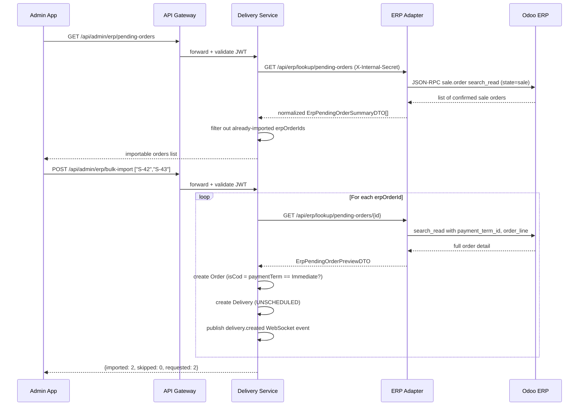
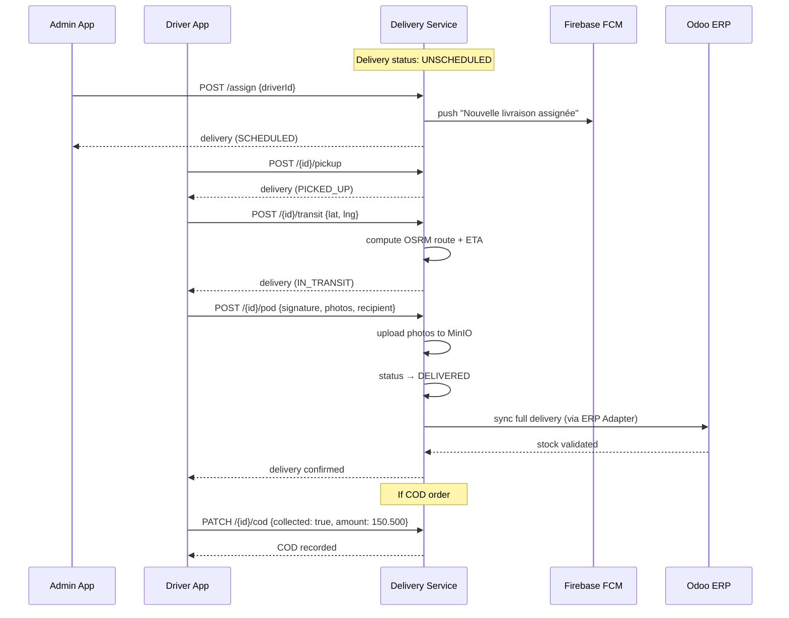
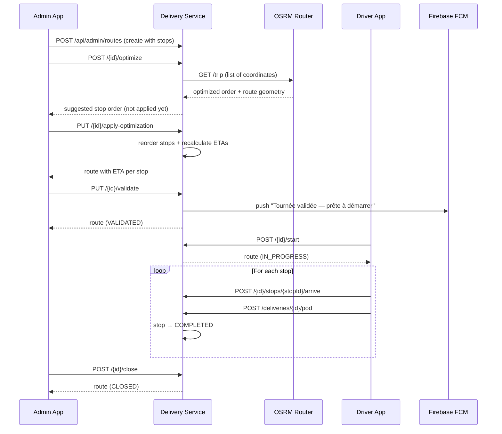
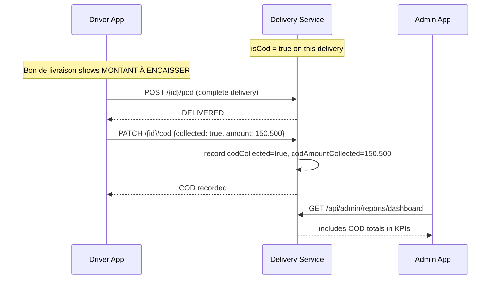
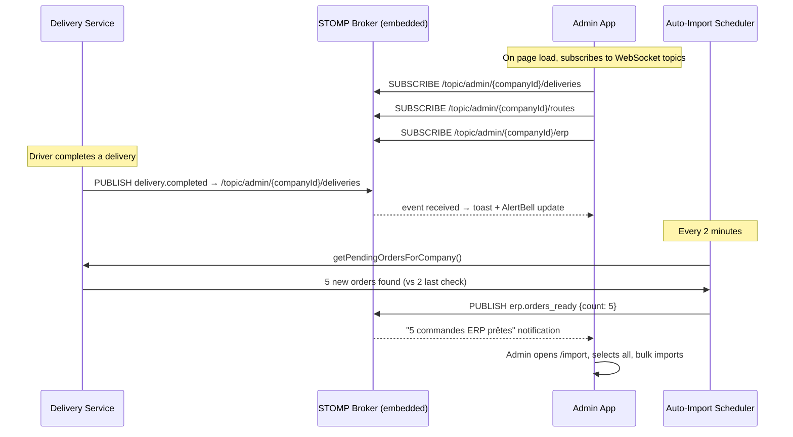

# Key Sequence Flows

## ERP Import Flow

```mermaid
sequenceDiagram
    participant Admin as Admin App
    participant GW as API Gateway
    participant DS as Delivery Service
    participant EA as ERP Adapter
    participant Odoo as Odoo ERP

    Admin->>GW: GET /api/admin/erp/pending-orders
    GW->>DS: forward + validate JWT
    DS->>EA: GET /api/erp/lookup/pending-orders (X-Internal-Secret)
    EA->>Odoo: JSON-RPC sale.order search_read (state=sale)
    Odoo-->>EA: list of confirmed sale orders
    EA-->>DS: normalized ErpPendingOrderSummaryDTO[]
    DS->>DS: filter out already-imported erpOrderIds
    DS-->>Admin: importable orders list

    Admin->>GW: POST /api/admin/erp/bulk-import ["S-42","S-43"]
    GW->>DS: forward + validate JWT
    loop For each erpOrderId
        DS->>EA: GET /api/erp/lookup/pending-orders/{id}
        EA->>Odoo: search_read with payment_term_id, order_line
        Odoo-->>EA: full order detail
        EA-->>DS: ErpPendingOrderPreviewDTO
        DS->>DS: create Order (isCod = paymentTerm == Immediate?)
        DS->>DS: create Delivery (UNSCHEDULED)
        DS->>DS: publish delivery.created WebSocket event
    end
    DS-->>Admin: {imported: 2, skipped: 0, requested: 2}
```

---

## Delivery Lifecycle

```mermaid
sequenceDiagram
    participant Admin as Admin App
    participant Driver as Driver App
    participant DS as Delivery Service
    participant FCM as Firebase FCM
    participant Odoo as Odoo ERP

    Note over DS: Delivery status: UNSCHEDULED

    Admin->>DS: POST /assign {driverId}
    DS->>FCM: push "Nouvelle livraison assignée"
    DS-->>Admin: delivery (SCHEDULED)

    Driver->>DS: POST /{id}/pickup
    DS-->>Driver: delivery (PICKED_UP)

    Driver->>DS: POST /{id}/transit {lat, lng}
    DS->>DS: compute OSRM route + ETA
    DS-->>Driver: delivery (IN_TRANSIT)

    Driver->>DS: POST /{id}/pod {signature, photos, recipient}
    DS->>DS: upload photos to MinIO
    DS->>DS: status → DELIVERED
    DS->>Odoo: sync full delivery (via ERP Adapter)
    Odoo-->>DS: stock validated
    DS-->>Driver: delivery confirmed

    Note over DS: If COD order
    Driver->>DS: PATCH /{id}/cod {collected: true, amount: 150.500}
    DS-->>Driver: COD recorded
```

---

## Route Optimization Flow

```mermaid
sequenceDiagram
    participant Admin as Admin App
    participant DS as Delivery Service
    participant OSRM as OSRM Router
    participant Driver as Driver App
    participant FCM as Firebase FCM

    Admin->>DS: POST /api/admin/routes (create with stops)
    Admin->>DS: POST /{id}/optimize
    DS->>OSRM: GET /trip (list of coordinates)
    OSRM-->>DS: optimized order + route geometry
    DS-->>Admin: suggested stop order (not applied yet)

    Admin->>DS: PUT /{id}/apply-optimization
    DS->>DS: reorder stops + recalculate ETAs
    DS-->>Admin: route with ETA per stop

    Admin->>DS: PUT /{id}/validate
    DS->>FCM: push "Tournée validée — prête à démarrer"
    DS-->>Admin: route (VALIDATED)

    Driver->>DS: POST /{id}/start
    DS-->>Driver: route (IN_PROGRESS)

    loop For each stop
        Driver->>DS: POST /{id}/stops/{stopId}/arrive
        Driver->>DS: POST /deliveries/{id}/pod
        DS->>DS: stop → COMPLETED
    end

    Admin->>DS: POST /{id}/close
    DS-->>Admin: route (CLOSED)
```

---

## COD Collection Flow

```mermaid
sequenceDiagram
    participant Driver as Driver App
    participant DS as Delivery Service
    participant Admin as Admin App

    Note over DS: isCod = true on this delivery
    Note over Driver: Bon de livraison shows MONTANT À ENCAISSER

    Driver->>DS: POST /{id}/pod (complete delivery)
    DS-->>Driver: DELIVERED

    Driver->>DS: PATCH /{id}/cod {collected: true, amount: 150.500}
    DS->>DS: record codCollected=true, codAmountCollected=150.500
    DS-->>Driver: COD recorded

    Admin->>DS: GET /api/admin/reports/dashboard
    DS-->>Admin: includes COD totals in KPIs
```

---

## Real-time Notification Flow

```mermaid
sequenceDiagram
    participant DS as Delivery Service
    participant WS as STOMP Broker (embedded)
    participant Admin as Admin App
    participant Scheduler as Auto-Import Scheduler

    Note over Admin: On page load, subscribes to WebSocket topics

    Admin->>WS: SUBSCRIBE /topic/admin/{companyId}/deliveries
    Admin->>WS: SUBSCRIBE /topic/admin/{companyId}/routes
    Admin->>WS: SUBSCRIBE /topic/admin/{companyId}/erp

    Note over DS: Driver completes a delivery
    DS->>WS: PUBLISH delivery.completed → /topic/admin/{companyId}/deliveries
    WS-->>Admin: event received → toast + AlertBell update

    Note over Scheduler: Every 2 minutes
    Scheduler->>DS: getPendingOrdersForCompany()
    DS->>Scheduler: 5 new orders found (vs 2 last check)
    Scheduler->>WS: PUBLISH erp.orders_ready {count: 5}
    WS-->>Admin: "5 commandes ERP prêtes" notification
    Admin->>Admin: Admin opens /import, selects all, bulk imports
```
