# System Architecture

## System Context Diagram

```mermaid
graph TB
    %% ── User Layer ───────────────────────────────────────────────────────────
    subgraph CLIENTS["Users"]
        direction LR
        ADMIN_USER(["Admin\nDispatcher"])
        DRIVER_USER(["Driver\nMobile"])
    end

    %% ── Applications ─────────────────────────────────────────────────────────
    subgraph APPS["Applications"]
        direction LR
        ADMIN_APP["Admin Web App"]
        DRIVER_APP["Driver Mobile App"]
    end

    %% ── Gateway ──────────────────────────────────────────────────────────────
    subgraph GATEWAY["API Gateway"]
        GW["Nginx\nJWT Validation\nRequest Routing"]
    end

    %% ── Microservices ────────────────────────────────────────────────────────
    subgraph SERVICES["Core Services"]
        direction TB

        subgraph IAM["IAM Service"]
            IAM_AUTH["Admin Auth\nClient Auth"]
            IAM_MGMT["Users / Companies\nClients / Profiles"]
        end

        subgraph DELIVERY["Delivery Service"]
            D_ORDERS["Orders & Deliveries\nERP Import / Bulk Import"]
            D_ROUTES["Routes & Optimization\nOSRM / ETAs / SLA"]
            D_OPS["Ops Dashboard\nDispatch / Exceptions\nAlerts / Audit"]
            D_PDF["PDF Generation\nBon de Livraison\nFeuille de Route"]
            D_WS["WebSocket\nSTOMP Broker\nReal-time Events"]
            D_SYNC["ERP Sync\nRetry Scheduler\nBackoff Logic"]
        end

        subgraph DRIVER_SVC["Driver Service"]
            DR_AUTH["Driver Auth\nJWT / Refresh Token"]
            DR_PROFILE["Profile / Location\nDuty Status / Stats"]
            DR_FCM["FCM Token\nPush Notifications"]
        end

        subgraph ERP_SVC["ERP Adapter"]
            ERP_LOOKUP["Lookup\nPending Orders\nClients / Products"]
            ERP_SYNC_SVC["Sync\nFull Delivery\nPartial / Cancel / Failure"]
            ERP_FACTORY["Company Factory\nOdoo Adapter\nDUX Adapter / Noop"]
        end
    end

    %% ── Data Layer ───────────────────────────────────────────────────────────
    subgraph DATA["Data Stores"]
        direction LR
        DB_APP[("PostgreSQL\napp_db\nUsers / Companies\nClients")]
        DB_DELIVERY[("PostgreSQL\ndelivery_db\nOrders / Deliveries\nRoutes / Zones")]
        DB_DRIVER[("PostgreSQL\ndriver_db\nDrivers / Locations\nHistory")]
        MINIO[("Object Storage\nMinIO\nPOD Photos / PDFs / Logos")]
    end

    %% ── External ─────────────────────────────────────────────────────────────
    subgraph EXTERNAL["External Systems"]
        direction LR
        ODOO["ERP (Odoo)\nSales Orders / Stock\nPartners / Products"]
        OSRM["OSRM Routing\nSelf-hosted\nTunisia OSM"]
        FIREBASE["Firebase FCM\nPush Notifications\nDriver Mobile App"]
        NOMINATIM["Nominatim\nOpenStreetMap\nGeocoding API"]
    end

    %% ── User → App ───────────────────────────────────────────────────────────
    ADMIN_USER -->|HTTPS| ADMIN_APP
    DRIVER_USER -->|HTTPS / Mobile| DRIVER_APP

    %% ── App → Gateway ────────────────────────────────────────────────────────
    ADMIN_APP -->|REST + Bearer JWT| GW
    DRIVER_APP -->|REST + Bearer JWT| GW

    %% ── Gateway → Services ───────────────────────────────────────────────────
    GW -->|/api/auth/admin\n/api/admin/users\n/api/admin/clients| IAM
    GW -->|/api/admin/deliveries\n/api/admin/routes\n/api/admin/erp\n/api/admin/ops\n/api/driver/deliveries| DELIVERY
    GW -->|/api/auth/driver\n/api/driver/profile| DRIVER_SVC

    %% ── WebSocket ────────────────────────────────────────────────────────────
    ADMIN_APP <-.->|"WebSocket STOMP\n/topic/admin/{companyId}/deliveries\n/topic/admin/{companyId}/routes\n/topic/admin/{companyId}/erp"| D_WS
    DRIVER_APP <-.->|"WebSocket STOMP\n/topic/driver/{driverId}"| D_WS

    %% ── Service → Service (Internal) ─────────────────────────────────────────
    DELIVERY -->|"X-Internal-Secret\n/internal/companies/{id}/erp-config"| IAM
    DELIVERY -->|"X-Internal-Secret\n/internal/drivers/{id}"| DRIVER_SVC
    DELIVERY -->|"X-Internal-Secret\nLookup + Sync"| ERP_SVC

    %% ── ERP Adapter → Odoo ───────────────────────────────────────────────────
    ERP_FACTORY -->|JSON-RPC over HTTP\nsale.order / stock.picking\nres.partner / product.product| ODOO

    %% ── Services → Data ──────────────────────────────────────────────────────
    IAM --- DB_APP
    DELIVERY --- DB_DELIVERY
    DRIVER_SVC --- DB_DRIVER
    DELIVERY -->|POD photos / Logos / PDFs| MINIO

    %% ── Services → External ──────────────────────────────────────────────────
    DELIVERY -->|OSRM Route API\nDistance / Duration / Geometry| OSRM
    DELIVERY -->|Geocode / Reverse Geocode| NOMINATIM
    DELIVERY -->|FCM HTTP v1 API| FIREBASE
    DRIVER_SVC -->|FCM Token Registration| FIREBASE

    %% ── Styles ───────────────────────────────────────────────────────────────
    classDef app fill:#1e3a5f,stroke:#3b82f6,color:#fff
    classDef service fill:#1a2e1a,stroke:#22c55e,color:#fff
    classDef db fill:#2d1b1b,stroke:#ef4444,color:#fff
    classDef external fill:#2d2000,stroke:#f59e0b,color:#fff
    classDef gateway fill:#2d1f2d,stroke:#a855f7,color:#fff
    classDef user fill:#1f2937,stroke:#6b7280,color:#fff

    class ADMIN_APP,DRIVER_APP app
    class IAM,IAM_AUTH,IAM_MGMT,DELIVERY,D_ORDERS,D_ROUTES,D_OPS,D_PDF,D_WS,D_SYNC,DRIVER_SVC,DR_AUTH,DR_PROFILE,DR_FCM,ERP_SVC,ERP_LOOKUP,ERP_SYNC_SVC,ERP_FACTORY service
    class DB_APP,DB_DELIVERY,DB_DRIVER,MINIO db
    class ODOO,OSRM,FIREBASE,NOMINATIM external
    class GW gateway
    class ADMIN_USER,DRIVER_USER user
```

---

## Port Map

| Service | Internal Port | External Port | Protocol |
|---|---|---|---|
| API Gateway | 80 | 80 | HTTP |
| IAM Service | 8080 | 8080 | HTTP + WS |
| Delivery Service | 8082 | 8082 | HTTP + WS |
| Driver Service | 8086 | 8086 | HTTP |
| ERP Adapter | 8088 | 8088 | HTTP |
| PostgreSQL (app) | 5432 | 5435 | TCP |
| PostgreSQL (delivery) | 5432 | 5434 | TCP |
| PostgreSQL (driver) | 5432 | 5437 | TCP |
| MinIO API | 9000 | 9000 | HTTP |
| MinIO Console | 9001 | 9001 | HTTP |
| OSRM | 5000 | 5000 | HTTP |
| Odoo | 8069 | 8069 | HTTP |

---

## Network

All services run on a single Docker bridge network: `microservices_asm-network`.  
Services communicate by container name (e.g. `http://delivery-service:8082`).  
Only the API Gateway (port 80) is exposed to the outside.

:::danger Production Note
In production, remove all database port mappings. Only expose ports 80 and 443. Move all credentials to `.env` files.
:::
