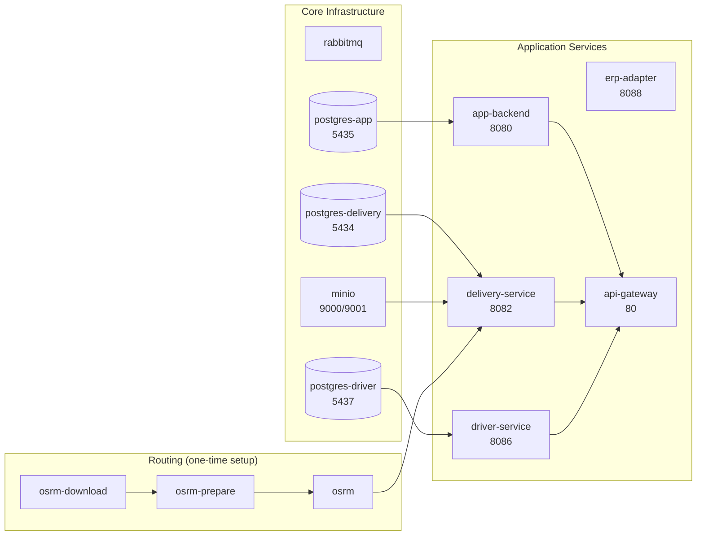

# Docker Setup

## Starting Everything

```bash
cd Microservices
docker compose up -d
```

To rebuild after code changes:

```bash
docker compose build delivery-service && docker compose up -d delivery-service
```

## Services



## Health Checks

Every service has a healthcheck. Dependencies use `condition: service_healthy` so services start in the right order automatically.

| Service | Healthcheck |
|---|---|
| postgres-* | `pg_isready` |
| rabbitmq | `rabbitmq-diagnostics ping` |
| minio | `curl /minio/health/live` |
| app-backend | `nc -z localhost 8080` |
| delivery-service | `nc -z localhost 8082` |
| driver-service | `nc -z localhost 8086` |
| erp-adapter | `wget /actuator/health` |

## Volumes

| Volume | Contents |
|---|---|
| `app-pgdata` | IAM PostgreSQL data |
| `delivery-pgdata` | Delivery PostgreSQL data |
| `driver-pgdata` | Driver PostgreSQL data |
| `minio_data` | POD photos, PDFs, logos |
| `osrm-data` | Tunisia road network (osm.pbf + processed files) |
| `rabbitmq-data` | Message queue data |

:::warning OSRM First Run
The first `docker compose up` downloads and processes the Tunisia OSM file (~100MB). This can take 10–15 minutes. Subsequent starts are instant (data cached in volume).
:::
