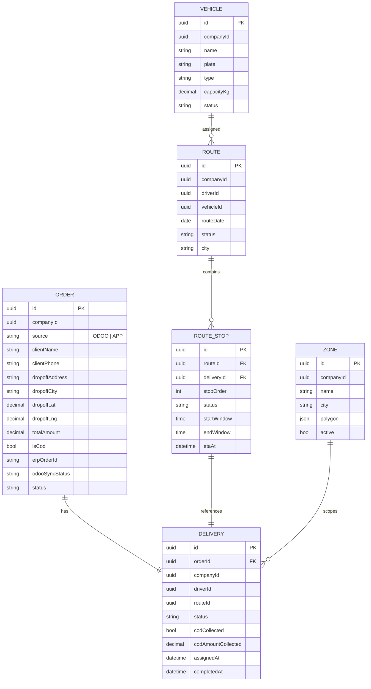
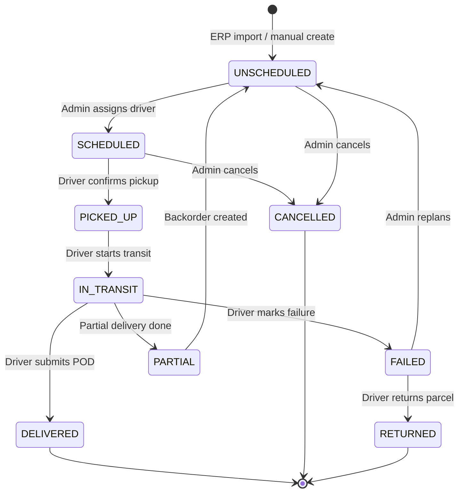

# Delivery Service

**Port:** `8082`  
**Database:** `delivery_db` (PostgreSQL port 5434)  
**Swagger:** `http://localhost:8082/swagger-ui.html`

## Responsibility

The Delivery Service is the **core** of the platform. It owns orders, deliveries, routes, zones, vehicles, ERP import, operations analytics, PDF generation, and real-time WebSocket events.

## Domain Model

## Delivery Status Machine

## Key Sub-Systems

### ERP Import
- Pulls pending orders from Odoo via the ERP Adapter
- Detects COD from payment terms
- Supports single import and bulk import
- `ErpAutoImportNotifier` sends real-time WebSocket alerts when new orders arrive

### Route Optimization
- Creates multi-stop routes and assigns them to drivers
- Calls OSRM self-hosted router for optimized ordering
- Calculates ETA per stop + SLA status
- Validates routes and notifies drivers via FCM

### PDF Generation
- **Bon de livraison** — per-delivery PDF with barcode, client info, items, COD box (if applicable), signature zones
- **Feuille de route** — route manifest PDF with all stops, COD totals, driver info

### Real-time Events (WebSocket STOMP)
Published to per-company topics so admins only receive their own company's events:

| Event | Topic | Trigger |
|---|---|---|
| `delivery.created` | `/topic/admin/{companyId}/deliveries` | Import, manual create |
| `delivery.scheduled` | `/topic/admin/{companyId}/deliveries` | Admin assigns driver |
| `delivery.in_transit` | `/topic/admin/{companyId}/deliveries` | Driver starts transit |
| `delivery.completed` | `/topic/admin/{companyId}/deliveries` | Driver submits POD |
| `delivery.failed` | `/topic/admin/{companyId}/deliveries` | Driver marks failure |
| `sla.breach` | `/topic/admin/{companyId}/deliveries` | SLA threshold exceeded |
| `route.validated` | `/topic/admin/{companyId}/routes` | Admin validates route |
| `erp.orders_ready` | `/topic/admin/{companyId}/erp` | Scheduler finds new Odoo orders |
| `erp.sync_failed` | `/topic/admin/{companyId}/deliveries` | Odoo sync fails permanently |

### ERP Sync (Outbound)
After each delivery outcome, status is synced back to Odoo with exponential backoff retry (up to 10 attempts). Uses `ErpSyncService` + `ErpSyncRetryScheduler`.

## Configuration (env vars)

| Variable | Description | Default |
|---|---|---|
| `ERP_ADAPTER_URL` | ERP Adapter base URL | `http://erp-adapter:8088` |
| `ROUTING_OSRM_BASE_URL` | OSRM routing URL | `http://osrm:5000` |
| `MINIO_URL` | MinIO API URL | `http://minio:9000` |
| `OPS_SLA_WAITING_MINUTES` | Waiting SLA threshold | `30` |
| `OPS_SLA_TRANSIT_MINUTES` | Transit SLA threshold | `60` |
| `FCM_ENABLED` | Enable Firebase push | `true` |
