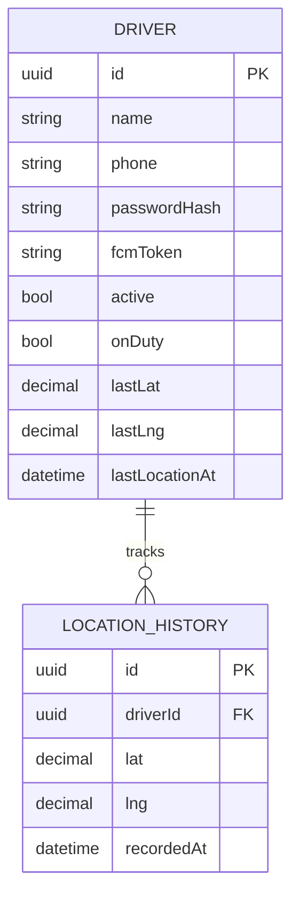

# Driver Service

**Port:** `8086`  
**Database:** `driver_db` (PostgreSQL port 5437)  
**Swagger:** `http://localhost:8086/swagger-ui.html`

## Responsibility

Owns **driver identity** — registration, authentication, profile, GPS location history, duty status, and FCM push token registration. Intentionally separate from the Delivery Service so driver auth and delivery logic can scale independently.

## Domain Model



## API Endpoints

### Driver-facing (requires Driver JWT)

| Method | Path | Description |
|---|---|---|
| GET | `/api/driver/profile` | Get own profile |
| PUT | `/api/driver/profile` | Update name |
| PUT | `/api/driver/password` | Change password |
| POST | `/api/driver/location` | Update GPS position |
| POST | `/api/driver/duty-status` | Toggle on-duty |
| PUT | `/api/driver/fcm-token` | Register push token |
| GET | `/api/driver/stats` | Personal performance stats |
| GET | `/api/driver/history` | Delivery history |

### Auth (public)

| Method | Path | Description |
|---|---|---|
| POST | `/api/auth/driver/register` | Register new driver |
| POST | `/api/auth/driver/login` | Login → JWT |
| POST | `/api/auth/driver/refresh-token` | Rotate token |

### Admin (super-admin JWT)

| Method | Path | Description |
|---|---|---|
| GET | `/api/admin/drivers` | List all drivers |
| POST | `/api/admin/drivers` | Create driver |
| PATCH | `/api/admin/drivers/{id}/status` | Activate / deactivate |
| POST | `/api/admin/drivers/{id}/reset-password` | Reset password |

### Internal (called by Delivery Service)

```
GET  /internal/drivers/{id}          → driver name, phone, fcmToken
POST /internal/drivers/{id}/location → write location from delivery events
X-Internal-Secret: asm-internal-2026
```

## FCM Push Notifications

The Driver Service stores each driver's Firebase Cloud Messaging token. The Delivery Service calls it to send push notifications:

| Event | Message |
|---|---|
| Route validated | "Tournée prête à démarrer" |
| Stop added to active route | "Nouvel arrêt ajouté" |
| Delivery reassigned | "Livraison réassignée" |
| Handoff required | "Transfert de colis en attente" |
