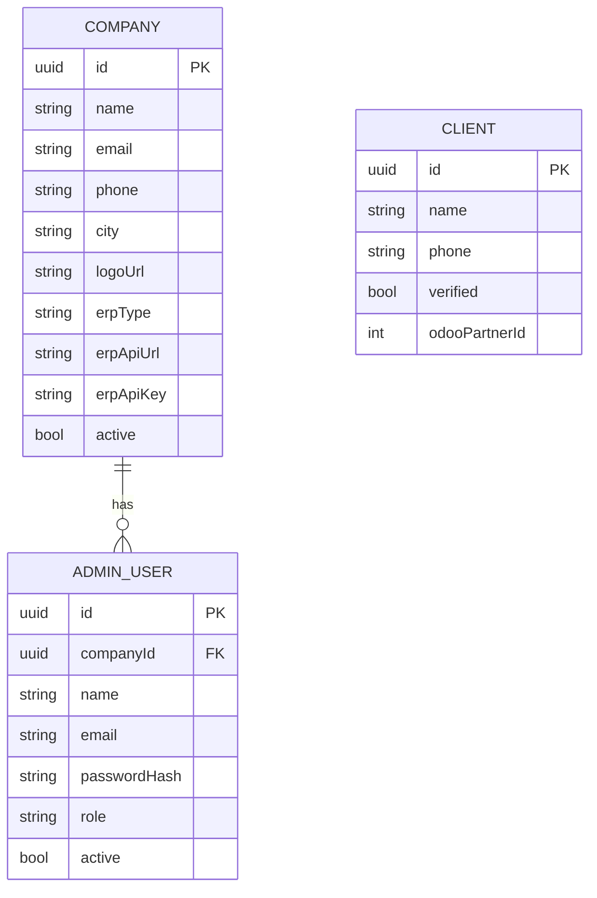

# IAM Service (Identity & Access Management)

**Port:** `8080`  
**Database:** `app_db` (PostgreSQL port 5435)  
**Swagger:** `http://localhost:8080/swagger-ui.html`

## Responsibility

The IAM Service owns everything related to **identity** — who can log in, what role they have, and which company they belong to. It is the single source of truth for admin users, client accounts, and company configurations.

## Domain Model



## API Endpoints

| Method | Path | Description |
|---|---|---|
| POST | `/api/auth/admin/login` | Admin login → sets httpOnly JWT cookies |
| POST | `/api/auth/admin/refresh` | Rotate access token using refresh cookie |
| POST | `/api/auth/admin/logout` | Clear auth cookies |
| GET | `/api/profile` | Get authenticated user profile |
| PUT | `/api/profile` | Update name / phone |
| PUT | `/api/profile/password` | Change password |
| POST | `/api/admin/users` | Create admin user for the company |
| GET | `/api/admin/users` | List company admin users |
| PATCH | `/api/admin/users/{id}/status` | Enable / disable user |
| GET | `/api/admin/clients` | Search clients |
| GET | `/api/admin/companies/me` | Get current company info |
| POST | `/api/admin/companies/{id}/logo` | Upload company logo |

## Token Structure

```json
{
  "sub": "user-uuid",
  "email": "admin@company.com",
  "role": "ADMIN",
  "companyId": "company-uuid",
  "name": "Aziz Hadjkacem",
  "iat": 1234567890,
  "exp": 1234571490
}
```

The `companyId` claim is the key — every downstream service uses it to scope data to the right tenant without any additional lookup.

## ERP Configuration

Each company stores its ERP connection settings in the IAM DB. The ERP Adapter fetches these at runtime (5-minute cache) via the internal endpoint:

```
GET /internal/companies/{id}/erp-config
X-Internal-Secret: asm-internal-2026
```

Response:
```json
{
  "erpType": "ODOO",
  "apiUrl": "http://odoo:8069/jsonrpc",
  "apiKey": "admin",
  "dbName": "DBTEST",
  "username": "admin",
  "uid": 2
}
```
