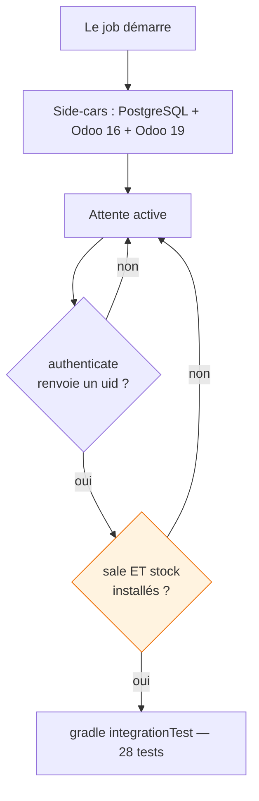

# Intégration continue

## Le pipeline

```mermaid
flowchart LR
    subgraph S1["build"]
        A["build-backend ×6"]
        B["typecheck-admin"]
        C["lint-admin"]
        R["rbac-policy-check"]
    end
    subgraph S2["unit-test"]
        D["unit-test-backend ×6"]
        E["test-admin"]
    end
    subgraph SS["security"]
        V["dependency-scan (Trivy)<br/>informatif"]
    end
    subgraph S3["integration-test"]
        F["delivery + PostgreSQL"]
        I["assistant + pgvector"]
        G["erp-adapter + Odoo 16 & 19<br/>(conditionnel)"]
    end
    subgraph S4["package"]
        H["package-images ×7"]
        P["pages — doc MkDocs"]
    end
    S1 --> S2 --> SS --> S3 --> S4

    style G stroke-dasharray: 5
    style V stroke-dasharray: 5
    style S4 fill:#e8f5e9,stroke:#2e7d32
```



**L'ordre suit la pyramide de tests : le contrôle le moins cher qui peut échouer passe en premier.**
Rien d'une étape ultérieure ne s'exécute si une précédente échoue — inutile de démarrer deux Odoo si
le code ne compile pas.

---

## Une matrice, pas cinq jobs

```yaml
.gradle-service: &gradle-service
  image: gradle:8.5-jdk17
  before_script:
    - cd "Microservices/$SERVICE"

.all-services: &all-services
  matrix:
    - SERVICE: [ApiGateway, AppBackend, DeliveryMicroservice, DriverService, ErpAdapterService, AssistantService]
```

!!! tip "Pourquoi c'est important"
    Cinq définitions de job quasi identiques ont déjà signifié que **trois services étaient
    simplement oubliés**. Une matrice ne peut pas oublier.

---

## Les tests d'intégration à base de données

Deux jobs lancent la suite `*IT` contre une **vraie** base fournie en side-car — pas de
Docker-in-Docker, les tests se connectent au service par le réseau du job :

- **delivery** contre `postgres:16` ;
- **assistant** contre `pgvector/pgvector:pg16` — il lui faut le type `vector` et l'opérateur de
  distance cosinus, que le PostgreSQL standard n'a pas. Y tourne l'isolation par locataire et
  l'autorisation ; l'évaluation de recherche en conditions réelles (`RetrievalEvalIT`) reste hors CI,
  fermée par `RUN_LIVE_EVAL`.

Chaque job attend que son side-car réponde avant de démarrer. Le connecteur ERP, lui, est un cas à
part — détaillé ci-dessous.

---

## Le job Odoo deux versions



!!! warning "Attendre le port ne suffit pas — cela a coûté deux exécutions"
    Odoo répond sur `/web/login` en quelques secondes, **bien avant** que `-i base,sale,stock` ait
    produit quoi que ce soit d'utilisable. Le port est donc un indicateur qui dit « prêt » alors que
    tous les tests sont condamnés.

    L'authentification seule ne suffit pas non plus : Odoo accepte un login dès que `base` est en
    place, pendant que `sale` et `stock` s'installent encore. Les tests touchent `stock.move.line` en
    premier — la condition de disponibilité est donc **« les deux modules sont `installed` »**, rien
    de plus faible.

**Deux détails d'infrastructure, chacun découvert par un échec :**

- `FF_NETWORK_PER_BUILD: "true"` — sans lui, les side-cars sont reliés au job et à rien d'autre :
  Odoo ne peut pas joindre sa base, réessaie indéfiniment, et n'ouvre jamais son port HTTP.
- Les variables `HOST`/`USER`/`PASSWORD` plutôt que `--db_host` : l'entrypoint d'Odoo construit ses
  propres arguments à partir de ces variables et les **ajoute après** la commande, écrasant en
  silence toute valeur passée en ligne de commande.

**Déclenchement :** modifications sous `Microservices/ErpAdapterService/`, ou **Run pipeline** depuis
l'interface. Le job n'apparaît pas sur un commit frontend, et ce n'est pas une panne.

---

## Construction des images

```yaml
NAMES="$IMAGE:$CI_COMMIT_SHORT_SHA,$IMAGE:$CI_COMMIT_REF_SLUG"
```

**BuildKit sans privilèges** (`moby/buildkit:rootless`), pas de Docker-in-Docker : le runner n'est pas
privilégié. Kaniko a été écarté — son dépôt amont a été archivé en 2025.

| Tag | Sens |
|---|---|
| `<short-sha>` | immuable, un commit = une image — **c'est ce qu'un déploiement épingle** |
| `<branch-slug>` | pointeur mouvant, pratique pour « le main actuel » |
| `<git-tag>` | uniquement si le commit porte une étiquette |

!!! danger "Pas de `latest`, volontairement"
    Un tag dont le sens change en silence est la façon dont deux machines finissent « sur la même
    version » tout en exécutant du code différent.

Comme les images Java se construisent depuis `Microservices/` (composite build), le job sépare le
contexte du dossier contenant le Dockerfile :

```yaml
--local context="$CONTEXT" \
--local dockerfile="${DOCKERFILE_DIR:-$CONTEXT}"
```

---

## Publication de la documentation

Le job `pages` reconstruit **cette documentation** à chaque commit sur la branche par défaut et la
publie sur GitLab Pages (image `squidfunk/mkdocs-material`).

```yaml
script:
  - mkdocs build --strict --site-dir public
```

- `--strict` fait **échouer** le job sur un lien mort ou une référence orpheline : une documentation
  qui ment sur ses propres liens n'est pas publiée.
- La doc **vit dans le dépôt** (`docs/` + `mkdocs.yml`) ; la publication n'est qu'un rendu, jamais une
  source. Les diagrammes Mermaid sont rendus nativement par le thème Material — rien à pré-générer.
- L'artefact `public/` est conservé **six mois** : tant que Pages n'est pas activé sur l'instance, ce
  ZIP *est* le mode de livraison.

---

## Contrôles de sécurité

Deux garde-fous, dans les stages `build` et `security`.

**`rbac-policy-check`** *(bloquant)*. La gateway possède `rbac-policy.json` ; un script le recopie dans
les trois autres services. `python sync-rbac-policy.py --check` fait échouer le build si une copie a
dérivé — sinon la gateway et un service appliqueraient des règles d'autorisation différentes. À
l'ajout de ce contrôle, les trois copies avaient d'ailleurs bel et bien dérivé : la règle
`/api/assistant/` manquait.

**`dependency-scan`** *(informatif, `allow_failure`)*. Trivy lit `package-lock.json` (npm) et vérifie
les Dockerfile, et signale HIGH/CRITICAL. Une CVE transitive doit être **visible** sans murer la
livraison.

!!! note "Portée du scan de dépendances"
    Les services Java n'ont pas de `gradle.lockfile` : Trivy en mode *filesystem* ne résout donc pas
    leurs dépendances. Le scan back-end se fait naturellement sur l'**image** construite
    (`trivy image`) — pas encore câblé, c'est le prochain raffinement.

---

## Ce qui reste

| Contrôle | Statut |
|---|---|
| Scan de dépendances des images Java (`trivy image`) | ❌ à câbler |
| Tests de bout en bout en CI | ❌ script manuel |
| Déploiement automatique | ⚪ hors périmètre — décision assumée (déploiement manuel, épinglé sur `<short-sha>`) |
