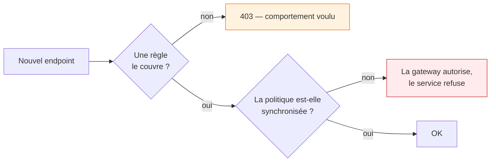
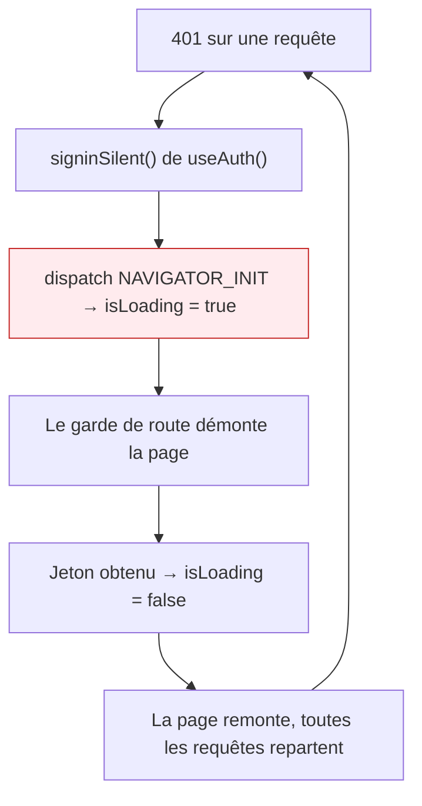
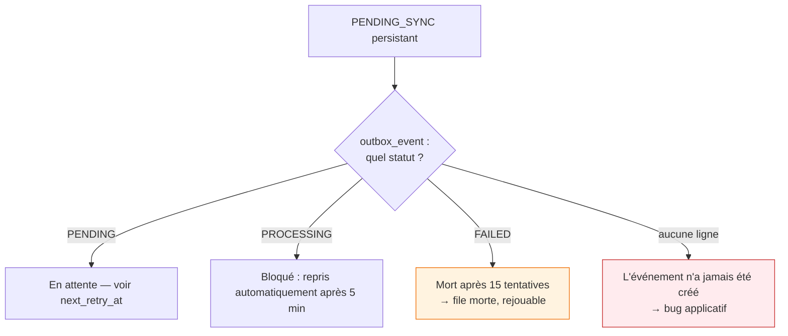
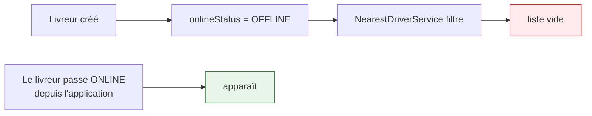

# Dépannage

Chaque entrée décrit un problème **réellement rencontré**, son symptôme trompeur, et la cause.

---

## 403 sur un endpoint qui vient d'être créé

**Symptôme.** L'endpoint fonctionne en test unitaire mais renvoie 403 en réel, même pour un
administrateur.

**Cause.** La politique RBAC est *fail-closed* : un chemin absent de `rbac-policy.json` est refusé.



**Correction.** Ajouter la règle, puis `sync-rbac-policy.py`. Attention à l'**ordre** : premier match
gagnant, donc une règle spécifique doit précéder la générique.

---

## 403 « No tenant context »

**Cause.** La requête arrive sans `X-Company-Id`. Trois origines possibles :

| Origine | Vérification |
|---|---|
| Le jeton n'a pas de claim `organization` | l'utilisateur est-il rattaché à une organisation Keycloak ? |
| L'utilisateur est dans **plusieurs** organisations | refus volontaire — le locataire serait non déterministe |
| Le chemin devrait être exempté | est-il dans `asm.tenant.tenant-less-prefixes` ? |

---

## Requête qui ne renvoie rien, sans erreur

**Symptôme.** 200 avec une liste vide, alors que les données existent.

**Cause probable.** Le `search_path` pointe sur `public` au lieu du schéma du client — le
`TenantContext` n'est pas posé.

**Où regarder.** Les logs portent `cid:` par requête. Un `cid` vide sur un chemin métier est déjà
l'anomalie.

!!! tip "Le cas des tâches planifiées"
    Un traitement `@Scheduled` ne passe pas par la chaîne web : il doit utiliser `TenantIterator`
    pour poser un locataire à chaque itération. L'oublier donne exactement ce symptôme.

---

## Écran de chargement infini au tableau de bord

**Symptôme.** Le back-office tourne indéfiniment, **aucune erreur** en console ni en réseau.

**Cause.** Un renouvellement de jeton qui **réussit** et détruit son propre appelant.



**Correction appliquée.** Renouveler sur l'instance `UserManager` directement, sans passer par
l'enrobage React, et ne bloquer sur `isLoading` **que** si aucune session n'existe encore.

!!! quote "La leçon"
    Une boucle infinie composée uniquement d'opérations qui réussissent ne laisse aucune erreur à
    chercher. Quand rien n'échoue et que rien n'avance, suspecter un cycle de succès.

---

## Le service ne démarre plus après un refactoring

**Symptôme.** Tout compile, le conteneur ne devient jamais `healthy`.

**Cause typique.** Une dépendance circulaire au démarrage de Spring.

```
BeanCurrentlyInCreationException: 'dispatchService'
```

**À vérifier.** Les champs `@Lazy` de la classe d'origine. Les transformer en arguments de
constructeur pendant un découpage **recrée le cycle** que `@Lazy` évitait — et le compilateur ne dit
rien.

---

## Une livraison reste `PENDING_SYNC`



```sql
SELECT status, retry_count, next_retry_at, last_error
FROM outbox_event WHERE aggregate_id = '<deliveryId>';
```

Le back-office expose la file morte (`/api/v1/admin/dlq`) avec rejeu.

---

## L'ERP refuse une synchronisation

| Message | Cause | Correction |
|---|---|---|
| « connection status is DISCONNECTED » | l'intégration n'est pas certifiée | relancer le test de connexion |
| « method does not exist » | mauvaise version de méthode Odoo | le moteur de capacités devrait l'éviter — vérifier le cache |
| « specify at least one non-zero quantity » | assistant de retour sans lignes | lignes non matérialisées (Odoo 16) |
| Réponse HTML au lieu d'un PDF | session web expirée | le contrôle `%PDF` transforme ça en erreur claire |

---

## OSRM redémarre en boucle

```
[error] Required files are missing, cannot continue
```

**Cause.** La carte n'a pas été préparée sur ce serveur.

```bash
docker compose --profile init up osrm-download osrm-prepare
```

---

## « Réaffecter » ne propose aucun livreur

**Cause.** `NearestDriverService` exclut les livreurs `OFFLINE`, et le statut par défaut d'un livreur
**est** `OFFLINE`.



Ce n'est pas un bug : un livreur hors service ne doit pas être proposé. Mais sur un environnement de
démonstration où personne ne s'est mis en ligne, la liste est vide.

!!! warning "Avant une démonstration"
    Mettre au moins un livreur `ONLINE`, avec une position GPS récente — le filtre exige aussi une
    position fraîche.
