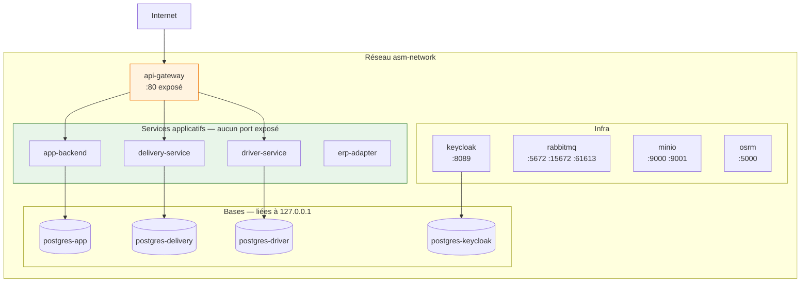
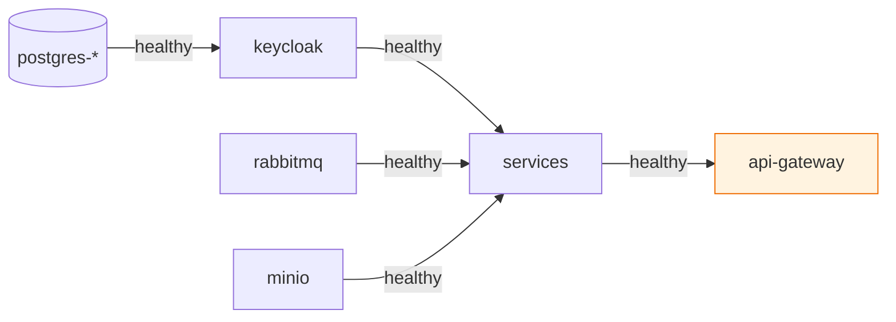

# Docker et déploiement

## L'architecture des conteneurs



!!! success "Un seul point d'entrée"
    Les ports des services applicatifs sont **commentés** dans `docker-compose.yml`. Les bases sont
    liées à `127.0.0.1` — inaccessibles depuis l'extérieur de la machine. Tout passe par la gateway.

---

## Le build en deux étages

```dockerfile
FROM gradle:8.5-jdk17 AS build
WORKDIR /workspace
COPY asm-tenant-core asm-tenant-core        # (1)
WORKDIR /workspace/DeliveryMicroservice
COPY DeliveryMicroservice/build.gradle DeliveryMicroservice/settings.gradle ./
COPY DeliveryMicroservice/src src
RUN gradle bootJar --no-daemon

FROM eclipse-temurin:17-jre-alpine           # (2)
COPY --from=build /workspace/DeliveryMicroservice/build/libs/*.jar app.jar
USER appuser                                 # (3)
```

1. Le module partagé d'abord : il change moins souvent que le service, donc éditer du code métier
   n'invalide pas son cache.
2. L'image finale ne contient **ni Gradle ni le JDK** — seulement un JRE et le jar.
3. Utilisateur non privilégié.

!!! warning "Le contexte de build est `Microservices/`, pas le dossier du service"
    Le composite build atteint `asm-tenant-core` par un chemin relatif : un contexte par service ne
    peut pas le voir.

    ```yaml
    build:
      context: .
      dockerfile: DeliveryMicroservice/Dockerfile
    ```

    D'où un **`.dockerignore`** à ce niveau : sans lui, chaque image embarquerait les fichiers de
    travail de tous les autres services (le contexte brut pèse ~200 Mo).

---

## Les volumes

| Volume | Contenu | Perte si supprimé |
|---|---|---|
| `delivery-pgdata` | livraisons, tournées, encaissements | **critique** |
| `app-pgdata` | comptes, paramètres | **critique** |
| `driver-pgdata` | livreurs, véhicules | **critique** |
| `keycloak-pgdata` | identités, organisations | **critique** |
| `erp-adapter-data` | correspondances ERP (H2) | reconfigurable |
| `delivery-wal-archive` | journaux WAL | restauration point-in-time |
| `minio_data` | photos de preuve | preuves perdues |
| `osrm-data` | carte compilée | reconstructible (long) |

!!! danger "`docker compose down -v` détruit tout"
    Sans `-v`, les conteneurs partent et les volumes restent — c'est ce qu'on veut pour redéployer.

    Pour tester une installation à froid **sans perdre les données** : utiliser un projet séparé.

    ```bash
    docker compose down                      # volumes conservés
    docker compose -p asmfresh up -d         # volumes neufs, mêmes ports
    docker compose -p asmfresh down -v       # détruit uniquement le test
    docker compose up -d                     # la pile d'origine revient
    ```

---

## L'ordre de démarrage



Les dépendances utilisent `condition: service_healthy`, pas `service_started`. Un service qui
démarrerait avant Keycloak échouerait à récupérer le JWKS et refuserait tous les jetons.

---

## Production

**Ce qui est prêt :**

- images versionnées par empreinte de commit, poussées au registre — jamais de `latest`
- secrets externalisés dans `.env`
- utilisateur non privilégié dans les images
- healthchecks partout
- archivage WAL sur la base métier

**Ce qui reste à faire :**

| | Statut |
|---|---|
| Terminaison TLS (reverse proxy) | à mettre en place |
| `KC_HOSTNAME_STRICT` à `true` | actuellement `false` |
| `docker compose --profile init` | à exécuter une fois par serveur |
| `ops/backup/install-cron.sh` | **jamais exécuté** — il existe des scripts, pas de sauvegarde |

!!! quote "Le principe de déploiement"
    « Build once, deploy many » : l'artefact qui part en production est **l'image construite par la
    CI**, jamais une recompilation sur le serveur. Un déploiement épingle une empreinte de commit —
    il n'y a pas de tag `latest`, parce qu'un tag dont le sens change en silence est la façon dont
    deux machines finissent « sur la même version » en exécutant du code différent.
