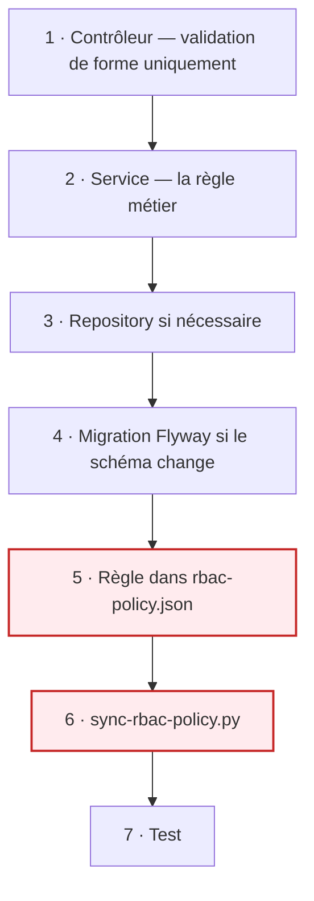
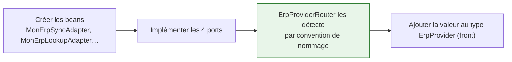

# Développement local

## L'organisation du dépôt

```
pfe/
├── Microservices/
│   ├── asm-tenant-core/       module partagé (multi-tenant)
│   ├── ApiGateway/
│   ├── AppBackend/
│   ├── DeliveryMicroservice/
│   ├── DriverService/
│   ├── ErpAdapterService/
│   ├── keycloak/              realm, thèmes
│   └── docker-compose.yml
├── Apps/admin-app-react/      back-office
├── docs/                      cette documentation
├── ops/                       scripts d'exploitation
└── .gitlab-ci.yml
```

L'application livreur (Flutter) vit dans un **dépôt séparé**.

!!! warning "Builds Gradle indépendants"
    Chaque service est un build autonome — il n'y a **pas** de `settings.gradle` racine. Le module
    partagé est résolu par *composite build* :

    ```groovy
    includeBuild('../asm-tenant-core')
    ```

    Conséquence : les images Docker se construisent depuis `Microservices/`, pas depuis le dossier du
    service, sinon le module frère serait invisible.

---

## Compiler

```bash
cd Microservices/DeliveryMicroservice
gradle compileJava test
```

Si Gradle n'est pas installé localement :

```bash
docker run --rm \
  -v "$PWD/..:/ms" -v asm-gradle-cache:/home/gradle/.gradle \
  -w /ms/DeliveryMicroservice gradle:8.5-jdk17 \
  gradle test --no-daemon
```

!!! tip "Monter `Microservices/` en entier"
    Le composite build a besoin du dossier parent pour atteindre `asm-tenant-core`. Monter seulement
    le dossier du service échouera à la résolution.

---

## Le back-office

```bash
cd Apps/admin-app-react
npm run dev          # serveur de développement
npm run typecheck    # tsc -b
npm test             # vitest
npm run lint:ci      # eslint, plafond d'avertissements
npm run check:design # refuse les couleurs en dur
```

!!! note "Le plafond d'avertissements"
    `lint:ci` accepte un nombre fixe d'avertissements connus. Le compte peut **baisser, jamais
    monter** : la dette existante est tolérée, la nouvelle est refusée.

---

## Ajouter une fonctionnalité

### Un endpoint



!!! danger "Étapes 5 et 6 — le piège"
    La politique est ***fail-closed***. Un endpoint absent de `rbac-policy.json` renvoie **403**, même
    pour un administrateur. C'est voulu — mais c'est la première chose à vérifier quand un nouvel
    endpoint « ne marche pas ».

    Et le fichier doit être **resynchronisé** dans les cinq services, sinon la gateway et le service
    n'appliquent pas les mêmes règles.

### Une migration

```bash
# Microservices/<Service>/src/main/resources/db/migration/
V45__ce_que_ca_fait.sql
```

- **Jamais modifier une migration déjà appliquée** — Flyway valide une somme de contrôle.
- Elle sera rejouée sur **tous** les schémas clients au prochain démarrage.
- Une colonne ajoutée doit être *nullable* ou avoir un défaut : les lignes existantes ne peuvent pas
  la remplir.

### Un adaptateur ERP



**Aucun code existant à modifier.** Le routeur normalise `MonErpSyncAdapter` en `"monerp"`. C'est ce
qu'a démontré l'ajout d'ERPNext après Odoo.

---

## Exporter les diagrammes

La documentation contient une centaine de diagrammes : des blocs ```mermaid``` inline dans les `.md`,
et quelques PlantUML (`diagrams/puml/`) pour les vues UML que Mermaid ne sait pas faire (cas
d'utilisation, déploiement). Un script unique les régénère tous en **SVG** — le format à insérer dans
un rapport, vectoriel et net à l'impression.

```bash
bash scripts/render-diagrams.sh
```

Il extrait chaque bloc Mermaid, rend Mermaid **et** PlantUML via Docker (aucune installation Node ou
Java locale), nettoie les SVG orphelins, copie les SVG PlantUML dans `docs/assets/uml/` (pour que
MkDocs les affiche) et écrit un manifeste `diagrams/INDEX.md` (SVG → doc source → type).

| Chemin | Contenu |
|---|---|
| `diagrams/svg/` | un SVG par diagramme — **le bundle pour le rapport** |
| `diagrams/mmd/` | sources Mermaid extraites (regénérées à chaque exécution, ne pas éditer) |
| `diagrams/puml/` | sources PlantUML (à éditer à la main pour les vues UML) |
| `diagrams/INDEX.md` | table de correspondance SVG ↔ doc ↔ type |

!!! warning "Piège chromium (déjà géré par le script)"
    L'image `minlag/mermaid-cli` est Alpine/musl : le Chrome téléchargé par puppeteer est glibc et ne
    démarre pas (`spawn … ENOENT`). Le script force `executablePath=/usr/bin/chromium-browser`, le
    chromium système de l'image. Ne pas retirer ce réglage.

Pour prévisualiser les diagrammes rendus en direct (sans exporter), `mkdocs serve` suffit : le thème
Material rend Mermaid nativement.

---

## Déboguer

| Symptôme | Première chose à regarder |
|---|---|
| 403 sur un endpoint neuf | il manque dans `rbac-policy.json` |
| 403 « No tenant context » | l'en-tête `X-Company-Id` n'arrive pas — jeton sans `organization` ? |
| Requête qui ne voit aucune donnée | mauvais schéma : vérifier `TenantContext` |
| Événement jamais parti | table `outbox_event` : statut et `last_error` |
| Écran de chargement infini | voir [Dépannage](depannage.md) |

!!! tip "Les logs portent le contexte"
    ```
    %5p [cid:%X{companyId}, rid:%X{requestId}]
    ```
    Chaque ligne est attribuable à un client et à une requête, sans instrumenter les appels
    individuels. `cid` vide sur un chemin métier est déjà une anomalie.
