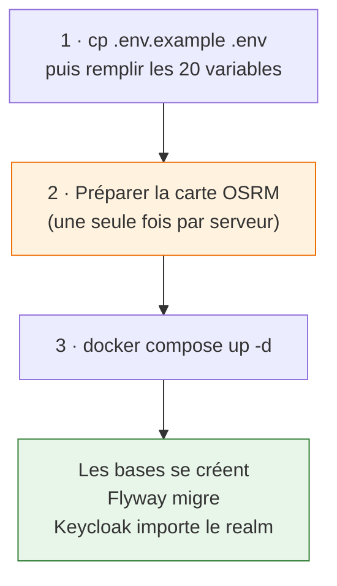
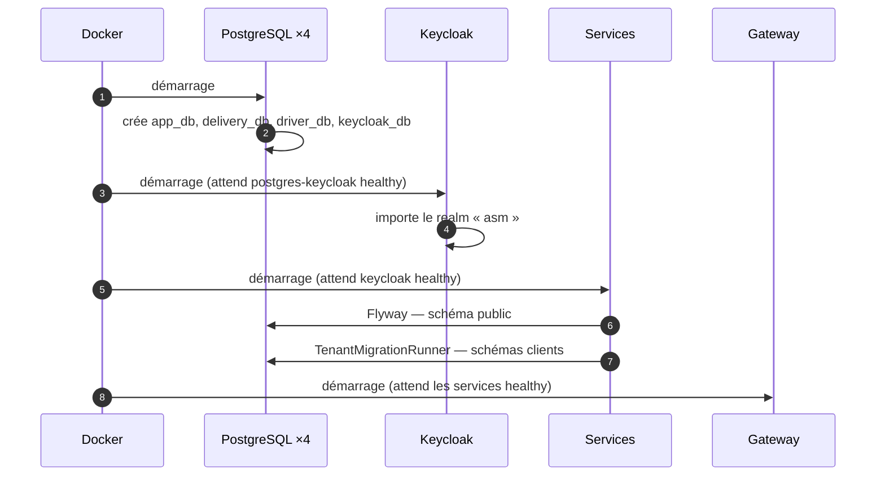
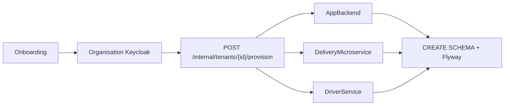

# Installation

!!! success "Vérifié sur des volumes vides"
    Cette procédure a été exécutée à froid, sur un projet Docker isolé aux volumes neufs. Les
    résultats observés sont indiqués à chaque étape.

---

## Prérequis

| | Version | Note |
|---|---|---|
| Docker + Compose | v2 | ~6 Go de RAM pour la pile complète |
| Node.js | 20+ | uniquement pour le back-office en développement |
| Java | 17 | uniquement pour compiler hors Docker |

---

## Les trois étapes



### 1 · Les variables

```bash
cd Microservices
cp .env.example .env
```

`.env.example` couvre **les 20 variables** référencées par `docker-compose.yml` — vérifié. `.env` est
dans `.gitignore` : aucun secret ne part dans git.

| Groupe | Variables |
|---|---|
| Bases | `APP_DB_PASS`, `DELIVERY_DB_PASS`, `DRIVER_DB_PASS`, `KC_DB_PASS` |
| Keycloak | `KC_ADMIN_PASSWORD`, `CLIENT_SECRET_*` (5 clients) |
| RabbitMQ | `RABBITMQ_USER`, `RABBITMQ_PASS` |
| Divers | `RESEND_API_KEY`, `OUTBOX_ALERT_WEBHOOK_URL` |

### 2 · La carte OSRM — l'étape qu'on oublie

```bash
docker compose --profile init up osrm-download osrm-prepare
```

!!! danger "Sans cette étape, OSRM redémarre en boucle"
    ```
    [warn] Missing/Broken File: /data/tunisia-latest.osrm.properties
    [error] Required files are missing, cannot continue
    ```
    Le service télécharge la carte OpenStreetMap de la Tunisie puis la compile pour l'algorithme MLD.
    **Plusieurs centaines de mégaoctets et de longues minutes**, une seule fois par serveur. C'est
    invisible en développement incrémental, parce que le volume est déjà rempli.

### 3 · La pile

```bash
docker compose up -d
```

Ce qui se passe seul, dans cet ordre :



**Résultat observé à froid :**

| Vérification | Résultat |
|---|---|
| Bases créées | 4 ✅ |
| Flyway `delivery_db` | **44 migrations** ✅ |
| Flyway `app_db` / `driver_db` / H2 | 1 chacune ✅ |
| Schémas clients | **0** — normal, aucun client encore ✅ |
| Realm Keycloak | `Realm 'asm' imported` ✅ |
| Gateway | `/v3/api-docs/delivery` → **200** ✅ |

!!! success "Aucun script SQL à lancer"
    Les bases sont créées par leurs conteneurs, puis chaque service applique ses propres migrations
    au démarrage. Voir [ADR-001](../adr/001-multi-tenant-par-schema.md).

---

## Le back-office

```bash
cd Apps/admin-app-react
npm ci
npm run dev          # http://localhost:5173
```

---

## Points d'accès

| Service | URL |
|---|---|
| API Gateway | `http://localhost` |
| Keycloak | `http://localhost:8089` |
| Back-office (dev) | `http://localhost:5173` |
| RabbitMQ (console) | `http://localhost:15672` |
| MinIO (console) | `http://localhost:9001` |

---

## Créer le premier client

Un client (*tenant*) est créé par l'endpoint d'onboarding d'`AppBackend`, qui enchaîne :



Sans client provisionné, l'interface se connecte mais ne montre rien : toutes les requêtes métier
exigent un `X-Company-Id` résolu depuis la claim `organization`.
