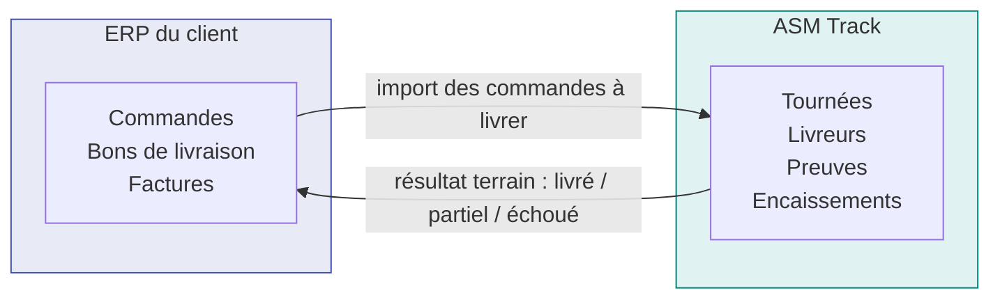
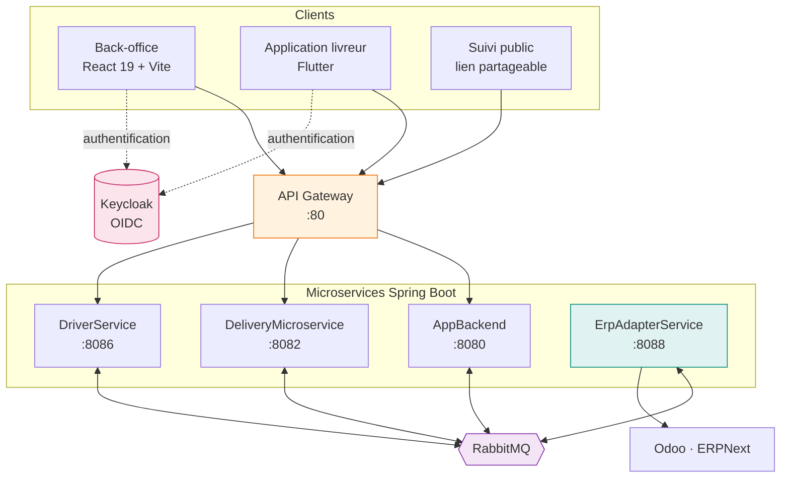

# ASM Track

!!! abstract "En une phrase"
    Une plateforme SaaS **multi-tenant** qui pilote les livraisons sur le terrain — de l'import
    depuis l'ERP du client jusqu'à la preuve de livraison signée — sans jamais se substituer à cet
    ERP pour les documents ni la facturation.

---

## Le parti pris qui explique tout le reste

**L'ERP du client reste maître de ses documents.** ASM Track n'émet ni bon de livraison ni facture :
il enregistre des **faits opérationnels** — qui livre quoi, quand, avec quelle preuve — et renvoie le
résultat dans l'ERP.

Cette décision se retrouve partout dans le code : le bon de livraison affiché au livreur est le PDF
rendu par Odoo, pas un document maison ; l'encaissement contre remboursement enregistre une
**custody** (qui détient l'argent) et jamais une écriture comptable.

**Pourquoi ce diagramme.** Il fixe la frontière de responsabilité, qui est la première question posée
en revue : « pourquoi ne générez-vous pas vos propres factures ? »

**Ce qu'il faut en retenir.** Le flux est **bidirectionnel mais asymétrique** : ASM Track lit des
commandes et écrit des résultats. Il ne crée jamais de document légal.

---

## Le système en un coup d'œil

**Pourquoi ce diagramme.** Il montre les deux règles de circulation du système, qu'aucune liste de
services ne rend visibles.

**Observations importantes.**

1. **`ErpAdapterService` n'est pas branché sur la gateway.** Aucune route ne mène à lui : il est
   joignable uniquement depuis l'intérieur, par message ou appel interne. C'est délibéré — voir
   [Intégration ERP](architecture/erp.md).
2. **Toute requête client passe par la gateway**, jamais directement par un service. C'est là que le
   jeton est vérifié et que le locataire est déterminé.
3. **Les services ne s'appellent presque pas entre eux.** Ils communiquent par RabbitMQ. Les rares
   appels HTTP directs sont marqués `/internal/` et exigent le rôle `SERVICE`.

!!! warning "Erreur classique"
    Croire que le back-office parle à `DeliveryMicroservice`. Il parle à la **gateway**, qui décide,
    enrichit la requête d'un `X-Company-Id` et route. Un service qui recevrait une requête sans cet
    en-tête la **refuse** — voir [Multi-tenant](architecture/multi-tenant.md).

---

## Chiffres

| | |
|---|---|
| Microservices | **5** (dont 1 interne) |
| Endpoints REST | **259** |
| Classes Java (production) | **573** |
| Frontend | 281 fichiers TypeScript |
| Tests automatisés | **596** (468 backend, 128 frontend) |
| Migrations Flyway | **44** sur la base des livraisons |
| Connecteurs ERP | **2** (Odoo 16→19, ERPNext) |
| Langues de l'interface | 3 (français, anglais, arabe avec RTL) |

!!! note "Ces chiffres sont recomptés, pas estimés"
    Ils proviennent du code au moment de la rédaction. Ils bougeront ; ce qui compte est l'ordre de
    grandeur et le rapport entre eux — par exemple 596 tests pour 573 classes de production.

---

## Par où commencer

-   :material-sitemap: **Comprendre l'architecture**

    ---

    Le découpage, ce que fait chaque service, et pourquoi.

    [:octicons-arrow-right-24: Vue d'ensemble](architecture/index.md)

-   :material-truck-delivery: **Comprendre le métier**

    ---

    Le cycle d'une livraison, de l'import ERP à la preuve signée.

    [:octicons-arrow-right-24: Cycle de vie](metier/livraison.md)

-   :material-rocket-launch: **Installer**

    ---

    Le parcours réel, vérifié sur des volumes vides.

    [:octicons-arrow-right-24: Installation](exploitation/installation.md)

-   :material-lightbulb-on: **Comprendre les décisions**

    ---

    Contexte, alternatives écartées, et ce que chaque choix coûte.

    [:octicons-arrow-right-24: ADR](adr/index.md)

