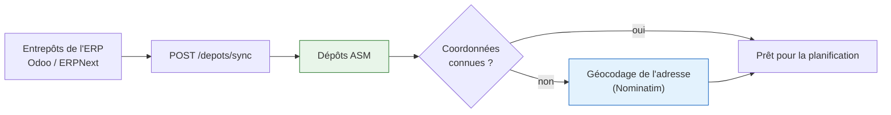
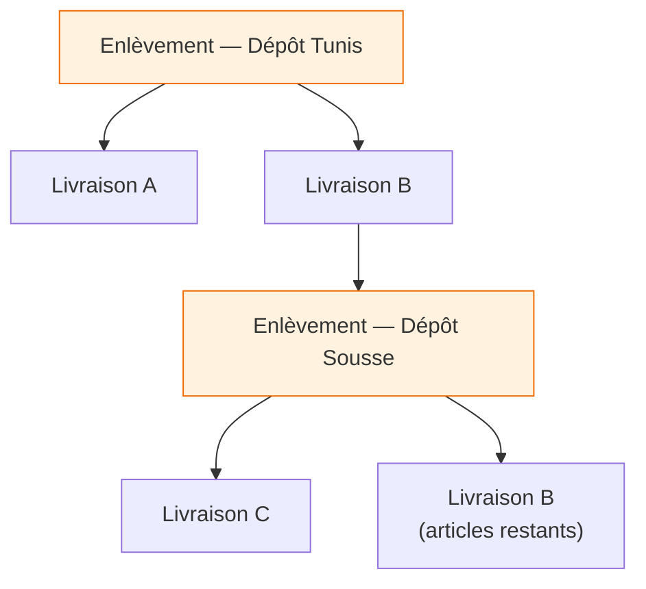

# Dépôts

Un dépôt est un **point de départ physique** : l'entrepôt où le livreur charge les colis avant de
partir en tournée.

Les dépôts ne se créent pas dans ASM. Ils sont **importés de l'ERP** (les entrepôts Odoo
`stock.warehouse`, les *Warehouses* ERPNext) et rafraîchis à la demande. La raison est la même que
pour les commandes : l'ERP est le système de référence du stock, et deux référentiels d'entrepôts qui
divergent produisent des chargements impossibles.

---

## D'où vient un dépôt

Le géocodage est nécessaire parce qu'un ERP stocke une **adresse**, pas des coordonnées. Or
l'optimisation d'itinéraire et les fenêtres horaires suggérées partent du dépôt : sans latitude et
longitude, une tournée n'a pas de point de départ mesurable.

!!! warning "Un dépôt sans coordonnées ne bloque pas l'import"
    Il reste importé, mais il ne peut pas servir de point de départ tant qu'il n'est pas localisé —
    manuellement si le géocodage échoue. C'est visible sur la page Dépôts.

---

## Une tournée peut charger dans plusieurs dépôts

C'est le cas courant dès que les commandes d'une même zone viennent de stocks différents.

Chaque livraison sait de quel dépôt elle est tirée, **ligne par ligne** : une commande dont deux
articles viennent de Tunis et un de Sousse est une commande à deux dépôts. ASM lit d'abord le dépôt
porté par les lignes ; à défaut seulement, celui de l'en-tête.

Une tournée reçoit alors **un arrêt d'enlèvement par dépôt concerné**.

---

## La règle qui gouverne l'ordre

!!! success "Aucune livraison avant son chargement"
    Un arrêt de livraison ne peut pas être placé avant l'arrêt d'enlèvement du dépôt d'où sortent ses
    articles. Un livreur ne peut pas remettre un colis qu'il n'a pas encore chargé.

Cette contrainte n'est pas un simple contrôle à la validation : **l'optimiseur la respecte pendant
qu'il cherche**. Une séquence qui la viole n'est jamais proposée, plutôt que d'être proposée puis
corrigée après coup — une correction après coup défait le travail d'optimisation et produit des
tournées absurdes.

Une livraison tirée de deux dépôts doit donc passer **après les deux** enlèvements correspondants.

---

## Ce que voit le livreur

Sur un arrêt d'enlèvement, l'application affiche ce qu'il doit charger **à ce dépôt précis** : le
nombre de colis, et le détail des articles par commande.

Confirmer l'enlèvement passe d'un coup au statut « chargé » toutes les livraisons de la tournée
tirées de ce dépôt — pas les autres, qui attendent leur propre arrêt.

---

## Voir aussi

- [Tournées](tournees.md) — construction, optimisation, validation
- [Intégration ERP](../architecture/erp.md) — comment les référentiels sont synchronisés
