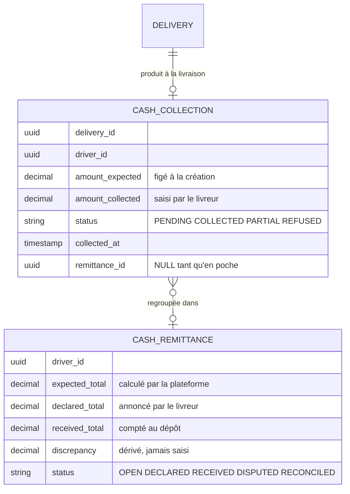
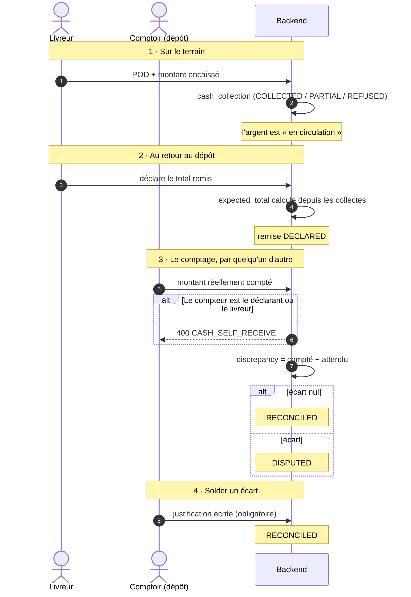
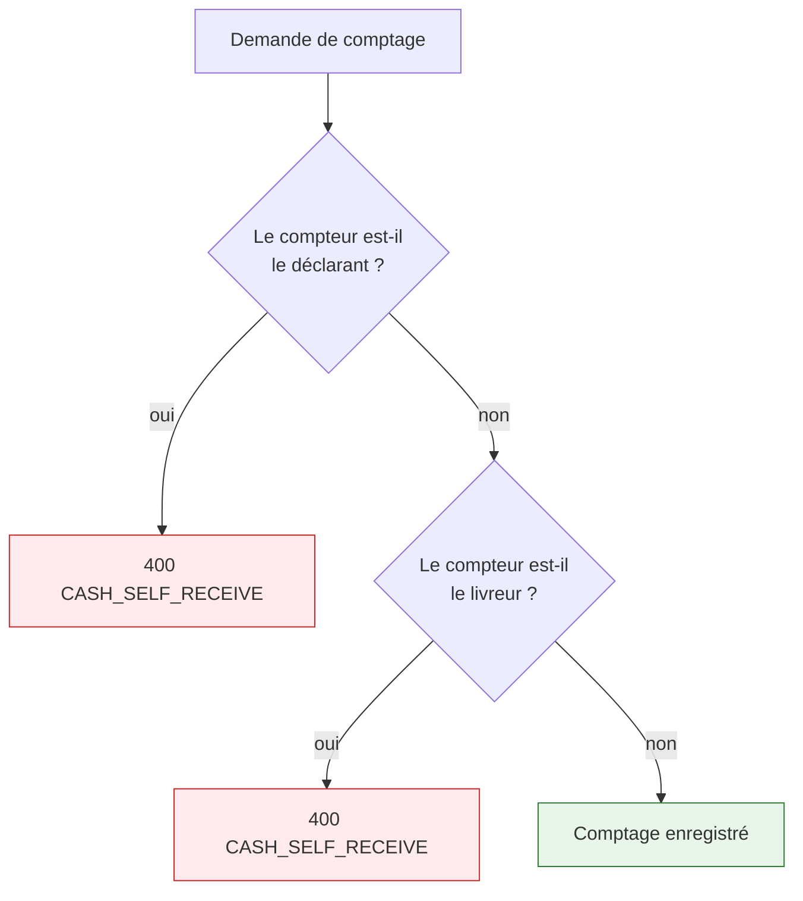
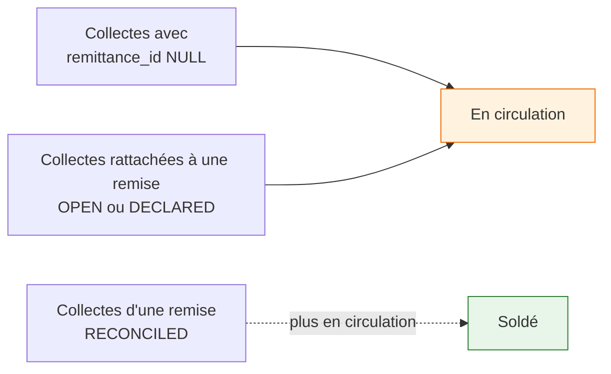

# Encaissement contre remboursement (COD)

En Tunisie, une part importante des livraisons est payée **en espèces à la remise**. Le livreur
collecte l'argent et le rapporte au dépôt.

---

## Le principe qui gouverne tout le module

!!! quote "ASM Track enregistre une garde, jamais une écriture comptable"
    La plateforme n'est pas un établissement de paiement. Elle ne détient pas de fonds, n'ouvre pas
    de compte, ne compense pas. Elle répond à une seule question, à tout instant :

    **« Qui détient physiquement cet argent en ce moment ? »**

    La comptabilité reste dans l'ERP du client. C'est le même principe que pour le bon de livraison :
    le système qui possède un document possède sa conformité.

---

## Les deux objets



**`amount_expected` est figé à la création.** Si le montant de la commande change ensuite dans l'ERP,
la collecte garde ce que le livreur devait réellement encaisser ce jour-là.

**`discrepancy` est dérivé, jamais accepté d'un appelant.** Un écart qu'on peut saisir est un écart
qu'on peut mettre à zéro.

---

## Le parcours complet



---

## La règle des deux personnes



!!! danger "C'est le module tout entier"
    Le livreur annonce un chiffre ; **quelqu'un d'autre compte**. Sans cette séparation, le module
    est un système déclaratif avec des colonnes en plus — un livreur qui confirme sa propre remise a
    simplement tapé un nombre deux fois, et toutes les tables autour deviennent décoratives.

**La justification d'un écart est obligatoire.** Un écart clos sans explication est indiscernable
d'un écart dissimulé, et cette différence est la seule chose sur laquelle un audit pourra s'appuyer.

---

## L'argent en circulation



```java
String STILL_HELD = """
    (c.remittanceId IS NULL
     OR EXISTS (SELECT 1 FROM CashRemittance r WHERE r.id = c.remittanceId
                AND r.status IN (OPEN, DECLARED)))
    """;
```

**Une collecte déclarée mais pas encore comptée est toujours en circulation.** Le livreur l'a
annoncée, personne ne l'a vérifiée : l'argent est encore chez lui. Ne compter que les collectes sans
remise donnerait un chiffre faux dès qu'un livreur déclare.

!!! tip "Aucun ERP ne sait produire ce chiffre"
    Il décrit un **état du terrain entre deux écritures comptables**. C'est précisément la valeur
    ajoutée de la plateforme sur ce sujet.

---

## Le garde-fou sur la devise

```java
private static final String COLLECTABLE_CURRENCY = "TND";
```

Une commande en devise étrangère **n'est pas encaissable en espèces** par un livreur en Tunisie. Le
drapeau COD est ignoré, avec un avertissement journalisé, plutôt que de demander au livreur de
collecter un montant dans une monnaie qu'il ne manipule pas.

De même, un montant nul ou négatif désactive l'encaissement : un COD à zéro n'est pas un COD.
