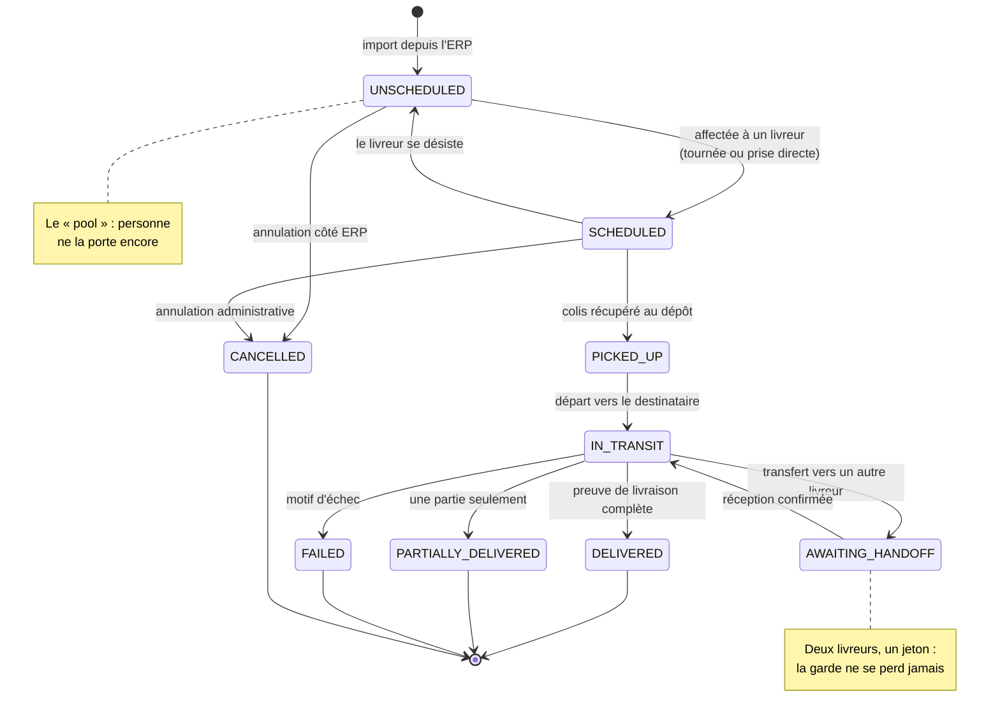
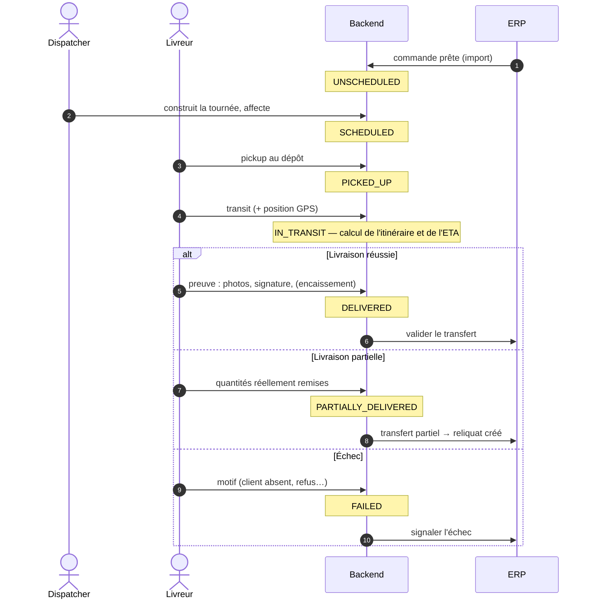
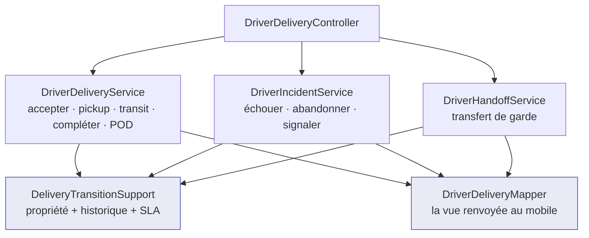
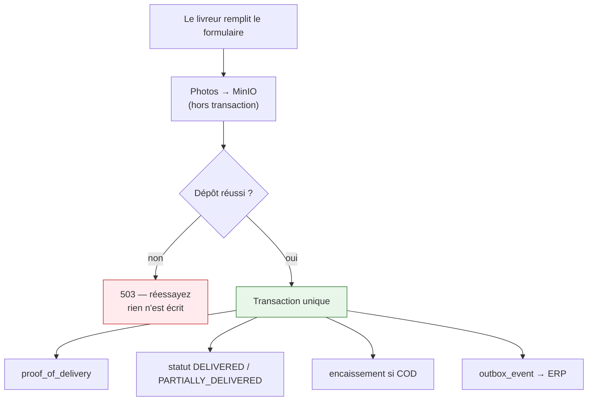
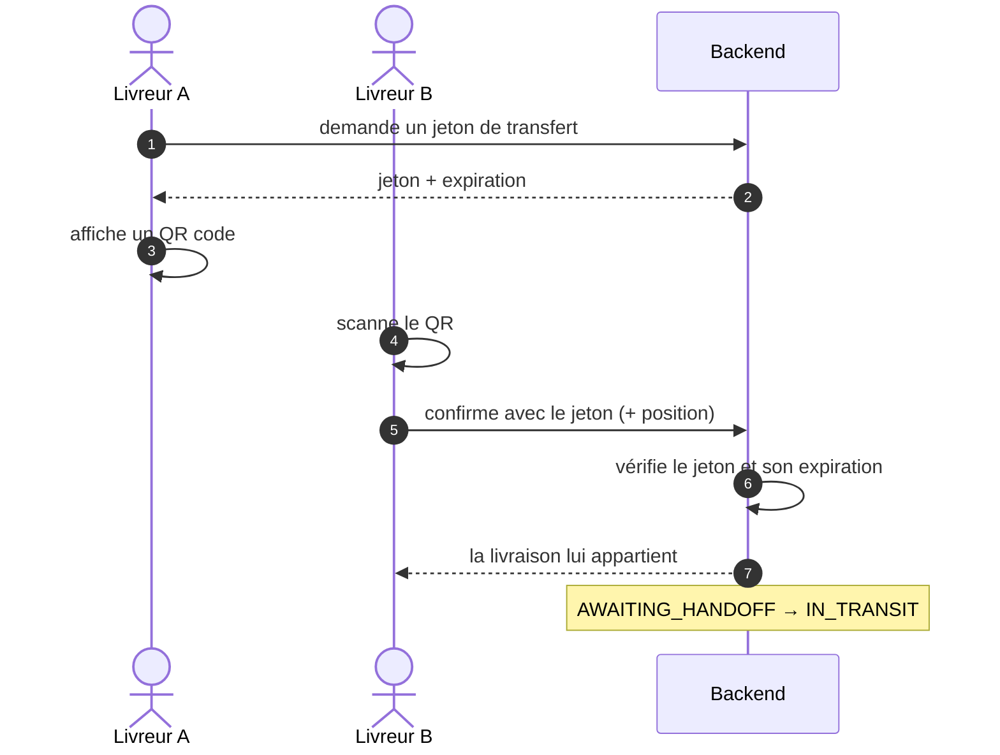

# Cycle de vie d'une livraison

C'est l'objet central de la plateforme. Tout le reste — tournées, retours, encaissement — gravite
autour de ces états.

---

## La machine à états

**Pourquoi ce diagramme.** Neuf états et leurs transitions légales tiennent en une image ; en texte,
il faut trois pages et on rate les transitions inverses.

**Observations importantes.**

- **`UNSCHEDULED` est un pool, pas une erreur.** Une livraison qui y retourne (désistement) est
  reprenable par un autre livreur.
- **Les états terminaux sont quatre**, et `PARTIALLY_DELIVERED` en fait partie : une livraison
  partielle est **close**, le reliquat vit dans une autre livraison créée par l'ERP.
- **`AWAITING_HANDOFF` existe pour que la garde ne soit jamais floue.** Sans lui, un colis passé de
  main en main serait « chez A » dans le système et « chez B » en réalité.

!!! danger "Erreur classique"
    Ajouter une transition « pour simplifier », par exemple `SCHEDULED → DELIVERED`. Chaque saut
    d'état supprime un horodatage que les SLA, les rapports de tournée et les litiges utilisent. Les
    transitions sont vérifiées côté service : `assertStatus(delivery, PICKED_UP, "start transit")`.

---

## Qui déclenche quoi

**Le point à retenir : l'ERP est informé au moment terminal, jamais avant.** Les états intermédiaires
sont une affaire de terrain, pas de comptabilité.

---

## Le service, découpé par phase

Le parcours livreur était porté par une classe unique de 1 192 lignes et 24 dépendances. Elle est
découpée selon les **moments réels du terrain** :

**`DeliveryTransitionSupport` est partagé, et ce n'est pas un détail.** Il porte trois opérations que
toute action de livreur effectue :

| Opération | Rôle |
|---|---|
| `loadAndAuthorize` | charge la livraison **et refuse à quiconque n'est pas le livreur qui la porte** |
| `assertStatus` | refuse une transition qui ne part pas du bon état |
| `appendHistory` | inscrit une ligne d'historique **et rafraîchit le SLA** |

!!! warning "Pourquoi ne pas les dupliquer par phase"
    Le contrôle de propriété est la **seule** règle empêchant un livreur de toucher la livraison d'un
    autre. Il doit avoir exactement une définition. Le rafraîchissement du SLA voyage avec
    l'historique volontairement : enregistrer le changement et re-dériver le SLA sont un seul acte —
    les séparer, c'est garantir qu'un jour l'un des deux sera oublié.

---

## La preuve de livraison

Le détail de l'ordre photos/transaction est expliqué dans [Stockage](../architecture/stockage.md).

**Une livraison partielle dérive son état des quantités**, elle n'est pas déclarée : si aucune ligne
n'est remise, le résultat est un **échec**, pas une livraison partielle vide — ce qui éviterait de
pousser un transfert vide à l'ERP.

---

## Le transfert de garde

**Pourquoi un jeton et pas un simple bouton.** Le transfert doit prouver une **remise physique**. Un
jeton à durée limitée, affiché par A et scanné par B, atteste que les deux étaient au même endroit au
même moment. Un bouton « j'ai donné le colis » n'atteste rien.
