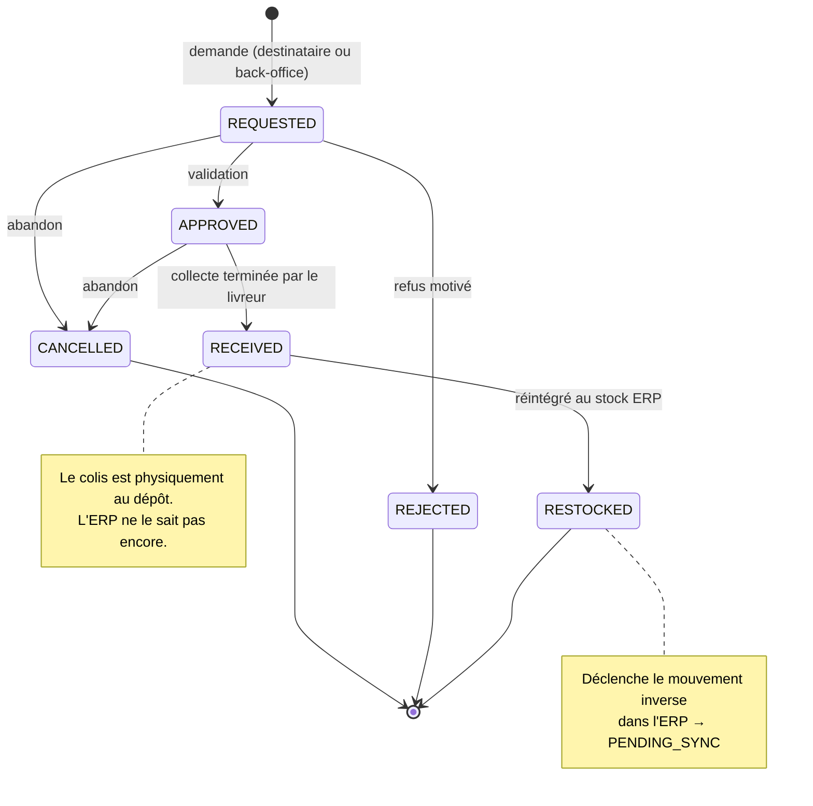
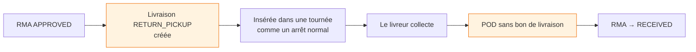
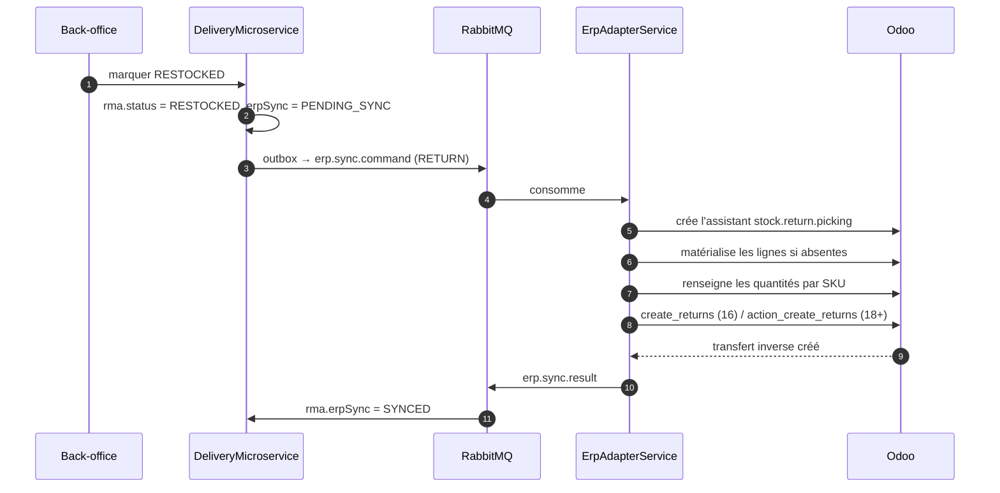
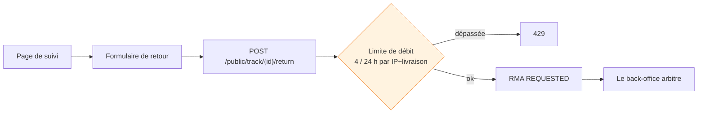

# Retours (RMA)

Un retour — *Return Merchandise Authorization* — est le mouvement inverse d'une livraison : le colis
repart du destinataire vers le dépôt, puis vers le stock de l'ERP.

---

## Le cycle de vie

**La frontière `RECEIVED` / `RESTOCKED` est le cœur du modèle.** `RECEIVED` est un fait de terrain :
le colis est revenu. `RESTOCKED` est une décision : il est bon pour la revente et rejoint le stock.
Un article revenu abîmé reste `RECEIVED` et ne repart jamais vers l'ERP.

---

## La collecte, une livraison à l'envers

**Une collecte de retour est une `Delivery` de type `RETURN_PICKUP`.** Elle traverse la même machine
à états, apparaît dans les mêmes tournées, et utilise le même écran mobile. Créer un objet séparé
aurait dupliqué la planification, l'affectation et la preuve.

!!! warning "Deux différences que le code traite explicitement"
    1. **Pas de bon de livraison.** Le document n'existe pas pour un mouvement inverse : la photo du
       BL est optionnelle sur ce type de collecte.
    2. **Le manifeste montre les lignes du RMA**, pas les quantités d'origine de la commande. Le
       livreur doit voir **ce qu'il vient chercher**, pas ce qui avait été livré.

!!! danger "Le piège que le code évite"
    Une collecte de retour **partage la commande d'origine** — une transaction déjà livrée et
    synchronisée. Un échec de collecte ne doit donc **jamais** toucher l'état ERP de cette commande :
    pas de `PENDING_SYNC`, pas de signalement d'échec, pas d'expédition de remplacement. Rien
    n'existe dans l'ERP pour le retour tant qu'il n'est pas `RESTOCKED`.

---

## Le retour dans l'ERP

**Deux subtilités Odoo, toutes deux découvertes en test :**

1. **L'assistant revient vide par RPC.** `stock.return.picking` remplit ses lignes dans
   `default_get`, ce que le client web déclenche et qu'un `create()` par RPC ne fait pas. Sur Odoo 16,
   l'assistant arrive donc **sans lignes** et le retour est refusé pour « au moins une quantité non
   nulle ». Les lignes sont matérialisées explicitement depuis les mouvements du transfert d'origine.
2. **La méthode change de nom en Odoo 18.** `create_returns` devient `action_create_returns`.
   Aucune des deux n'existe sur les deux versions : appeler la mauvaise échoue avec « method does not
   exist ». Le nom est dérivé de la version, pas essayé à tour de rôle.

Si la synchronisation échoue définitivement, le RMA passe `SYNC_FAILED` — il ne reste pas bloqué en
`PENDING_SYNC` en attendant un message qui n'arrivera jamais.

---

## Le canal public

Un destinataire peut demander un retour depuis sa page de suivi, sans compte :

**Quatre tentatives par jour** : assez pour reprendre un envoi qui a échoué, très insuffisant pour
abuser d'un point d'entrée ouvert. Demander un retour est un acte unique dans la vie d'un colis.
