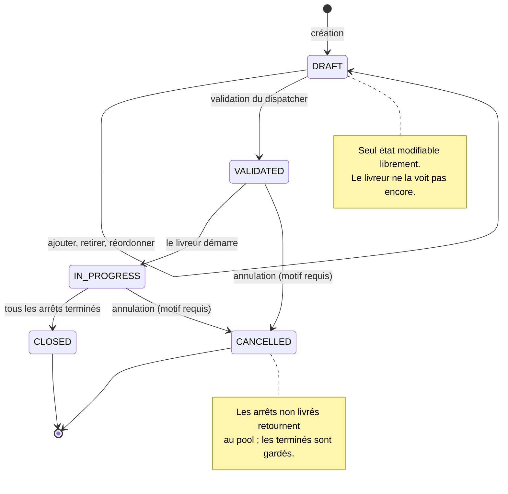
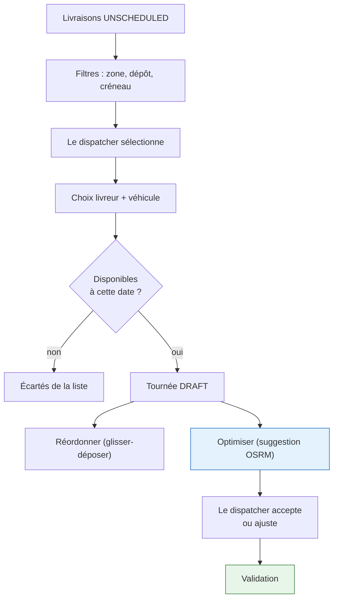
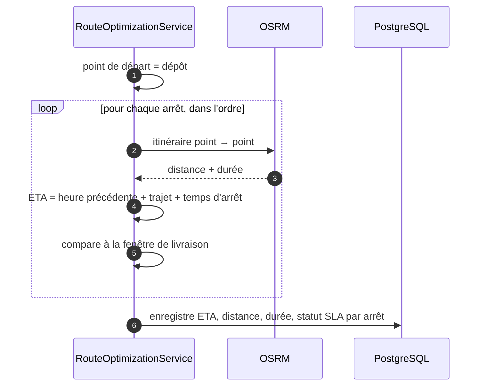
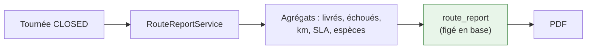

# Tournées

Une tournée est une **séquence ordonnée d'arrêts** confiée à un livreur et un véhicule pour une
journée.

---

## Le cycle de vie

**La frontière `DRAFT` / `VALIDATED` est la décision structurante.** Tant qu'une tournée est en
brouillon, le dispatcher réorganise librement. À la validation, elle devient un engagement : le
livreur la voit, les SLA sont calculés, et toute modification passe par des opérations contrôlées.

!!! note "Annuler ne détruit pas"
    Une tournée annulée en cours renvoie ses arrêts **non livrés** au pool (`UNSCHEDULED`) et conserve
    les arrêts terminés. Le travail déjà fait n'est jamais perdu, et le reste redevient
    replanifiable.

---

## La construction d'une tournée

!!! tip "L'optimisation suggère, elle n'applique pas"
    L'endpoint `/optimize` renvoie un ordre proposé ; c'est le dispatcher qui l'accepte via
    `/stops/reorder`. Un « appliquer directement » a existé et a été supprimé, sans appelant : le
    dispatcher connaît des contraintes que l'algorithme ignore — un client qui n'ouvre qu'après 14 h,
    une rue en travaux.

---

## Le calcul des ETA

**OSRM tourne en local**, sur les données OpenStreetMap de la Tunisie. Deux raisons : aucun appel
externe facturé par requête, et les temps de trajet reflètent le réseau routier réel plutôt qu'une
distance à vol d'oiseau.

!!! warning "Ce qu'OSRM ne sait pas"
    Il ne connaît ni le trafic en temps réel, ni les habitudes locales. Les ETA sont une **base de
    planification**, pas une promesse au client. C'est pourquoi le SLA se compare à une fenêtre et
    non à une minute.

---

## Le rapport de tournée

À la clôture, un rapport consolide la journée : arrêts livrés, échoués, distance parcourue, respect
des SLA, encaissements. Il est exportable en PDF.

**Le rapport est figé en base, pas recalculé.** Un rapport recalculé six mois plus tard donnerait des
chiffres différents — les SLA évoluent, les référentiels changent. Un rapport de journée doit dire ce
qui s'est passé **ce jour-là**.
