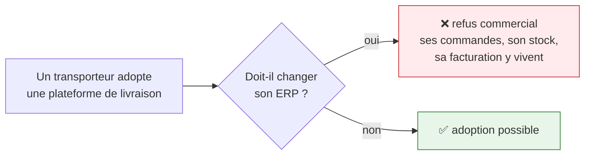
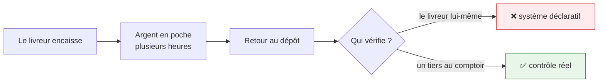
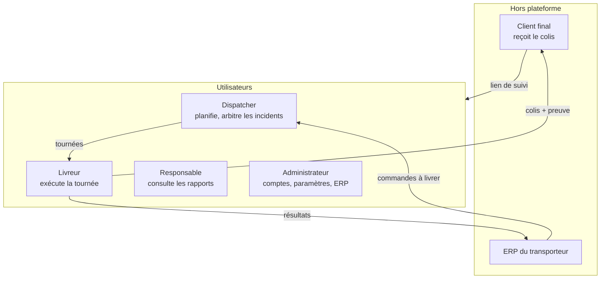

# Contexte métier

## Le terrain

ASM Track est développé pour **ASM (All Soft Multimédia)**, à Sfax, dans le cadre d'un projet de fin
d'études ISIMS 2026.

La cible : les **opérateurs logistiques tunisiens** — des PME qui livrent pour le compte de
e-commerçants et de distributeurs. Leur quotidien impose trois contraintes qui ont façonné
l'architecture.

---

## Contrainte 1 — Ils ont déjà un ERP

Ses commandes, son stock et sa facturation vivent dans Odoo ou ERPNext. Aucune plateforme de
livraison ne le fera migrer.

**Conséquence architecturale.** ASM Track **se branche** sur cet ERP au lieu de le remplacer. Il
n'émet ni bon de livraison ni facture : il enregistre des faits opérationnels et renvoie le résultat.

→ [Intégration ERP](../architecture/erp.md) · [ADR-003](../adr/003-ports-adapters-erp.md)

---

## Contrainte 2 — Le paiement à la livraison domine

Une part importante des livraisons est réglée **en espèces à la remise**. Le livreur collecte, puis
rapporte l'argent au dépôt.

**Conséquence architecturale.** Un module d'encaissement bâti sur une **séparation des rôles** : le
livreur déclare, quelqu'un d'autre compte. Et une position réglementaire nette — la plateforme
enregistre une **garde**, jamais une écriture comptable ; elle ne détient pas de fonds.

→ [Encaissement](../metier/encaissement.md)

---

## Contrainte 3 — Plusieurs transporteurs, souvent concurrents

Le produit est vendu en SaaS. Deux transporteurs d'une même ville peuvent être clients — et
concurrents directs.

**Conséquence architecturale.** L'isolation ne peut pas reposer sur la discipline du développeur. Un
`WHERE company_id = ?` oublié suffirait à faire traverser la frontière, et le défaut serait
silencieux : la requête réussit, les tests passent, l'incident se découvre en production.

D'où un **schéma PostgreSQL par client**, où la frontière est portée par le moteur de base de données.

→ [Multi-tenant](../architecture/multi-tenant.md) · [ADR-001](../adr/001-multi-tenant-par-schema.md)

---

## Les acteurs

| Acteur | Outil | Ce qu'il attend |
|---|---|---|
| **Dispatcher** | back-office | construire des tournées vite, voir les incidents tôt |
| **Livreur** | application mobile | une liste claire, qui fonctionne sans réseau |
| **Responsable** | back-office | des chiffres justes sur la journée écoulée |
| **Administrateur** | back-office | brancher l'ERP sans développeur |
| **Client final** | lien de suivi | savoir où est son colis, sans créer de compte |

!!! note "L'administrateur est un acteur, pas une évidence"
    Connecter un ERP est une opération de configuration, faite **une fois** par client — et pourtant
    elle décide de tout le reste. D'où un assistant de paramétrage guidé : test de connexion,
    certification des capacités, correspondance des champs.
