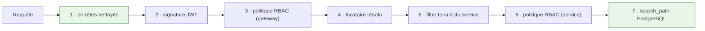

# Exigences non fonctionnelles

Chaque exigence est suivie de **ce qui la satisfait dans le code**, et de ce qui reste ouvert.

---

## Sécurité

| Exigence | Mise en œuvre | Statut |
|---|---|---|
| Authentification déléguée, pas de mot de passe stocké | Keycloak 26, OIDC, JWT RS256 | ✅ |
| Autorisation vérifiable dans son ensemble | `rbac-policy.json`, 30 règles, *fail-closed* | ✅ |
| Défense indépendante de la topologie | politique évaluée à la gateway **et** dans le service | ✅ |
| Impossibilité d'usurper un locataire | en-têtes de contexte supprimés puis reconstruits depuis le jeton | ✅ |
| Isolation des données entre clients | schéma PostgreSQL par client, `SET search_path` | ✅ |
| Pas de secret dans le dépôt | `.env` ignoré, `.env.example` complet | ✅ |
| Limitation de débit sur les points publics | suivi 120/10 min, retours 4/24 h | ✅ |
| TLS | reverse proxy à mettre en place | ❌ |

**Sept contrôles avant qu'une ligne ne soit lue.** Aucun ne dépend du code métier.

---

## Fiabilité

| Exigence | Mise en œuvre |
|---|---|
| Aucune perte d'événement métier | outbox transactionnel, `@Transactional(MANDATORY)` |
| Reprise sur panne externe | 15 tentatives, attente exponentielle — **21,7 h** de couverture |
| Échec définitif visible et rejouable | file morte + écran d'administration |
| Reprise après crash | événements bloqués en `PROCESSING` repris après 5 minutes |
| Pas de doublon sur rejeu | clés d'idempotence, `SKIP LOCKED` sur l'outbox |
| Continuité terrain sans réseau | file locale Hive côté mobile |

!!! warning "Une limite chiffrée honnêtement"
    21,7 heures couvrent une panne nocturne et une journée de travail. Elles **ne couvrent pas** un
    vendredi soir résolu le lundi — il faudrait 25 tentatives pour atteindre 60 h. Le compromis est
    assumé : un événement en échec depuis un jour relève plus souvent d'une configuration cassée que
    d'une indisponibilité.

---

## Performance

| Exigence | Mise en œuvre |
|---|---|
| Un pool de connexions, pas un par client | `SchemaMultiTenantConnectionProvider` |
| Pas d'appel réseau dans une transaction | photos déposées avant la transaction |
| Pas de recalcul à l'affichage | `sla_state` et `route_report` figés en base |
| Index sur les accès fréquents | 64 index |
| Cache des capacités ERP | par client, évite un `fields_get` par appel |
| Temps réel sans sondage | WebSocket relayé par RabbitMQ |

!!! note "Non mesuré"
    Aucun test de charge n'a été conduit. Les choix ci-dessus évitent des goulots **connus**
    (épuisement de pool, N+1, transactions longues) mais ne constituent pas une preuve de tenue en
    charge.

---

## Maintenabilité

| Indicateur | Valeur |
|---|---|
| Contrôleurs | 30, **104 lignes en moyenne** |
| Méthodes > 100 lignes | **10 sur 2 083** |
| `TODO` / `FIXME` | **0** |
| `printStackTrace` | **0** |
| Tests désactivés | **0** |
| Tests automatisés | **596** |
| Décisions documentées | 4 ADR |

---

## Exploitabilité

| Exigence | Mise en œuvre | Statut |
|---|---|---|
| Journaux attribuables | MDC `companyId` / `requestId` sur chaque ligne | ✅ |
| Sondes de santé | healthcheck sur tous les conteneurs | ✅ |
| Métriques | Actuator + Prometheus | ✅ |
| Schéma reproductible | Flyway sur les 4 services, vérifié à froid | ✅ |
| Archivage continu | WAL sur la base métier, `archive_timeout=300` | ✅ |
| **Sauvegardes planifiées** | scripts présents, **cron jamais installé** | ❌ |

!!! danger "Le point le plus important de cette page"
    `ops/backup/install-cron.sh` n'a jamais été exécuté. Il existe des scripts qui **savent**
    sauvegarder — il n'existe pas de sauvegarde.

---

## Internationalisation

Trois langues (français, anglais, arabe), avec **test de parité** qui échoue si une clé manque. L'arabe
bascule le document en `dir="rtl"`. La langue de l'application est transmise à la page de connexion
Keycloak.
