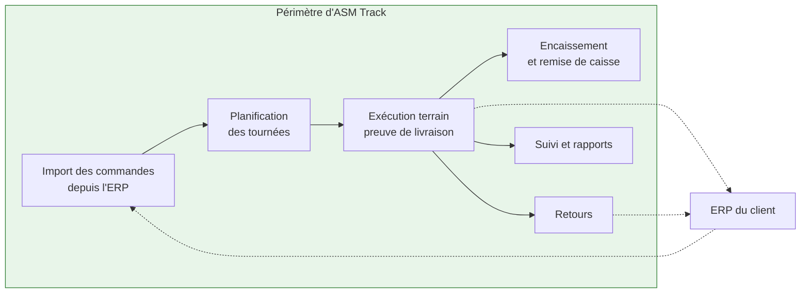
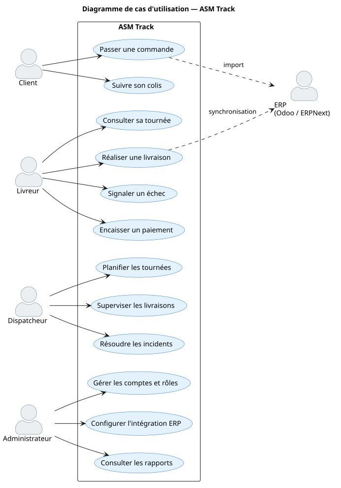
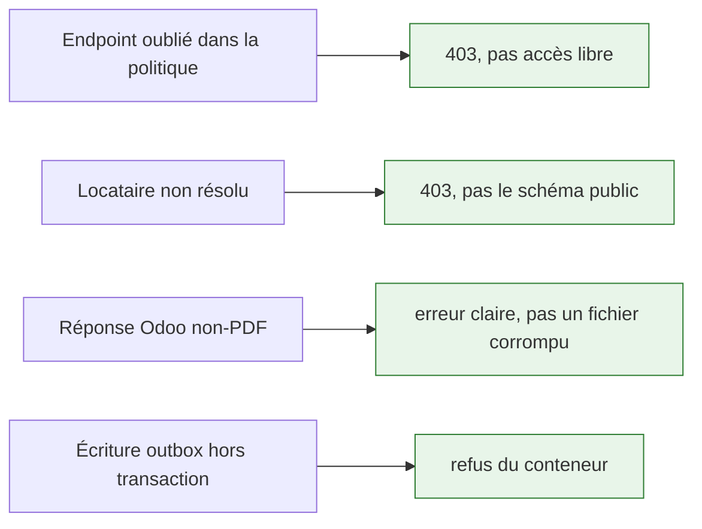

# Objectifs et périmètre

## Ce que la plateforme fait

| Domaine | Contenu |
|---|---|
| **Import** | commandes prêtes à livrer, clients, dépôts, articles — depuis Odoo ou ERPNext |
| **Planification** | tournées, affectation livreur/véhicule, séquencement, optimisation, ETA et SLA |
| **Exécution** | acceptation, enlèvement, transit, preuve par photo du bon signé et du colis, transfert de garde |
| **Encaissement** | collecte COD, remise de caisse avec comptage par un tiers |
| **Retours** | demande, approbation, collecte inverse, réintégration au stock ERP |
| **Suivi** | temps réel pour le dispatch, lien public pour le destinataire, rapports de tournée |
| **Administration** | comptes back-office, rôles fins, paramétrage ERP guidé, journal d'audit |

### Acteurs et cas d'utilisation

Vue d'ensemble des acteurs et de ce que chacun peut faire. L'ERP est un acteur **secondaire** : il
alimente le système en commandes et reçoit en retour les preuves de livraison.

---

## Ce que la plateforme ne fait pas — et pourquoi

!!! danger "Ces exclusions sont des décisions, pas des manques"

| Hors périmètre | Raison |
|---|---|
| **Émettre factures et bons de livraison** | le système qui possède un document possède sa conformité — mentions légales, numérotation continue, TVA vivent dans l'ERP |
| **Tenir une comptabilité** | ASM Track enregistre une **garde** d'espèces, pas une écriture ; la plateforme n'est pas un établissement de paiement |
| **Gérer un stock** | l'ERP est maître ; la plateforme déclenche des mouvements, elle ne les possède pas |
| **Un serveur d'authentification maison** | Keycloak fait ce travail mieux, et une erreur y serait une faille |
| **Calculer un itinéraire propriétaire** | OSRM sur données OSM, auto-hébergé |

---

## Objectifs d'ingénierie

Au-delà des fonctionnalités, quatre objectifs ont guidé les décisions techniques.

### 1 · L'isolation ne doit pas dépendre de la vigilance

Une requête mal écrite ne doit pas pouvoir traverser la frontière entre clients. La séparation est
portée par PostgreSQL — pas par un filtre applicatif qu'on peut oublier.

### 2 · Une panne externe ne doit pas bloquer le terrain

Un livreur devant une porte ne doit jamais attendre qu'un ERP réponde. D'où l'outbox transactionnel :
il valide, l'écran répond, la synchronisation suit.

### 3 · Une erreur doit échouer bruyamment

Un défaut visible en développement coûte une minute ; le même défaut silencieux coûte un incident.

### 4 · Ajouter un ERP ne doit pas toucher au métier

Validé en pratique : l'ajout d'ERPNext après Odoo n'a demandé **aucune modification** des interfaces.

---

## Ce qui reste ouvert

Voir [Limites connues](../limites.md) pour la liste honnête de ce qui n'est pas fait.
