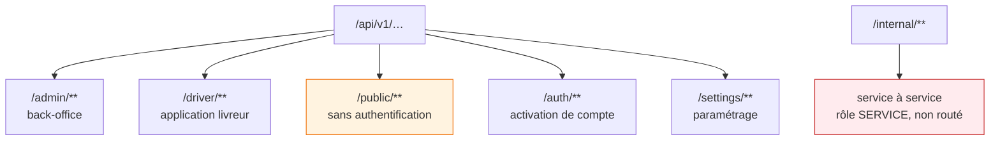
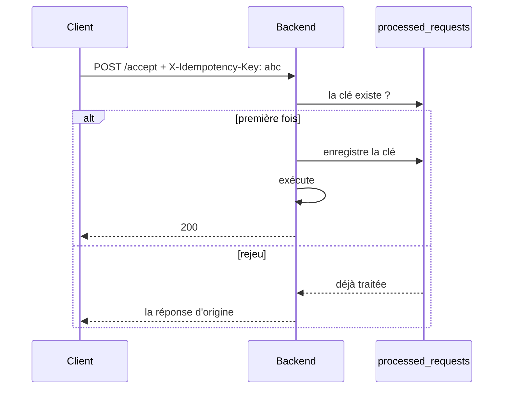

# Référence de l'API

## Contrats publiés

Chaque service expose son contrat OpenAPI (springdoc) et son interface Swagger. La gateway les
agrège.

Les contrats des trois services exposés publiquement sont **versionnés** dans
[`docs/openapi/`](https://git.asmtechtn.com) — un contrat qui n'existe que sur une machine allumée
n'est pas un livrable.

```bash
./ops/openapi/export.sh        # régénère depuis une pile démarrée
```

| Service | Chemins | Exposé publiquement |
|---|---|---|
| `delivery` | 152 | ✅ |
| `driver` | 21 | ✅ |
| `app-backend` | 27 | ✅ |
| `erp-adapter` | 26 | ❌ **volontairement absent** |

!!! note "Pourquoi l'adaptateur ERP n'est pas publié"
    C'est un service interne, sans route dans la gateway. Publier le contrat d'une porte que personne
    ne peut ouvrir ne sert qu'à donner envie de la chercher.

---

## Les familles d'URL



| Préfixe | Qui | Permission type |
|---|---|---|
| `/api/v1/admin/deliveries` | dispatcher, admin | `perm:delivery:view` / `perm:dispatch:operate` |
| `/api/v1/admin/routes` | dispatcher | `perm:route:view` / `perm:route:manage` |
| `/api/v1/admin/cash` | comptoir, manager | `perm:dispatch:operate` |
| `/api/v1/driver/**` | livreur | rôle `DRIVER` |
| `/api/v1/public/**` | tout le monde | aucune — limité en débit |
| `/internal/**` | services | rôle `SERVICE`, non routé par la gateway |

---

## Conventions transverses

### Idempotence



Les écritures sensibles portent `@IdempotentOperation`. La clé est générée **une fois par requête**
côté client et survit aux rejeux — indispensable pour la file hors ligne du mobile.

### Erreurs

Chaque service a **exactement un** `@RestControllerAdvice`. La forme est uniforme :

```json
{ "status": 403, "message": "No tenant context" }
```

Les erreurs métier portent un code stable exploitable par le client :

| Code | Signification |
|---|---|
| `CASH_SELF_RECEIVE` | le déclarant ne peut pas compter sa propre remise |
| `RATE_LIMITED` | trop d'appels sur un point d'entrée public |
| `POD_UPLOAD_FAILED` | dépôt de photo impossible — réessayable |

### Pagination

Spring Boot 3.3 sérialise une `Page` en `{content, page: {…}}`. Le client aplatit ces champs au
premier niveau dans son intercepteur, une fois pour toutes.

!!! tip "Piège évité"
    Voir `{content, page}` dans un `curl` et « corriger » le backend casserait le front, qui gère
    déjà la conversion. Vérifier la couche cliente avant de toucher au contrat.

---

## Validation

Les DTO portent 129 contraintes Bean Validation. **Les 34 DTO contraints ont tous leur `@Valid`** au
point d'entrée — une annotation sans `@Valid` ne s'exécuterait jamais, et le code semblerait validé
sans l'être.
